```
## [1] "p01_2mgmL"
```
 
## Raw Activity ##


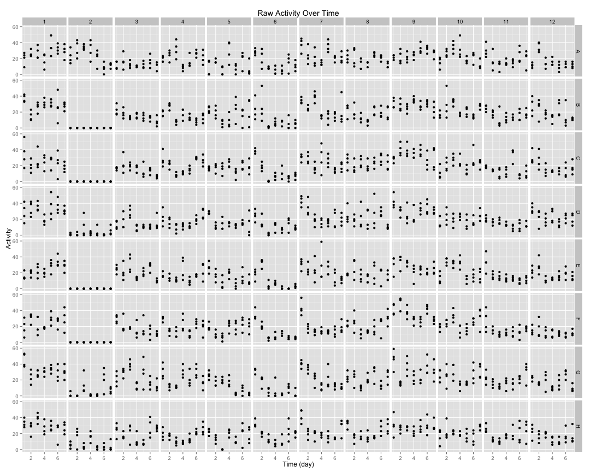 

## Cleaned Data ##


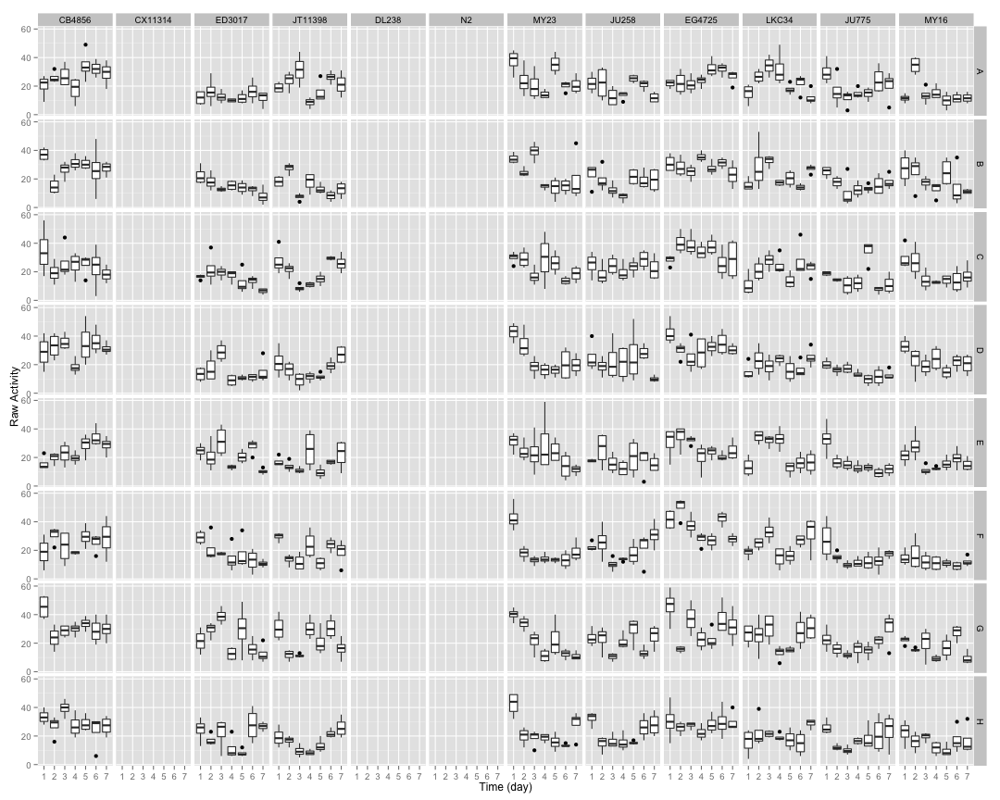 


## Well Mean Data ##

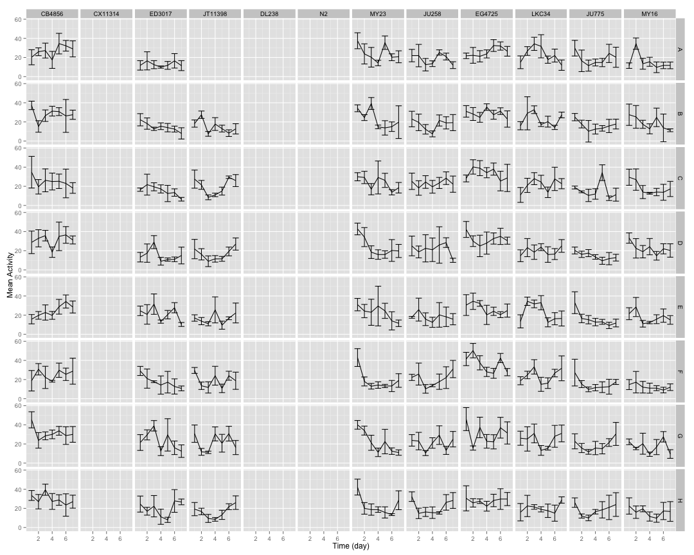 

## Well Median Data ##

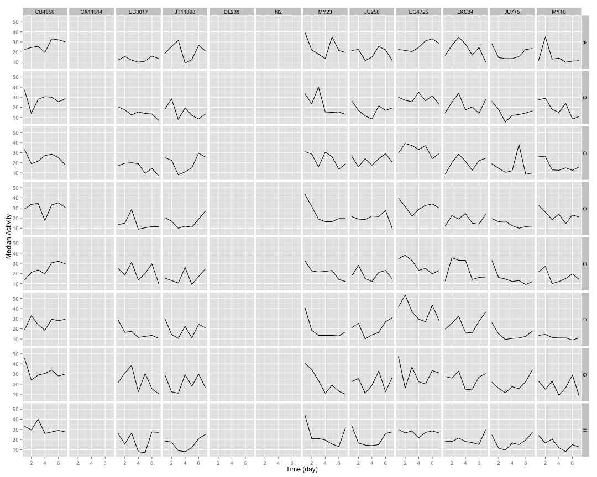 

## Well Total Data ##

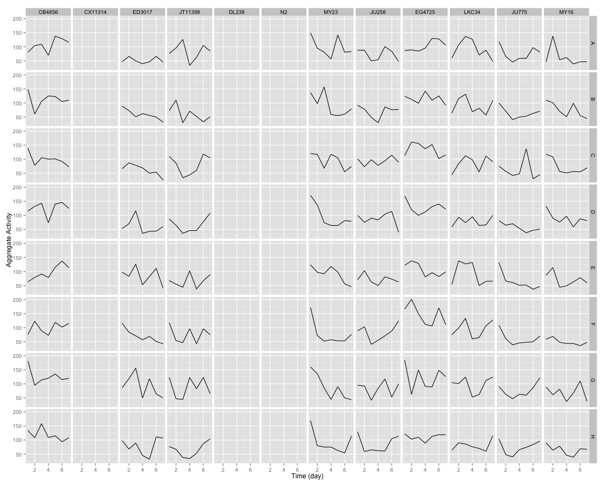 

## Well Normalized Data ##


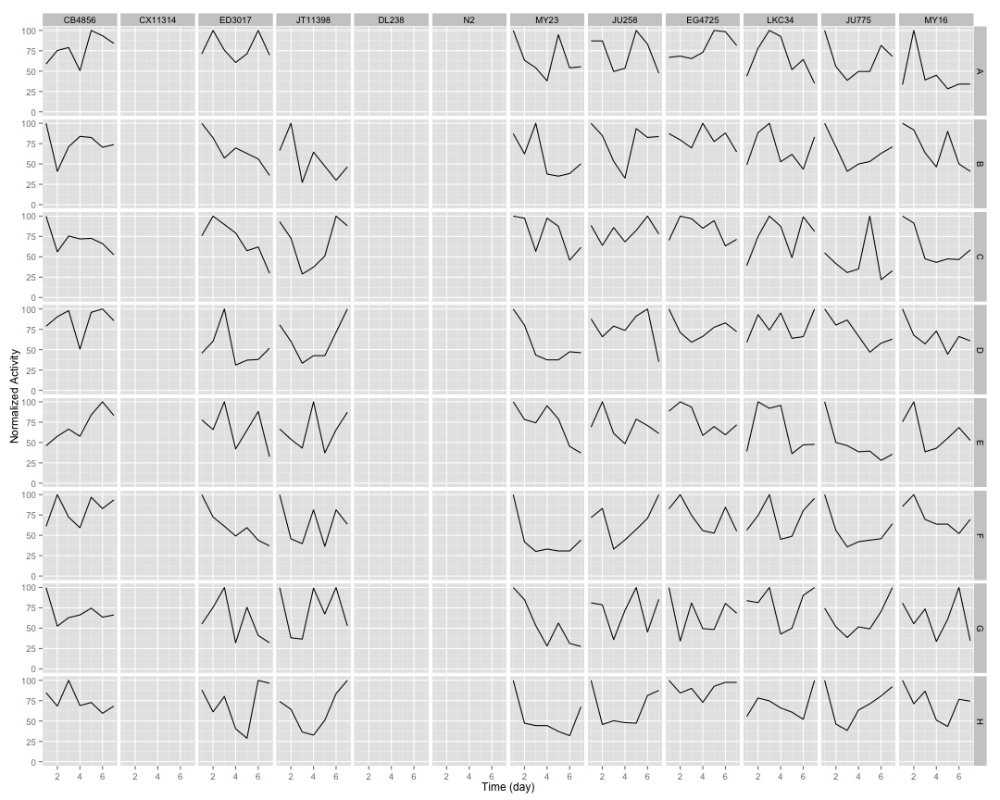 

## Setting Top of Curve by Well ##


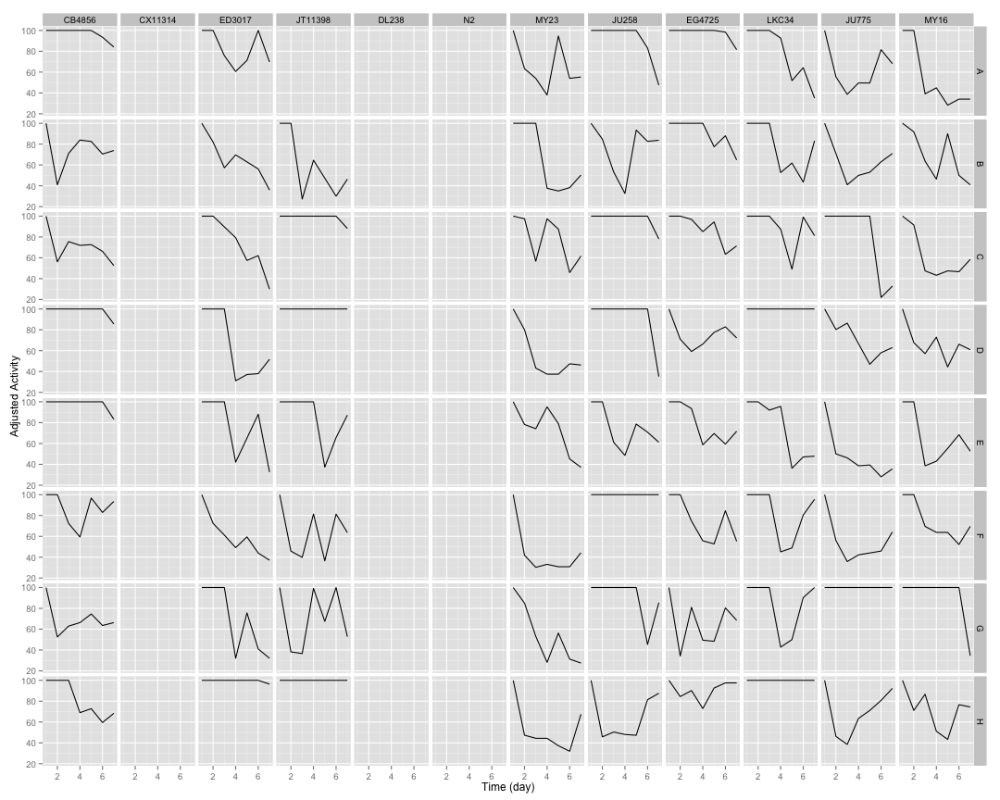 

## Well Curve Fitting ##


```
##     strain row      bparam       cparam
## 1   CB4856   A  0.14090354 17329.164576
## 2   CB4856   B  0.17343087  1746.219794
## 3   CB4856   C  0.73831405    11.717669
## 4   CB4856   D  0.20502608 20257.995472
## 5   CB4856   E -1.05457046     1.394554
## 6   CB4856   F  0.16612957 17722.978074
## 7   CB4856   G  0.46640731    19.997052
## 8   CB4856   H  0.61023168    21.364983
## 9  CX11314   A  0.00000000     0.000000
## 10 CX11314   B  0.00000000     0.000000
## 11 CX11314   C  0.00000000     0.000000
## 12 CX11314   D  0.00000000     0.000000
## 13 CX11314   E  0.00000000     0.000000
## 14 CX11314   F  0.00000000     0.000000
## 15 CX11314   G  0.00000000     0.000000
## 16 CX11314   H  0.00000000     0.000000
## 17  ED3017   A  0.14381423 25435.854114
## 18  ED3017   B  1.40200069     5.971722
## 19  ED3017   C  3.20918917     5.969215
## 20  ED3017   D  0.30113486     4.453337
## 21  ED3017   E  0.66749033    10.671421
## 22  ED3017   F  1.34747249     4.865560
## 23  ED3017   G  0.70551863     5.997861
## 24  ED3017   H  0.09948453 23437.063596
## 25 JT11398   A  0.00000000     0.000000
## 26 JT11398   B  0.93905947     4.267022
## 27 JT11398   C  0.09226409  8470.120560
## 28 JT11398   D  0.05320346 19241.782917
## 29 JT11398   E  0.06931549 17623.531357
## 30 JT11398   F  0.39124176    14.773548
## 31 JT11398   G  0.10086236 20188.097466
## 32 JT11398   H  0.06096876 17699.119652
## 33   DL238   A  0.00000000     0.000000
## 34   DL238   B  0.00000000     0.000000
## 35   DL238   C  0.00000000     0.000000
## 36   DL238   D  0.00000000     0.000000
## 37   DL238   E  0.00000000     0.000000
## 38   DL238   F  0.00000000     0.000000
## 39   DL238   G  0.00000000     0.000000
## 40   DL238   H  0.00000000     0.000000
## 41      N2   A  0.00000000     0.000000
## 42      N2   B  0.00000000     0.000000
## 43      N2   C  0.00000000     0.000000
## 44      N2   D  0.00000000     0.000000
## 45      N2   E  0.00000000     0.000000
## 46      N2   F  0.00000000     0.000000
## 47      N2   G  0.00000000     0.000000
## 48      N2   H  0.00000000     0.000000
## 49    MY23   A  0.66689316     9.055345
## 50    MY23   B  1.29940546     4.725373
## 51    MY23   C  1.62364887     8.718828
## 52    MY23   D  1.31503666     4.053957
## 53    MY23   E  3.60326345     6.202796
## 54    MY23   F  1.19211569     2.604216
## 55    MY23   G  1.82937151     3.841350
## 56    MY23   H  0.85586035     3.833475
## 57   JU258   A  0.47993059    26.591798
## 58   JU258   B  0.31699212   123.891034
## 59   JU258   C  0.16674987 19684.403366
## 60   JU258   D  0.44067999    49.213122
## 61   JU258   E  0.36312851    35.584101
## 62   JU258   F  0.07367170 20205.829710
## 63   JU258   G  0.10109345 25352.285833
## 64   JU258   H  0.18329939   118.932025
## 65  EG4725   A  0.15362040 16773.986509
## 66  EG4725   B  0.29260946   497.355486
## 67  EG4725   C  2.26457106     9.823063
## 68  EG4725   D  0.38572050    64.194638
## 69  EG4725   E  1.30159097     9.898195
## 70  EG4725   F  0.90947753    10.484454
## 71  EG4725   G  0.35339351    22.134979
## 72  EG4725   H  0.26125454 21890.091177
## 73   LKC34   A  0.18790457   134.847173
## 74   LKC34   B  0.08626478 24237.540753
## 75   LKC34   C  0.12990376 18568.293465
## 76   LKC34   D  0.14852236 20689.088776
## 77   LKC34   E  0.53987268    12.060481
## 78   LKC34   F  0.10584111 16736.584110
## 79   LKC34   G  0.14315219 26356.605175
## 80   LKC34   H  0.09426820 18988.824826
## 81   JU775   A  0.40335598    12.922776
## 82   JU775   B  0.63366470     8.463533
## 83   JU775   C -0.02109103 17683.694201
## 84   JU775   D  1.29310828     7.553385
## 85   JU775   E  1.31796725     3.116723
## 86   JU775   F  0.78022219     4.375158
## 87   JU775   G  0.05640512 17721.792536
## 88   JU775   H  0.09867780 19047.035418
## 89    MY16   A  0.51917779     2.302421
## 90    MY16   B  1.44948158     6.440825
## 91    MY16   C  1.23829132     5.147300
## 92    MY16   D  0.78899775     8.541673
## 93    MY16   E  0.67028022     7.165071
## 94    MY16   F  1.02094992     9.316921
## 95    MY16   G  0.36093041    14.495886
## 96    MY16   H  0.73014163    12.632958
```

## 2 Parameter Logistic Function Fits by Well ##


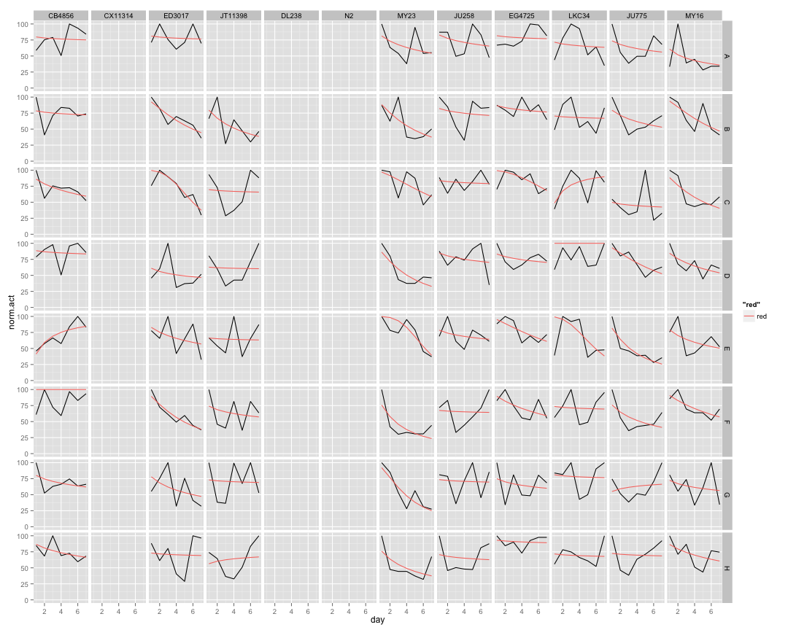 

## Strain Mean Data ##


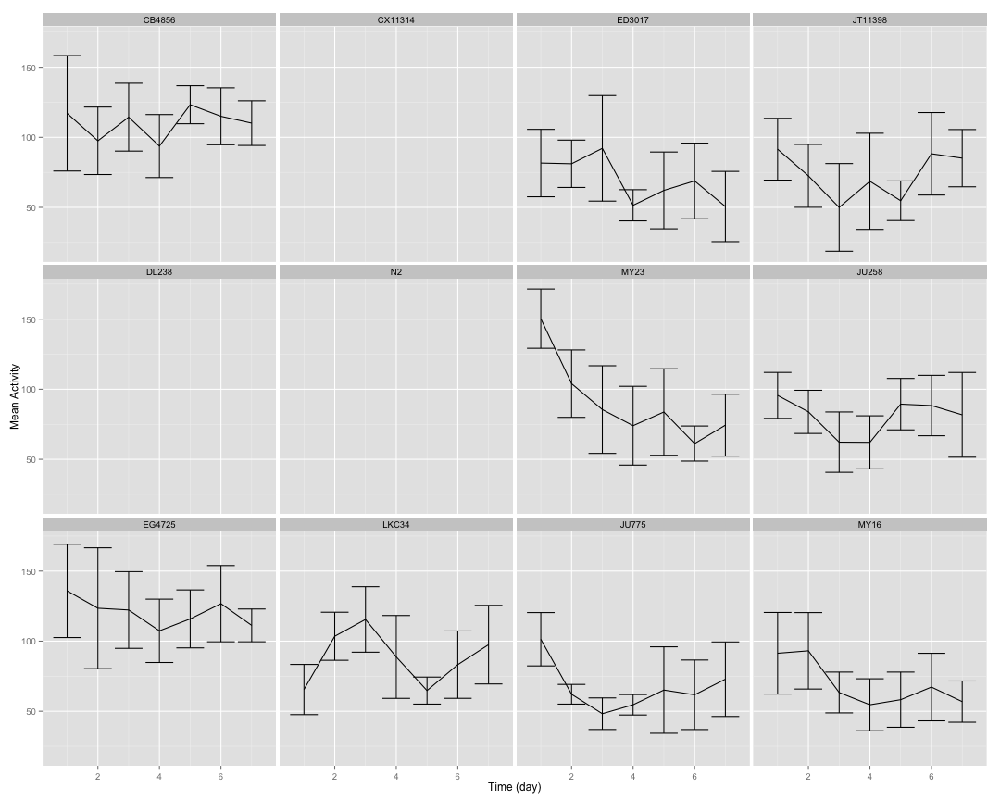 

## Strain Median Data ##

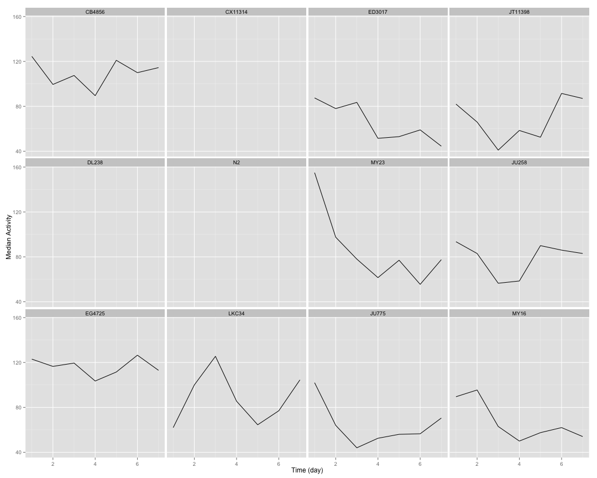 

## Strain Total Data ##

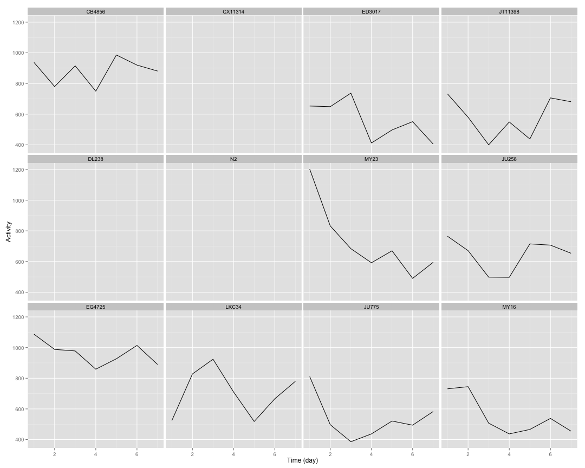 

## Strain Normalized Data ##


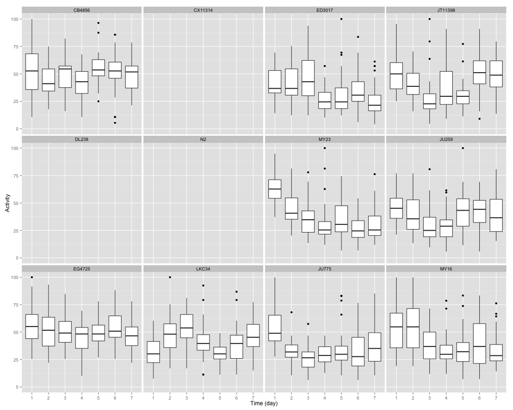 

## Setting Top of Curve by Strain ##


## Strain Curve Fitting ##


```
##     strain    bparam       cparam
## 1   CB4856 0.2373159 27428.603788
## 2  CX11314 0.0000000     0.000000
## 3   ED3017 1.3140881     9.265795
## 4  JT11398 0.1563927  5850.053012
## 5    DL238 0.0000000     0.000000
## 6       N2 0.0000000     0.000000
## 7     MY23 1.1429640     4.977077
## 8    JU258 0.2430726  3298.117731
## 9   EG4725 0.6638536    79.843121
## 10   LKC34 0.1318833 25068.280381
## 11   JU775 0.5164195    11.926610
## 12    MY16 1.1620848     9.125554
```

## 2 Parameter Logistic Function Fits by Strain ##


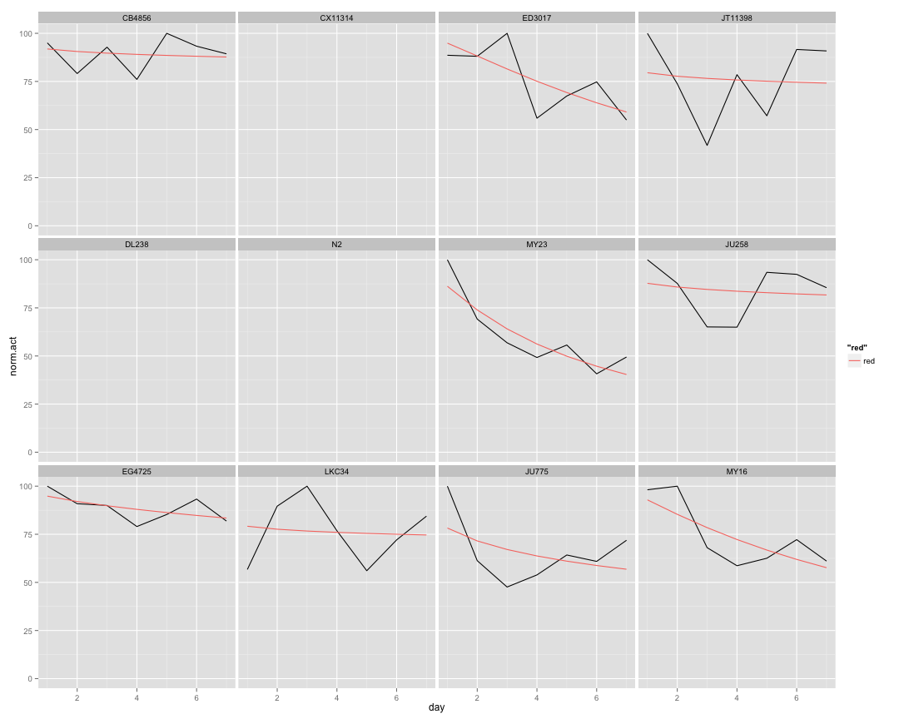 

## Implementing NLS ##


