```
## [1] "p03_3mgmL"
```
 
## Raw Activity ##


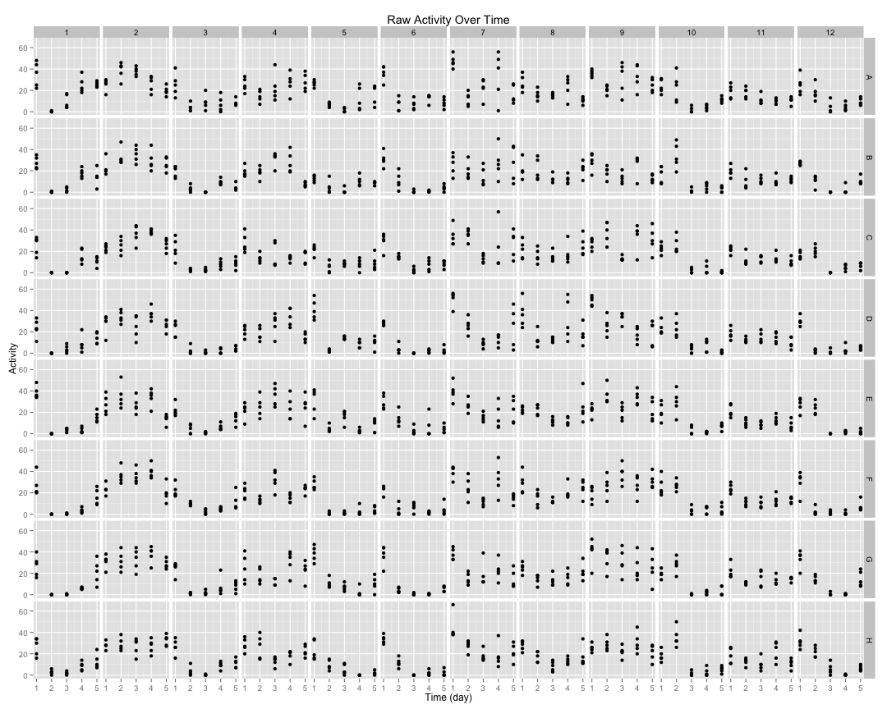 

## Cleaned Data ##


 


## Well Mean Data ##

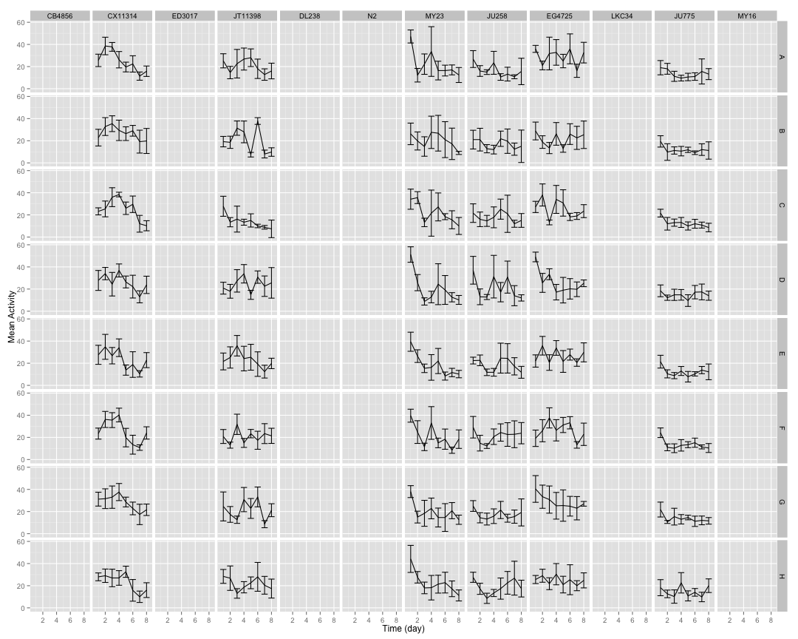 

## Well Median Data ##

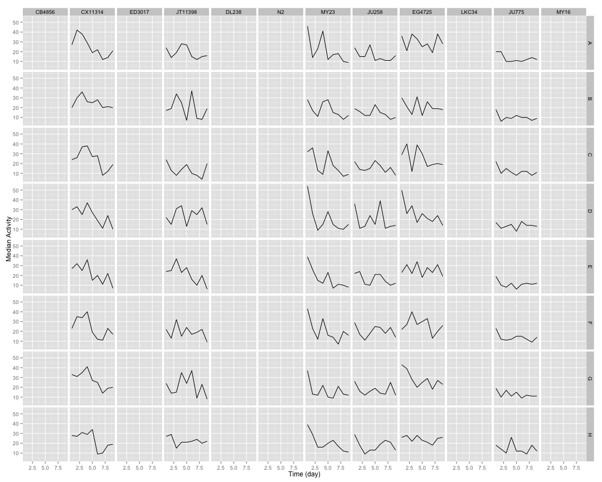 

## Well Total Data ##

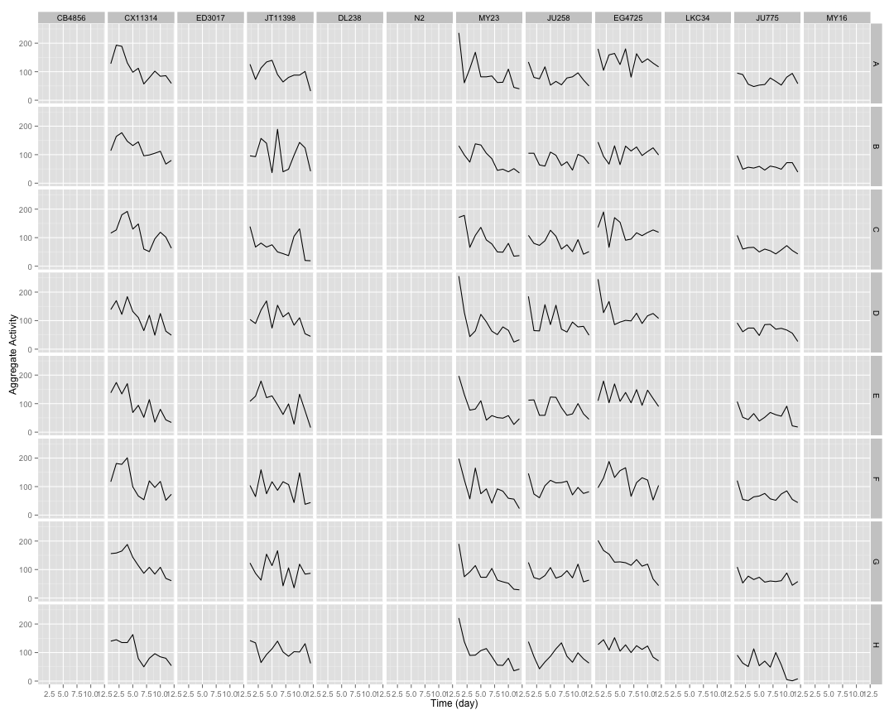 

## Well Normalized Data ##


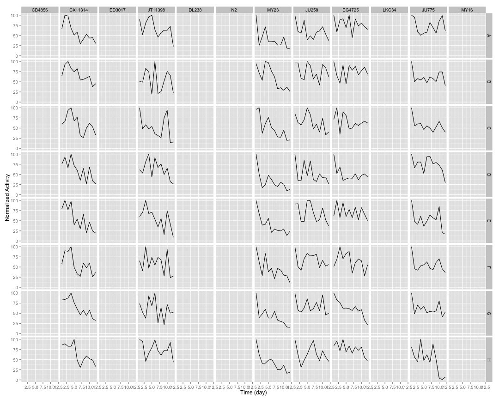 

## Setting Top of Curve by Well ##


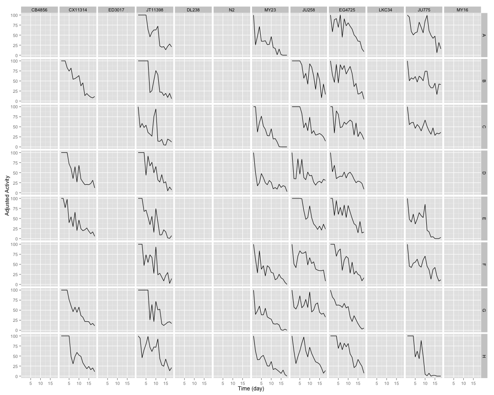 

## Well Curve Fitting ##


```
##     strain row    bparam    cparam
## 1   CB4856   A 0.0000000  0.000000
## 2   CB4856   B 0.0000000  0.000000
## 3   CB4856   C 0.0000000  0.000000
## 4   CB4856   D 0.0000000  0.000000
## 5   CB4856   E 0.0000000  0.000000
## 6   CB4856   F 0.0000000  0.000000
## 7   CB4856   G 0.0000000  0.000000
## 8   CB4856   H 0.0000000  0.000000
## 9  CX11314   A 0.0000000  0.000000
## 10 CX11314   B 2.7639962  9.030270
## 11 CX11314   C 0.0000000  0.000000
## 12 CX11314   D 1.7544916  7.757668
## 13 CX11314   E 1.9081123  6.565246
## 14 CX11314   F 0.0000000  0.000000
## 15 CX11314   G 2.2327986  8.333743
## 16 CX11314   H 1.9459732  8.164487
## 17  ED3017   A 0.0000000  0.000000
## 18  ED3017   B 0.0000000  0.000000
## 19  ED3017   C 0.0000000  0.000000
## 20  ED3017   D 0.0000000  0.000000
## 21  ED3017   E 0.0000000  0.000000
## 22  ED3017   F 0.0000000  0.000000
## 23  ED3017   G 0.0000000  0.000000
## 24  ED3017   H 0.0000000  0.000000
## 25 JT11398   A 2.0588879  9.345407
## 26 JT11398   B 0.8239224  4.935016
## 27 JT11398   C 1.0686277  4.595168
## 28 JT11398   D 2.1154925  9.068247
## 29 JT11398   E 1.9665562  6.655544
## 30 JT11398   F 1.1784576  6.767267
## 31 JT11398   G 1.0124012  6.718837
## 32 JT11398   H 1.9730554 11.277917
## 33   DL238   A 0.0000000  0.000000
## 34   DL238   B 0.0000000  0.000000
## 35   DL238   C 0.0000000  0.000000
## 36   DL238   D 0.0000000  0.000000
## 37   DL238   E 0.0000000  0.000000
## 38   DL238   F 0.0000000  0.000000
## 39   DL238   G 0.0000000  0.000000
## 40   DL238   H 0.0000000  0.000000
## 41      N2   A 0.0000000  0.000000
## 42      N2   B 0.0000000  0.000000
## 43      N2   C 0.0000000  0.000000
## 44      N2   D 0.0000000  0.000000
## 45      N2   E 0.0000000  0.000000
## 46      N2   F 0.0000000  0.000000
## 47      N2   G 0.0000000  0.000000
## 48      N2   H 0.0000000  0.000000
## 49    MY23   A 1.2483072  3.274002
## 50    MY23   B 0.0000000  0.000000
## 51    MY23   C 1.9766516  5.432685
## 52    MY23   D 1.1246166  2.607828
## 53    MY23   E 0.0000000  0.000000
## 54    MY23   F 1.2686197  4.267038
## 55    MY23   G 1.3073606  3.677392
## 56    MY23   H 1.3321761  3.814157
## 57   JU258   A 0.0000000  0.000000
## 58   JU258   B 1.3789645 12.947005
## 59   JU258   C 1.3053497  8.760608
## 60   JU258   D 0.7777984  5.305823
## 61   JU258   E 1.4888766  9.869435
## 62   JU258   F 0.9674322 10.367466
## 63   JU258   G 0.5748633 17.067533
## 64   JU258   H 0.9578928  8.309697
## 65  EG4725   A 2.7843259 12.568936
## 66  EG4725   B 3.8112306 12.315250
## 67  EG4725   C 0.8942474 10.117146
## 68  EG4725   D 0.8257351  4.937990
## 69  EG4725   E 1.6768833 10.565147
## 70  EG4725   F 1.8742659  9.253180
## 71  EG4725   G 1.8021011  7.676939
## 72  EG4725   H 2.6800878 11.226032
## 73   LKC34   A 0.0000000  0.000000
## 74   LKC34   B 0.0000000  0.000000
## 75   LKC34   C 0.0000000  0.000000
## 76   LKC34   D 0.0000000  0.000000
## 77   LKC34   E 0.0000000  0.000000
## 78   LKC34   F 0.0000000  0.000000
## 79   LKC34   G 0.0000000  0.000000
## 80   LKC34   H 0.0000000  0.000000
## 81   JU775   A 1.0383856 11.937247
## 82   JU775   B 0.6268274  8.884273
## 83   JU775   C 0.7023669  7.328434
## 84   JU775   D 0.0000000  0.000000
## 85   JU775   E 1.2261592  4.734228
## 86   JU775   F 0.8074247  5.696789
## 87   JU775   G 0.0000000  0.000000
## 88   JU775   H 2.1973316  5.956650
## 89    MY16   A 0.0000000  0.000000
## 90    MY16   B 0.0000000  0.000000
## 91    MY16   C 0.0000000  0.000000
## 92    MY16   D 0.0000000  0.000000
## 93    MY16   E 0.0000000  0.000000
## 94    MY16   F 0.0000000  0.000000
## 95    MY16   G 0.0000000  0.000000
## 96    MY16   H 0.0000000  0.000000
```

## 2 Parameter Logistic Function Fits by Well ##


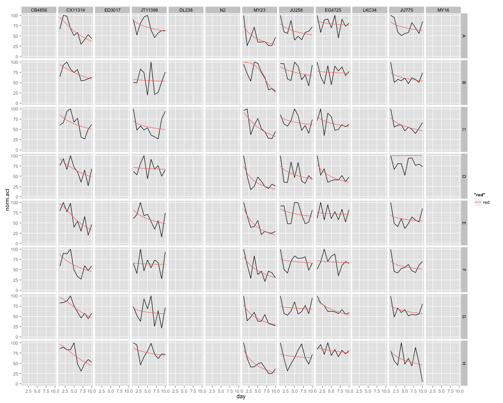 

## Strain Mean Data ##


 

## Strain Median Data ##

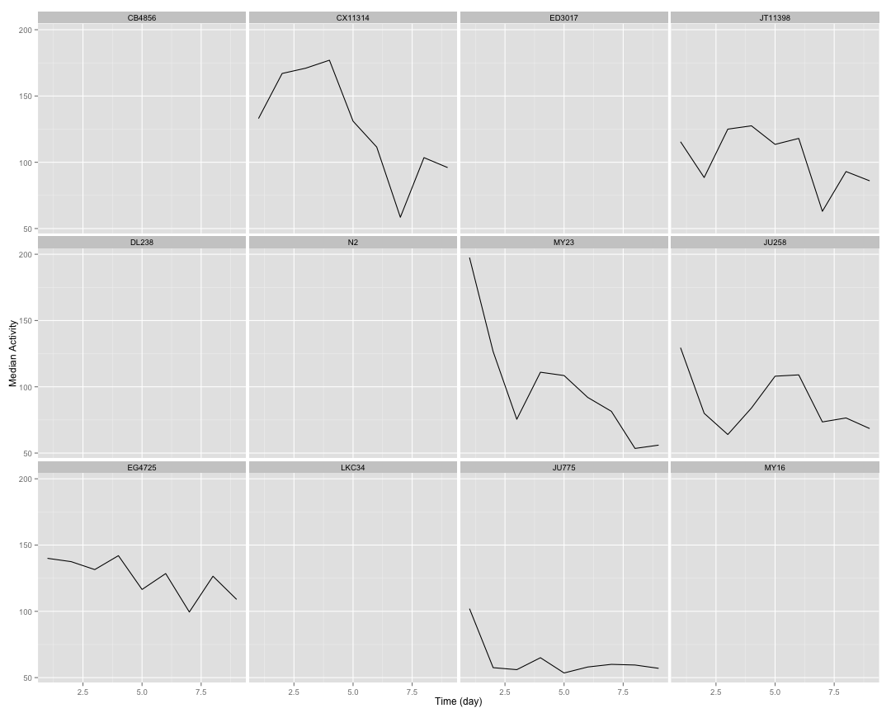 

## Strain Total Data ##

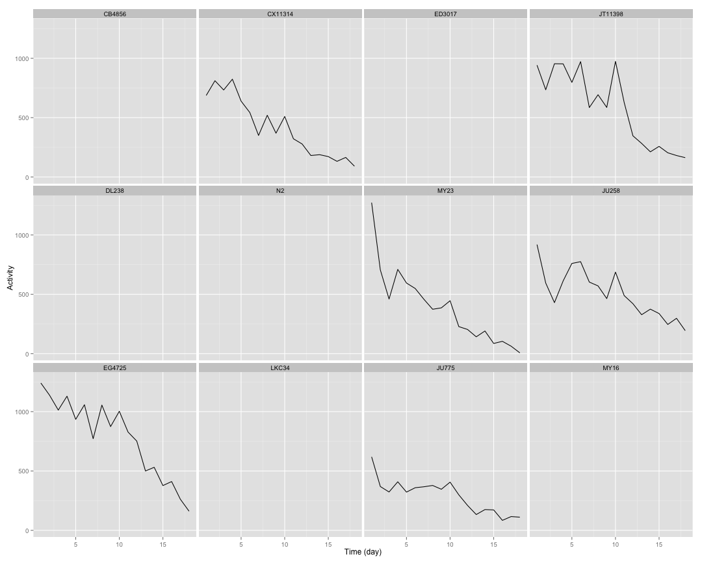 

## Strain Normalized Data ##


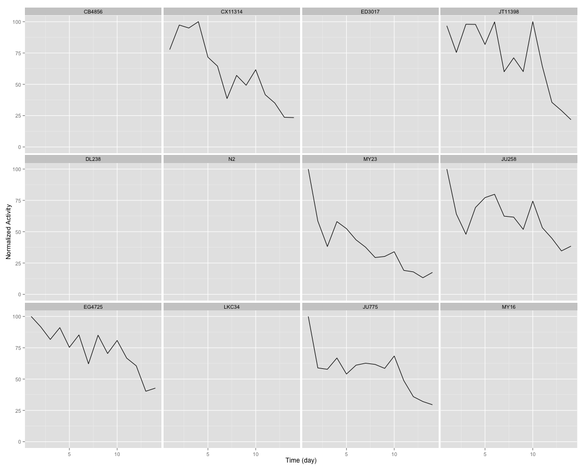 

## Setting Top of Curve by Strain ##


## Strain Curve Fitting ##


```
##     strain   bparam    cparam
## 1   CB4856 0.000000  0.000000
## 2  CX11314 2.334388  8.707573
## 3   ED3017 0.000000  0.000000
## 4  JT11398 3.445767 11.245714
## 5    DL238 0.000000  0.000000
## 6       N2 0.000000  0.000000
## 7     MY23 1.308606  3.725070
## 8    JU258 1.034315 10.086800
## 9   EG4725 2.689136 12.168458
## 10   LKC34 0.000000  0.000000
## 11   JU775 1.036536  6.910763
## 12    MY16 0.000000  0.000000
```

## 2 Parameter Logistic Function Fits by Strain ##


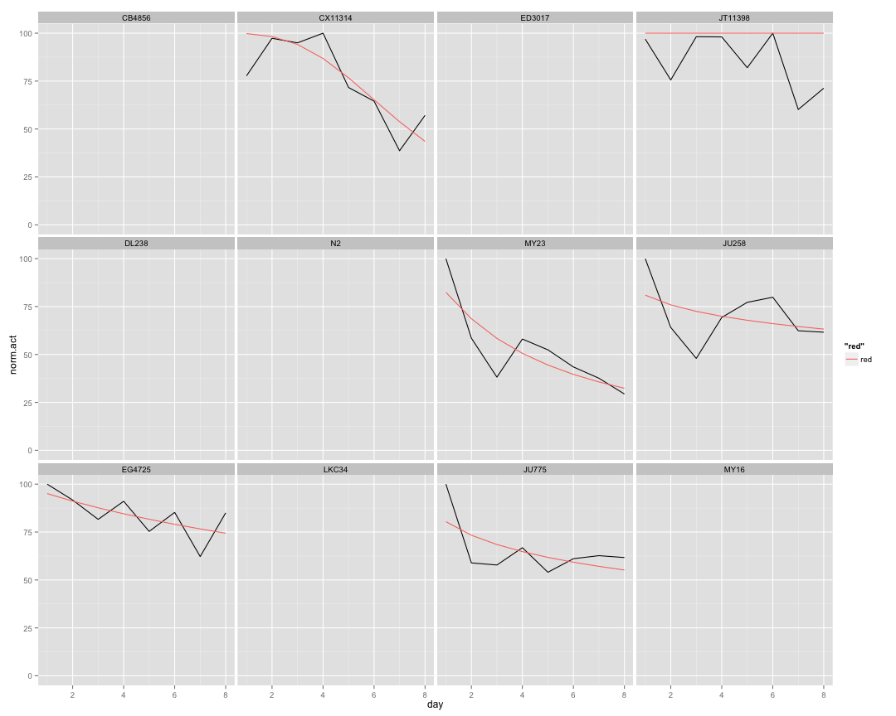 

## Implementing NLS ##


