```
## [1] "p03_4mgmL"
```
 
## Raw Activity ##


 

## Cleaned Data ##


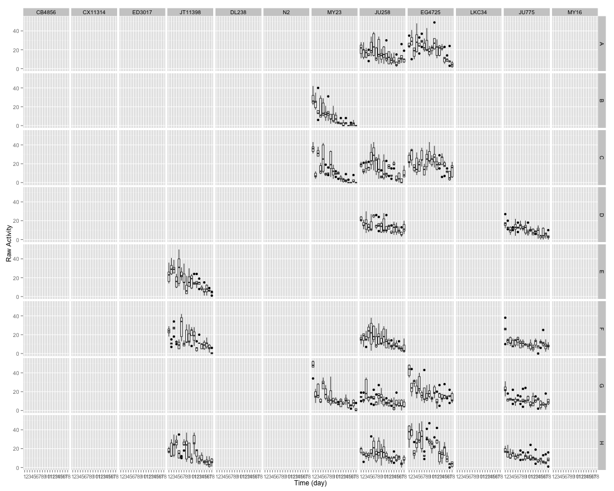 

## Temperature Normalized ##


## Well Mean Data ##

 

## Well Median Data ##

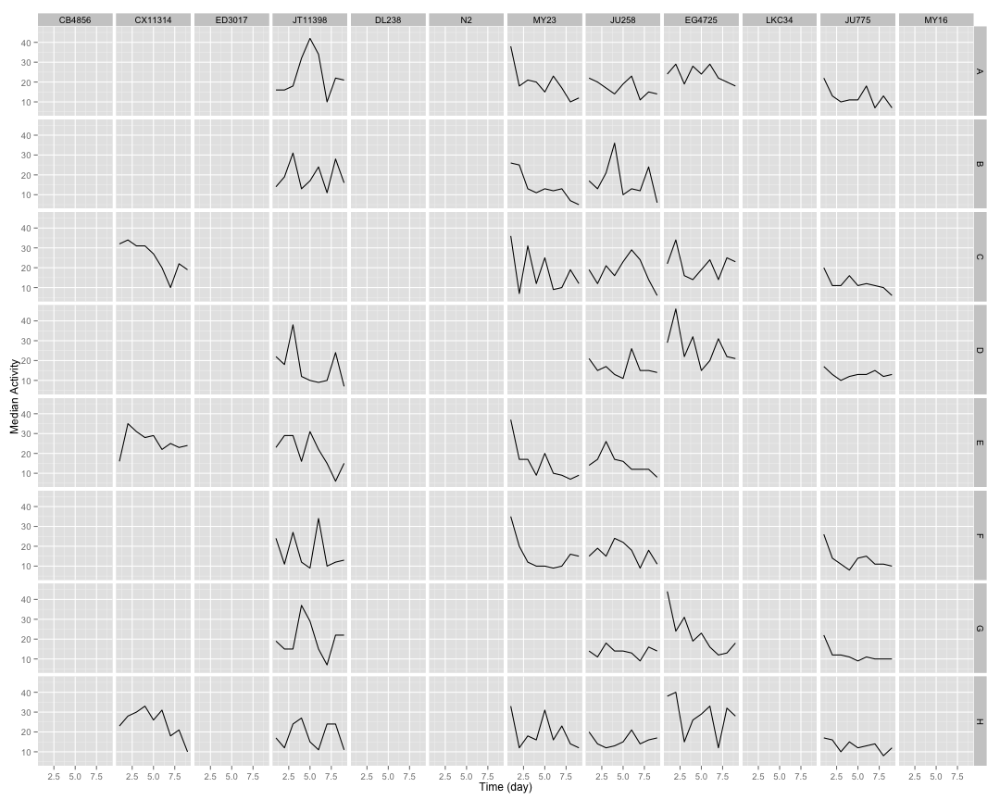 

## Well Total Data ##

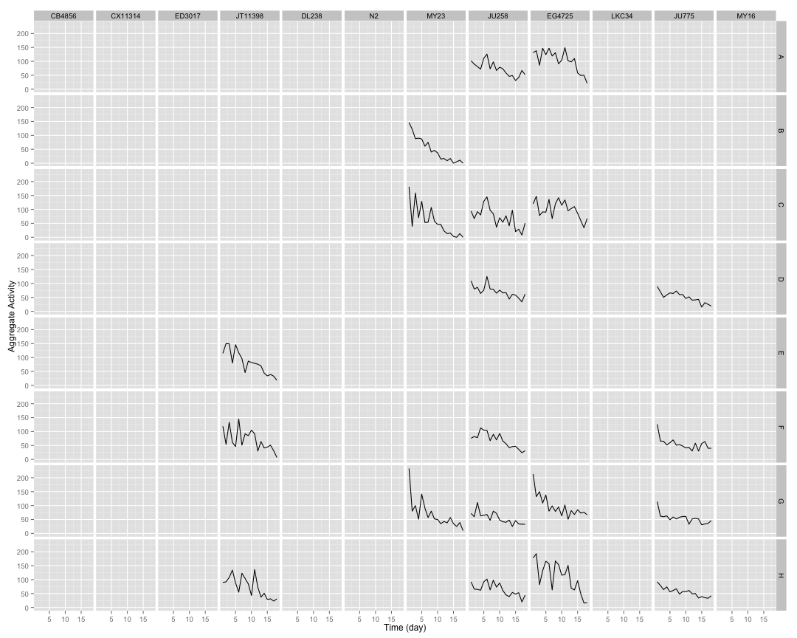 

## Well Normalized Data ##


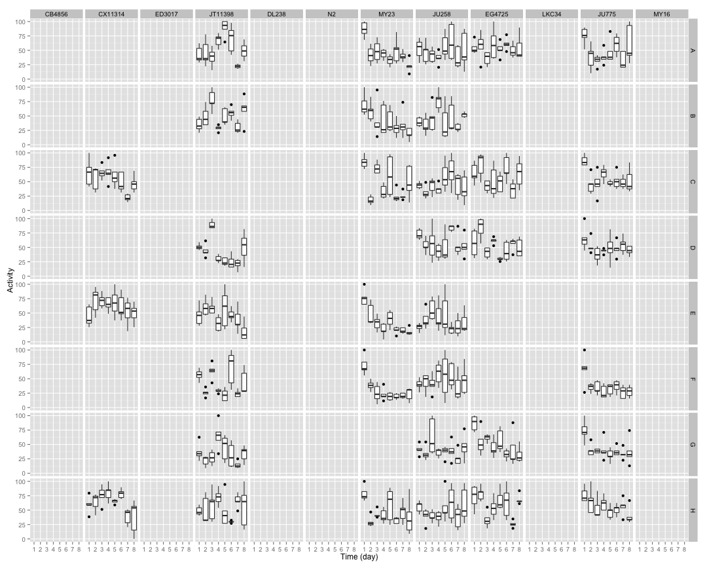 

## Well Curve Fitting ##


```
##     strain row      bparam       cparam
## 1   CB4856   A  0.00000000 0.000000e+00
## 2   CB4856   B  0.00000000 0.000000e+00
## 3   CB4856   C  0.00000000 0.000000e+00
## 4   CB4856   D  0.00000000 0.000000e+00
## 5   CB4856   E  0.00000000 0.000000e+00
## 6   CB4856   F  0.00000000 0.000000e+00
## 7   CB4856   G  0.00000000 0.000000e+00
## 8   CB4856   H  0.00000000 0.000000e+00
## 9  CX11314   A  0.00000000 0.000000e+00
## 10 CX11314   B  0.00000000 0.000000e+00
## 11 CX11314   C  2.45383350 9.355085e+00
## 12 CX11314   D  0.00000000 0.000000e+00
## 13 CX11314   E 20.98893064 3.124772e+01
## 14 CX11314   F  0.00000000 0.000000e+00
## 15 CX11314   G  0.00000000 0.000000e+00
## 16 CX11314   H  3.81058594 8.239613e+00
## 17  ED3017   A  0.00000000 0.000000e+00
## 18  ED3017   B  0.00000000 0.000000e+00
## 19  ED3017   C  0.00000000 0.000000e+00
## 20  ED3017   D  0.00000000 0.000000e+00
## 21  ED3017   E  0.00000000 0.000000e+00
## 22  ED3017   F  0.00000000 0.000000e+00
## 23  ED3017   G  0.00000000 0.000000e+00
## 24  ED3017   H  0.00000000 0.000000e+00
## 25 JT11398   A -0.14867167 3.891524e-01
## 26 JT11398   B  0.04982675 2.547133e+04
## 27 JT11398   C  0.00000000 0.000000e+00
## 28 JT11398   D  0.71519699 3.006429e+00
## 29 JT11398   E  2.04552158 8.711094e+00
## 30 JT11398   F  0.26145414 2.044213e+01
## 31 JT11398   G  0.01754766 2.429926e+04
## 32 JT11398   H  0.11269646 2.541895e+04
## 33   DL238   A  0.00000000 0.000000e+00
## 34   DL238   B  0.00000000 0.000000e+00
## 35   DL238   C  0.00000000 0.000000e+00
## 36   DL238   D  0.00000000 0.000000e+00
## 37   DL238   E  0.00000000 0.000000e+00
## 38   DL238   F  0.00000000 0.000000e+00
## 39   DL238   G  0.00000000 0.000000e+00
## 40   DL238   H  0.00000000 0.000000e+00
## 41      N2   A  0.00000000 0.000000e+00
## 42      N2   B  0.00000000 0.000000e+00
## 43      N2   C  0.00000000 0.000000e+00
## 44      N2   D  0.00000000 0.000000e+00
## 45      N2   E  0.00000000 0.000000e+00
## 46      N2   F  0.00000000 0.000000e+00
## 47      N2   G  0.00000000 0.000000e+00
## 48      N2   H  0.00000000 0.000000e+00
## 49    MY23   A  0.98776547 4.266325e+00
## 50    MY23   B  1.52614476 5.403834e+00
## 51    MY23   C  0.81040887 4.633730e+00
## 52    MY23   D  0.00000000 0.000000e+00
## 53    MY23   E  1.45391637 3.177127e+00
## 54    MY23   F  1.25853771 2.749553e+00
## 55    MY23   G  0.00000000 0.000000e+00
## 56    MY23   H  0.70059562 5.647911e+00
## 57   JU258   A  0.17403653 1.049783e+03
## 58   JU258   B  0.14754370 1.803332e+01
## 59   JU258   C  0.06006360 3.085320e+04
## 60   JU258   D  0.33951728 3.864048e+01
## 61   JU258   E  0.35693770 1.994949e+01
## 62   JU258   F  0.13890918 2.595822e+04
## 63   JU258   G  0.13970387 2.470130e+02
## 64   JU258   H  0.14038687 2.768342e+04
## 65  EG4725   A  0.35249922 5.087130e+02
## 66  EG4725   B  0.00000000 0.000000e+00
## 67  EG4725   C  0.11706167 4.738750e+04
## 68  EG4725   D  0.58979216 9.262644e+00
## 69  EG4725   E  0.00000000 0.000000e+00
## 70  EG4725   F  0.00000000 0.000000e+00
## 71  EG4725   G  1.07966677 5.587077e+00
## 72  EG4725   H  0.43970392 4.820582e+01
## 73   LKC34   A  0.00000000 0.000000e+00
## 74   LKC34   B  0.00000000 0.000000e+00
## 75   LKC34   C  0.00000000 0.000000e+00
## 76   LKC34   D  0.00000000 0.000000e+00
## 77   LKC34   E  0.00000000 0.000000e+00
## 78   LKC34   F  0.00000000 0.000000e+00
## 79   LKC34   G  0.00000000 0.000000e+00
## 80   LKC34   H  0.00000000 0.000000e+00
## 81   JU775   A  0.42561465 1.274421e+01
## 82   JU775   B  0.00000000 0.000000e+00
## 83   JU775   C  0.71768593 7.746697e+00
## 84   JU775   D  0.44525239 4.353909e+01
## 85   JU775   E  0.00000000 0.000000e+00
## 86   JU775   F  0.86283937 4.534344e+00
## 87   JU775   G  0.70380135 5.941663e+00
## 88   JU775   H  0.95723123 1.217597e+01
## 89    MY16   A  0.00000000 0.000000e+00
## 90    MY16   B  0.00000000 0.000000e+00
## 91    MY16   C  0.00000000 0.000000e+00
## 92    MY16   D  0.00000000 0.000000e+00
## 93    MY16   E  0.00000000 0.000000e+00
## 94    MY16   F  0.00000000 0.000000e+00
## 95    MY16   G  0.00000000 0.000000e+00
## 96    MY16   H  0.00000000 0.000000e+00
```

## 2 Parameter Logistic Function Fits by Well ##


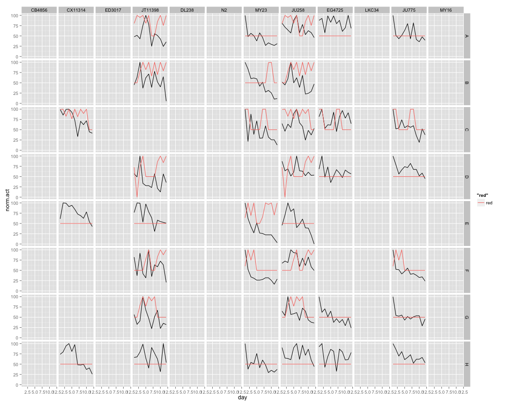 

## Strain Mean Data ##


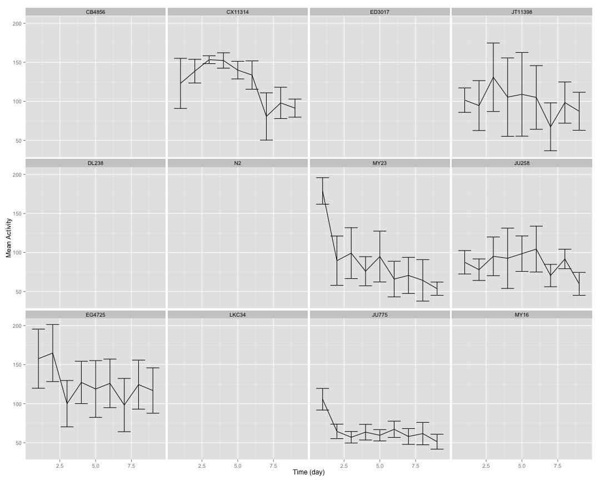 

## Strain Median Data ##

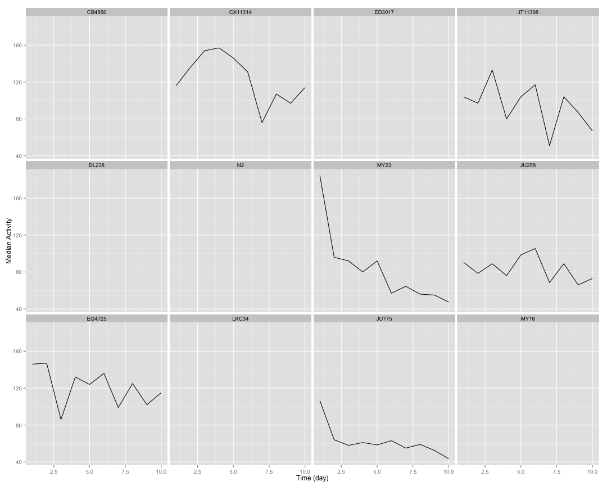 

## Strain Total Data ##

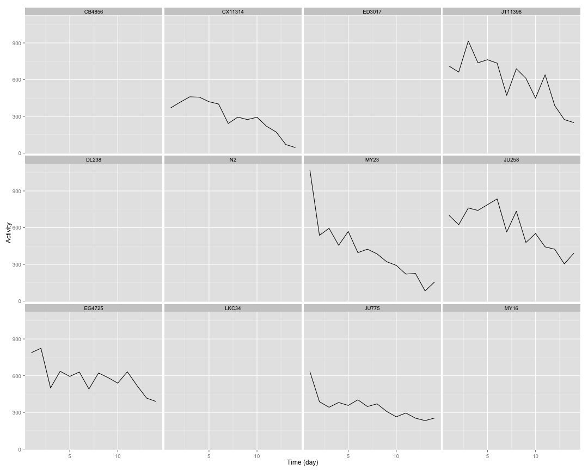 

## Strain Normalized Data ##


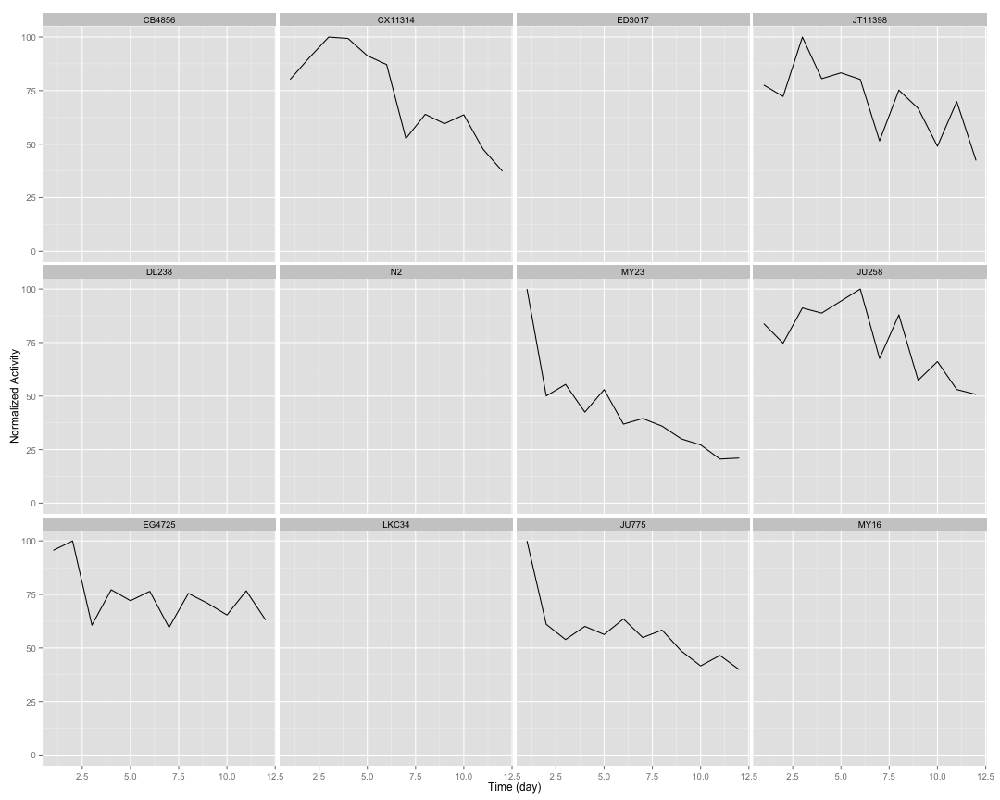 

## Strain Curve Fitting ##


```
##     strain    bparam     cparam
## 1   CB4856 0.0000000   0.000000
## 2  CX11314 3.1154360   9.386219
## 3   ED3017 0.0000000   0.000000
## 4  JT11398 0.4637017  56.331383
## 5    DL238 0.0000000   0.000000
## 6       N2 0.0000000   0.000000
## 7     MY23 1.0481522   3.991886
## 8    JU258 0.3985177 235.561177
## 9   EG4725 0.7184603  22.718832
## 10   LKC34 0.0000000   0.000000
## 11   JU775 0.6606724   8.784895
## 12    MY16 0.0000000   0.000000
```

## 2 Parameter Logistic Function Fits by Strain ##


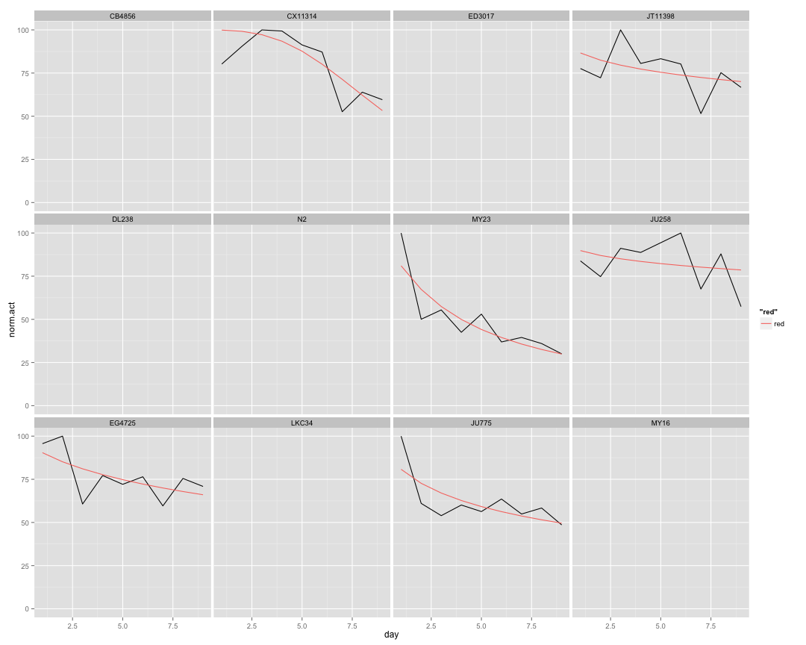 

## Plate Distribution ##

 

## Plate Data ##


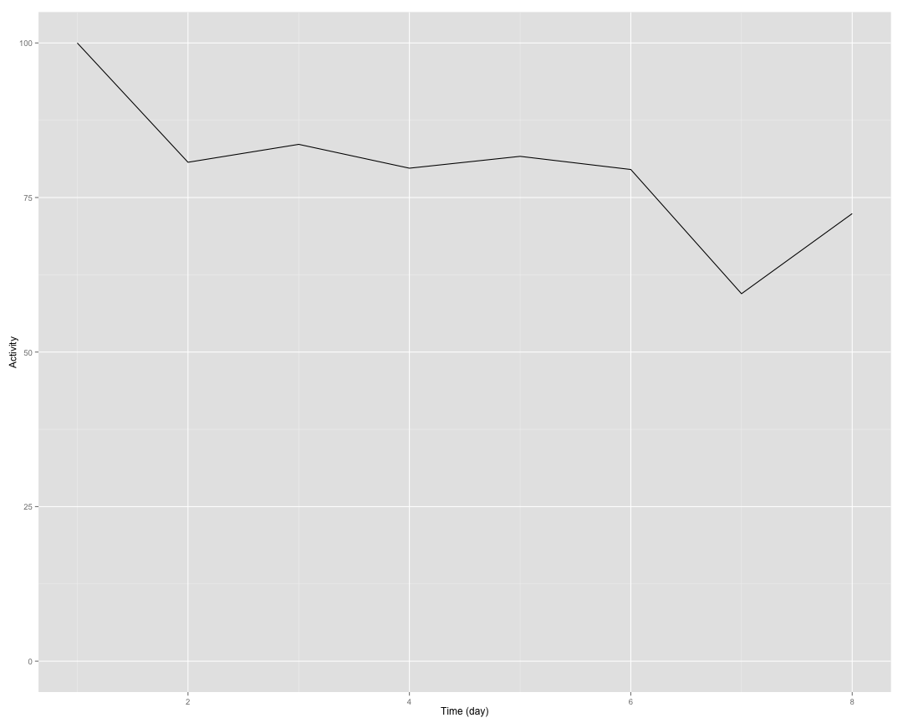 

## Implementing NLS ##


