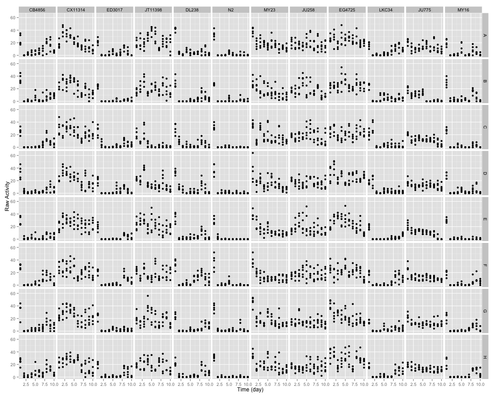
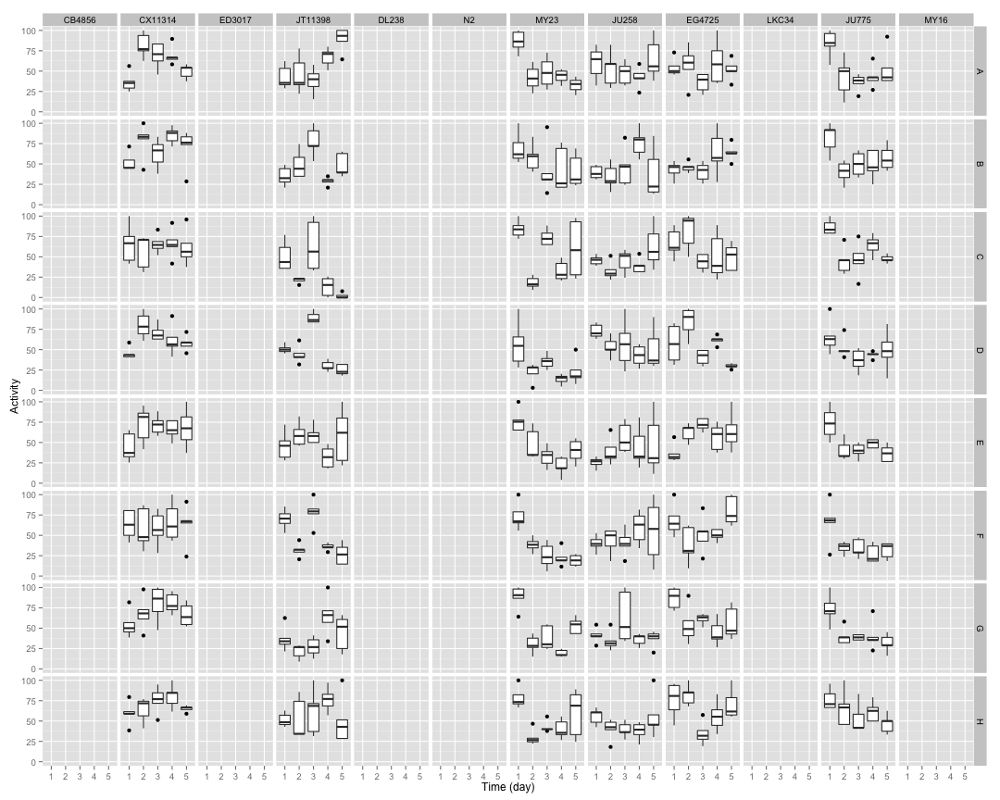
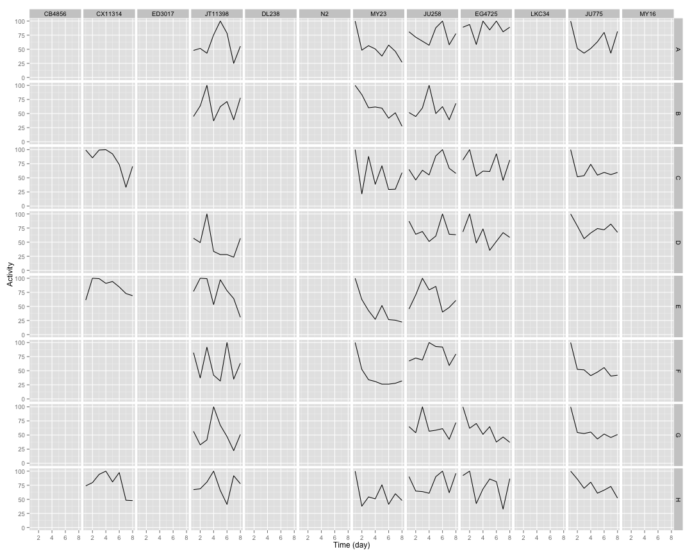
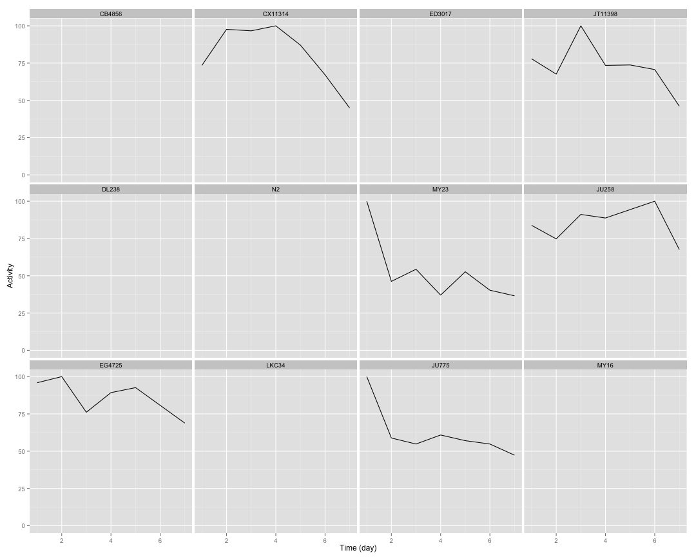

## Raw Activity

 


## Normalized Data

 


## Combined Data

 


## Summary Data

 

## Curve Fitting


```
##     strain row      bparam       cparam
## 1   CB4856   A  0.00000000 0.000000e+00
## 2   CB4856   B  0.00000000 0.000000e+00
## 3   CB4856   C  0.00000000 0.000000e+00
## 4   CB4856   D  0.00000000 0.000000e+00
## 5   CB4856   E  0.00000000 0.000000e+00
## 6   CB4856   F  0.00000000 0.000000e+00
## 7   CB4856   G  0.00000000 0.000000e+00
## 8   CB4856   H  0.00000000 0.000000e+00
## 9  CX11314   A  0.09588957 2.646786e+04
## 10 CX11314   B  0.14130840 2.547656e+04
## 11 CX11314   C  8.43901832 6.771846e+00
## 12 CX11314   D  0.13527715 2.579217e+04
## 13 CX11314   E  0.22933554 2.351480e+04
## 14 CX11314   F 18.78142689 5.797497e+00
## 15 CX11314   G 10.79777709 5.790396e+00
## 16 CX11314   H  0.22333036 2.191523e+04
## 17  ED3017   A  0.00000000 0.000000e+00
## 18  ED3017   B  0.00000000 0.000000e+00
## 19  ED3017   C  0.00000000 0.000000e+00
## 20  ED3017   D  0.00000000 0.000000e+00
## 21  ED3017   E  0.00000000 0.000000e+00
## 22  ED3017   F  0.00000000 0.000000e+00
## 23  ED3017   G  0.00000000 0.000000e+00
## 24  ED3017   H  0.00000000 0.000000e+00
## 25 JT11398   A -1.05102685 1.561720e+00
## 26 JT11398   B  0.05823249 2.294870e+04
## 27 JT11398   C  1.92724984 2.524697e+00
## 28 JT11398   D  0.75769515 2.980519e+00
## 29 JT11398   E  0.21647249 6.846945e+03
## 30 JT11398   F  0.12121467 3.628229e+02
## 31 JT11398   G -0.40349393 1.404874e+00
## 32 JT11398   H  0.28594838 6.562005e+01
## 33   DL238   A  0.00000000 0.000000e+00
## 34   DL238   B  0.00000000 0.000000e+00
## 35   DL238   C  0.00000000 0.000000e+00
## 36   DL238   D  0.00000000 0.000000e+00
## 37   DL238   E  0.00000000 0.000000e+00
## 38   DL238   F  0.00000000 0.000000e+00
## 39   DL238   G  0.00000000 0.000000e+00
## 40   DL238   H  0.00000000 0.000000e+00
## 41      N2   A  0.00000000 0.000000e+00
## 42      N2   B  0.00000000 0.000000e+00
## 43      N2   C  0.00000000 0.000000e+00
## 44      N2   D  0.00000000 0.000000e+00
## 45      N2   E  0.00000000 0.000000e+00
## 46      N2   F  0.00000000 0.000000e+00
## 47      N2   G  0.00000000 0.000000e+00
## 48      N2   H  0.00000000 0.000000e+00
## 49    MY23   A  0.98939936 4.224898e+00
## 50    MY23   B  1.57667259 5.239893e+00
## 51    MY23   C  0.89264379 4.376197e+00
## 52    MY23   D  0.95589565 3.578537e+00
## 53    MY23   E  1.60415109 3.090368e+00
## 54    MY23   F  1.85237441 2.541408e+00
## 55    MY23   G  1.05014985 2.843055e+00
## 56    MY23   H  0.73487351 5.197409e+00
## 57   JU258   A  0.13215634 2.507251e+04
## 58   JU258   B -0.45568146 1.056377e+00
## 59   JU258   C -0.74501371 9.689937e-01
## 60   JU258   D  0.10563617 2.291617e+04
## 61   JU258   E  0.09196108 2.698474e+04
## 62   JU258   F  0.17098138 2.257876e+04
## 63   JU258   G  0.07960188 1.194906e+04
## 64   JU258   H  0.13896169 2.793600e+04
## 65  EG4725   A  0.21484783 2.759784e+04
## 66  EG4725   B  0.13457791 2.348232e+04
## 67  EG4725   C  0.36173020 6.435759e+01
## 68  EG4725   D  1.03830367 5.397900e+00
## 69  EG4725   E  0.15515199 2.162584e+04
## 70  EG4725   F  0.20031825 1.317033e+02
## 71  EG4725   G  1.26373911 5.045507e+00
## 72  EG4725   H  0.46913368 4.789995e+01
## 73   LKC34   A  0.00000000 0.000000e+00
## 74   LKC34   B  0.00000000 0.000000e+00
## 75   LKC34   C  0.00000000 0.000000e+00
## 76   LKC34   D  0.00000000 0.000000e+00
## 77   LKC34   E  0.00000000 0.000000e+00
## 78   LKC34   F  0.00000000 0.000000e+00
## 79   LKC34   G  0.00000000 0.000000e+00
## 80   LKC34   H  0.00000000 0.000000e+00
## 81   JU775   A  0.45125400 1.153713e+01
## 82   JU775   B  1.50708916 3.804108e+00
## 83   JU775   C  0.72193452 7.487378e+00
## 84   JU775   D  0.70605078 1.410250e+01
## 85   JU775   E  0.93177658 5.381310e+00
## 86   JU775   F  0.99350245 4.136480e+00
## 87   JU775   G  1.05289536 4.356872e+00
## 88   JU775   H  1.20482747 9.018109e+00
## 89    MY16   A  0.00000000 0.000000e+00
## 90    MY16   B  0.00000000 0.000000e+00
## 91    MY16   C  0.00000000 0.000000e+00
## 92    MY16   D  0.00000000 0.000000e+00
## 93    MY16   E  0.00000000 0.000000e+00
## 94    MY16   F  0.00000000 0.000000e+00
## 95    MY16   G  0.00000000 0.000000e+00
## 96    MY16   H  0.00000000 0.000000e+00
```

```
##     strain    bparam       cparam
## 1   CB4856 0.0000000     0.000000
## 2  CX11314 7.1318616     6.622138
## 3   ED3017 0.0000000     0.000000
## 4  JT11398 0.1233619 60528.480622
## 5    DL238 0.0000000     0.000000
## 6       N2 0.0000000     0.000000
## 7     MY23 1.1260856     3.569119
## 8    JU258 0.2341724 22734.616952
## 9   EG4725 0.7883916    47.210769
## 10   LKC34 0.0000000     0.000000
## 11   JU775 0.9005901     5.899575
## 12    MY16 0.0000000     0.000000
```

