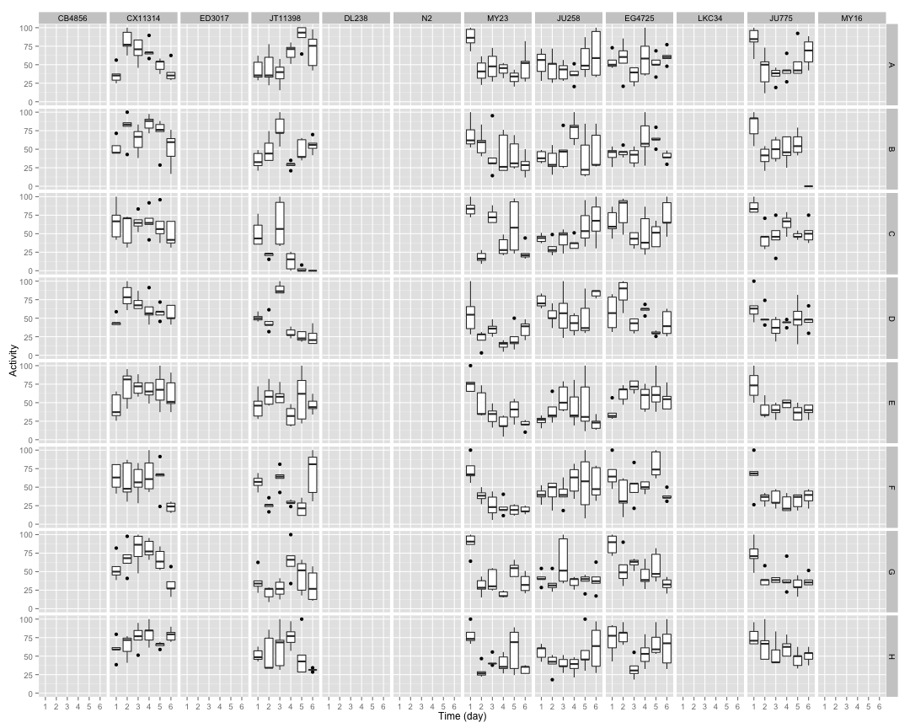

## Raw Activity

 


## Normalized Data

 


## Combined Data

 


## Summary Data

 

## Curve Fitting


```
##     strain row      bparam       cparam
## 1   CB4856   A  0.00000000     0.000000
## 2   CB4856   B  0.00000000     0.000000
## 3   CB4856   C  0.00000000     0.000000
## 4   CB4856   D  0.00000000     0.000000
## 5   CB4856   E  0.00000000     0.000000
## 6   CB4856   F  0.00000000     0.000000
## 7   CB4856   G  0.00000000     0.000000
## 8   CB4856   H  0.00000000     0.000000
## 9  CX11314   A  0.11825012 24570.862282
## 10 CX11314   B  0.16520965 22735.991483
## 11 CX11314   C  0.32496310 29829.247808
## 12 CX11314   D  0.14446201 23398.781225
## 13 CX11314   E  7.98092525    13.250934
## 14 CX11314   F  0.27717928 23860.866899
## 15 CX11314   G 36.14993761     5.218935
## 16 CX11314   H  0.19786650 23184.886976
## 17  ED3017   A  0.00000000     0.000000
## 18  ED3017   B  0.00000000     0.000000
## 19  ED3017   C  0.00000000     0.000000
## 20  ED3017   D  0.00000000     0.000000
## 21  ED3017   E  0.00000000     0.000000
## 22  ED3017   F  0.00000000     0.000000
## 23  ED3017   G  0.00000000     0.000000
## 24  ED3017   H  0.00000000     0.000000
## 25 JT11398   A -1.08426786     1.565621
## 26 JT11398   B  0.04991140 24201.134864
## 27 JT11398   C  1.60035922     2.580064
## 28 JT11398   D  0.55374953     3.456201
## 29 JT11398   E  0.19168684 25940.981279
## 30 JT11398   F  1.16200758     4.240600
## 31 JT11398   G -0.75234327     1.569594
## 32 JT11398   H  0.12550939 26908.624663
## 33   DL238   A  0.00000000     0.000000
## 34   DL238   B  0.00000000     0.000000
## 35   DL238   C  0.00000000     0.000000
## 36   DL238   D  0.00000000     0.000000
## 37   DL238   E  0.00000000     0.000000
## 38   DL238   F  0.00000000     0.000000
## 39   DL238   G  0.00000000     0.000000
## 40   DL238   H  0.00000000     0.000000
## 41      N2   A  0.00000000     0.000000
## 42      N2   B  0.00000000     0.000000
## 43      N2   C  0.00000000     0.000000
## 44      N2   D  0.00000000     0.000000
## 45      N2   E  0.00000000     0.000000
## 46      N2   F  0.00000000     0.000000
## 47      N2   G  0.00000000     0.000000
## 48      N2   H  0.00000000     0.000000
## 49    MY23   A  1.38229086     3.407186
## 50    MY23   B  1.45235681     5.568304
## 51    MY23   C  0.59828791     6.743756
## 52    MY23   D  1.53698104     2.814709
## 53    MY23   E  1.63050559     3.070838
## 54    MY23   F  2.09146243     2.470114
## 55    MY23   G  1.23031682     2.651106
## 56    MY23   H  0.60475798     6.562254
## 57   JU258   A  0.19984735  5484.936748
## 58   JU258   B -0.59804413     1.187464
## 59   JU258   C  0.09993923 22289.479348
## 60   JU258   D  1.11748383     7.851885
## 61   JU258   E  0.12418793 23557.809062
## 62   JU258   F  0.15371365 22271.984886
## 63   JU258   G  0.07407653 31802.710356
## 64   JU258   H  0.30638575   365.922347
## 65  EG4725   A  0.17688224 51518.912447
## 66  EG4725   B 12.10295960    27.471901
## 67  EG4725   C  1.19024246     6.206586
## 68  EG4725   D  1.26938367     4.788694
## 69  EG4725   E  0.15854670 21847.862683
## 70  EG4725   F  0.10274276 24083.305274
## 71  EG4725   G  1.04879930     5.969149
## 72  EG4725   H  0.74058643    14.693232
## 73   LKC34   A  0.00000000     0.000000
## 74   LKC34   B  0.00000000     0.000000
## 75   LKC34   C  0.00000000     0.000000
## 76   LKC34   D  0.00000000     0.000000
## 77   LKC34   E  0.00000000     0.000000
## 78   LKC34   F  0.00000000     0.000000
## 79   LKC34   G  0.00000000     0.000000
## 80   LKC34   H  0.00000000     0.000000
## 81   JU775   A  0.94569167     4.319874
## 82   JU775   B  0.68484799     7.978998
## 83   JU775   C  0.85791670     6.022047
## 84   JU775   D  0.92570673     8.865653
## 85   JU775   E  1.07611456     4.710824
## 86   JU775   F  1.35990552     3.382365
## 87   JU775   G  1.30999169     3.747694
## 88   JU775   H  1.44480777     7.370883
## 89    MY16   A  0.00000000     0.000000
## 90    MY16   B  0.00000000     0.000000
## 91    MY16   C  0.00000000     0.000000
## 92    MY16   D  0.00000000     0.000000
## 93    MY16   E  0.00000000     0.000000
## 94    MY16   F  0.00000000     0.000000
## 95    MY16   G  0.00000000     0.000000
## 96    MY16   H  0.00000000     0.000000
```

```
##     strain     bparam       cparam
## 1   CB4856  0.0000000     0.000000
## 2  CX11314 34.8804527     5.280794
## 3   ED3017  0.0000000     0.000000
## 4  JT11398  0.1383079 29824.764213
## 5    DL238  0.0000000     0.000000
## 6       N2  0.0000000     0.000000
## 7     MY23  1.2345120     3.380664
## 8    JU258  0.2661521 25582.787250
## 9   EG4725  0.5708218   150.490694
## 10   LKC34  0.0000000     0.000000
## 11   JU775  1.0350228     5.123979
## 12    MY16  0.0000000     0.000000
```

