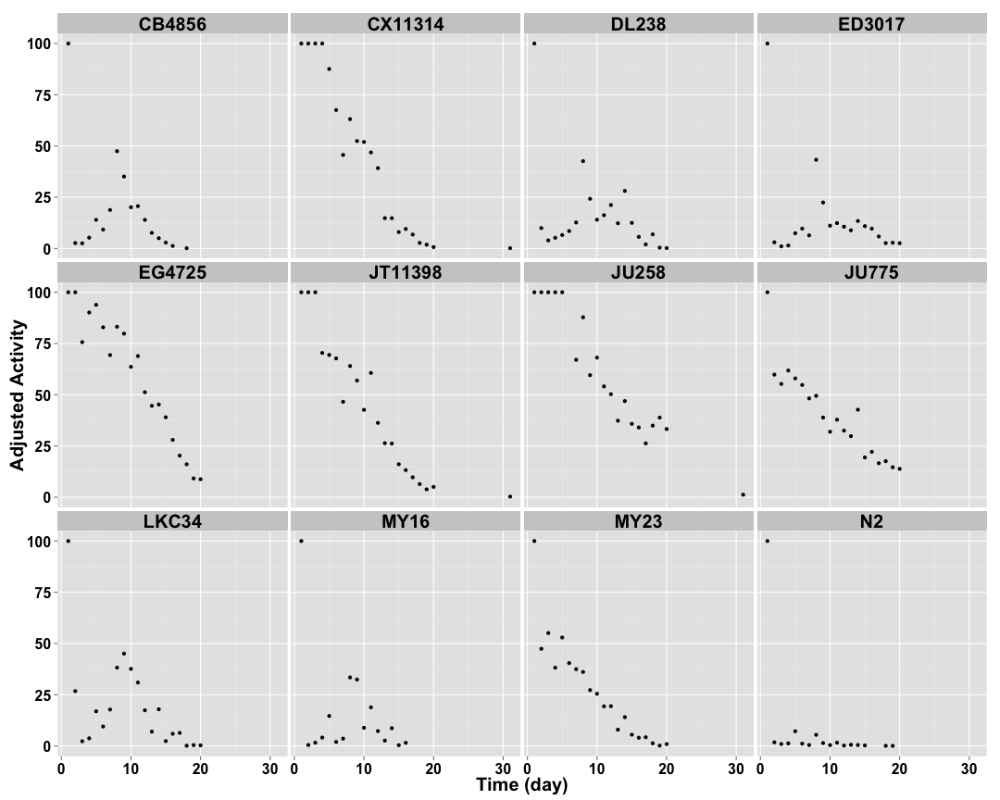

```
## [1] "p03_4mgmL"
```
 
## Raw Activity ##


 

## Cleaned Data ##


 


## Well Mean Data ##

 

## Well Median Data ##

 

## Well Total Data ##

 

## Well Normalized Data ##


 

## Setting Top of Curve by Well ##


 

## Well Curve Fitting ##


```
##     strain row    bparam    cparam
## 1   CB4856   A 0.0000000  0.000000
## 2   CB4856   B 0.0000000  0.000000
## 3   CB4856   C 0.0000000  0.000000
## 4   CB4856   D 0.0000000  0.000000
## 5   CB4856   E 0.0000000  0.000000
## 6   CB4856   F 0.0000000  0.000000
## 7   CB4856   G 0.0000000  0.000000
## 8   CB4856   H 0.0000000  0.000000
## 9  CX11314   A 0.0000000  0.000000
## 10 CX11314   B 0.0000000  0.000000
## 11 CX11314   C 3.3897927  9.259200
## 12 CX11314   D 0.0000000  0.000000
## 13 CX11314   E 4.4905481 10.432105
## 14 CX11314   F 0.0000000  0.000000
## 15 CX11314   G 0.0000000  0.000000
## 16 CX11314   H 3.6478536  8.445771
## 17  ED3017   A 0.0000000  0.000000
## 18  ED3017   B 0.0000000  0.000000
## 19  ED3017   C 0.0000000  0.000000
## 20  ED3017   D 0.0000000  0.000000
## 21  ED3017   E 0.0000000  0.000000
## 22  ED3017   F 0.0000000  0.000000
## 23  ED3017   G 0.0000000  0.000000
## 24  ED3017   H 0.0000000  0.000000
## 25 JT11398   A 1.1298688  5.314775
## 26 JT11398   B 1.3914193  6.246842
## 27 JT11398   C 0.0000000  0.000000
## 28 JT11398   D 1.0309348  3.212687
## 29 JT11398   E 1.8794780  9.566828
## 30 JT11398   F 0.7557959  7.076506
## 31 JT11398   G 0.9948063  3.757510
## 32 JT11398   H 1.5089720 10.247274
## 33   DL238   A 0.0000000  0.000000
## 34   DL238   B 0.0000000  0.000000
## 35   DL238   C 0.0000000  0.000000
## 36   DL238   D 0.0000000  0.000000
## 37   DL238   E 0.0000000  0.000000
## 38   DL238   F 0.0000000  0.000000
## 39   DL238   G 0.0000000  0.000000
## 40   DL238   H 0.0000000  0.000000
## 41      N2   A 0.0000000  0.000000
## 42      N2   B 0.0000000  0.000000
## 43      N2   C 0.0000000  0.000000
## 44      N2   D 0.0000000  0.000000
## 45      N2   E 0.0000000  0.000000
## 46      N2   F 0.0000000  0.000000
## 47      N2   G 0.0000000  0.000000
## 48      N2   H 0.0000000  0.000000
## 49    MY23   A 1.4332120  4.034444
## 50    MY23   B 2.0470207  5.153976
## 51    MY23   C 1.3839079  4.107322
## 52    MY23   D 0.0000000  0.000000
## 53    MY23   E 1.6846819  3.155682
## 54    MY23   F 1.2588441  2.797692
## 55    MY23   G 0.0000000  0.000000
## 56    MY23   H 1.0016690  4.963575
## 57   JU258   A 0.9269829 11.932211
## 58   JU258   B 0.9200059  4.717041
## 59   JU258   C 0.7975589  7.628262
## 60   JU258   D 0.6938612 11.901958
## 61   JU258   E 2.9824548  7.034545
## 62   JU258   F 2.3097411 12.022239
## 63   JU258   G 0.7727183  7.720509
## 64   JU258   H 1.1075952 14.765569
## 65  EG4725   A 3.5070027 14.353422
## 66  EG4725   B 0.0000000  0.000000
## 67  EG4725   C 0.6207141 27.703172
## 68  EG4725   D 1.2823416  6.896941
## 69  EG4725   E 0.0000000  0.000000
## 70  EG4725   F 0.0000000  0.000000
## 71  EG4725   G 0.8550455  6.146158
## 72  EG4725   H 1.4688320 10.842075
## 73   LKC34   A 0.0000000  0.000000
## 74   LKC34   B 0.0000000  0.000000
## 75   LKC34   C 0.0000000  0.000000
## 76   LKC34   D 0.0000000  0.000000
## 77   LKC34   E 0.0000000  0.000000
## 78   LKC34   F 0.0000000  0.000000
## 79   LKC34   G 0.0000000  0.000000
## 80   LKC34   H 0.0000000  0.000000
## 81   JU775   A 0.9576484  6.383161
## 82   JU775   B 0.0000000  0.000000
## 83   JU775   C 1.5054798  5.679201
## 84   JU775   D 1.2466166 10.453984
## 85   JU775   E 0.0000000  0.000000
## 86   JU775   F 0.6502637  4.982616
## 87   JU775   G 0.6415862  6.447784
## 88   JU775   H 0.9912180 12.461351
## 89    MY16   A 0.0000000  0.000000
## 90    MY16   B 0.0000000  0.000000
## 91    MY16   C 0.0000000  0.000000
## 92    MY16   D 0.0000000  0.000000
## 93    MY16   E 0.0000000  0.000000
## 94    MY16   F 0.0000000  0.000000
## 95    MY16   G 0.0000000  0.000000
## 96    MY16   H 0.0000000  0.000000
```

## 2 Parameter Logistic Function Fits by Well ##


 

## Strain Mean Data ##


 

## Strain Median Data ##

 

## Strain Total Data ##

 

## Strain Normalized Data ##


 

## Setting Top of Curve by Strain ##


 

## Strain Curve Fitting ##


```
##     strain    bparam    cparam
## 1   CB4856 0.0000000  0.000000
## 2  CX11314 3.8065975  9.528689
## 3   ED3017 0.0000000  0.000000
## 4  JT11398 2.7446352  9.988020
## 5    DL238 0.0000000  0.000000
## 6       N2 0.0000000  0.000000
## 7     MY23 1.3689276  3.841544
## 8    JU258 2.5109821 12.018313
## 9   EG4725 1.4492758 12.307181
## 10   LKC34 0.0000000  0.000000
## 11   JU775 0.9026277  7.040523
## 12    MY16 0.0000000  0.000000
```

## 2 Parameter Logistic Function Fits by Strain ##


 
