```
## [1] "p01_2mgmL2"
```
 
## Raw Activity ##


 

## Cleaned Data ##


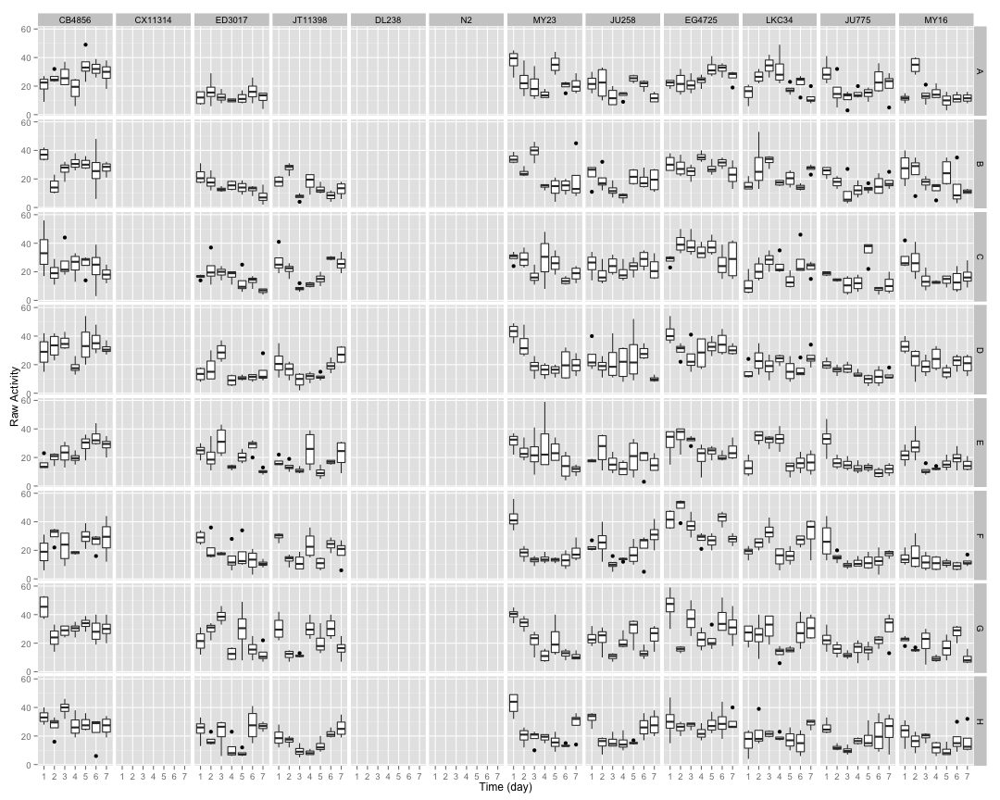 


## Well Mean Data ##

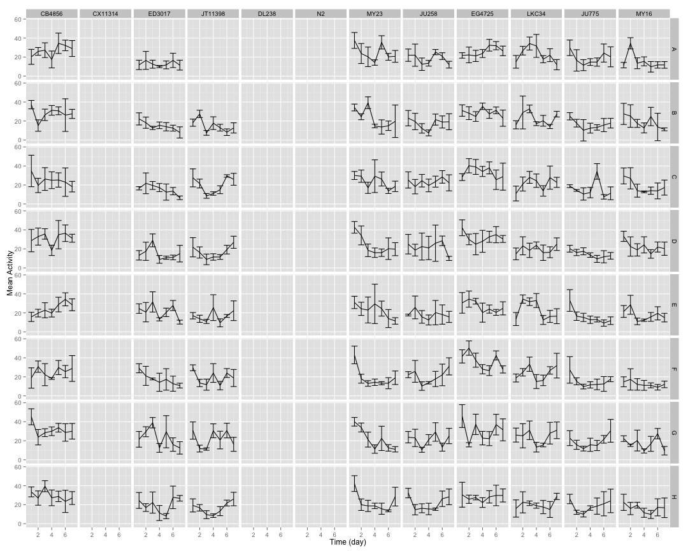 

## Well Median Data ##

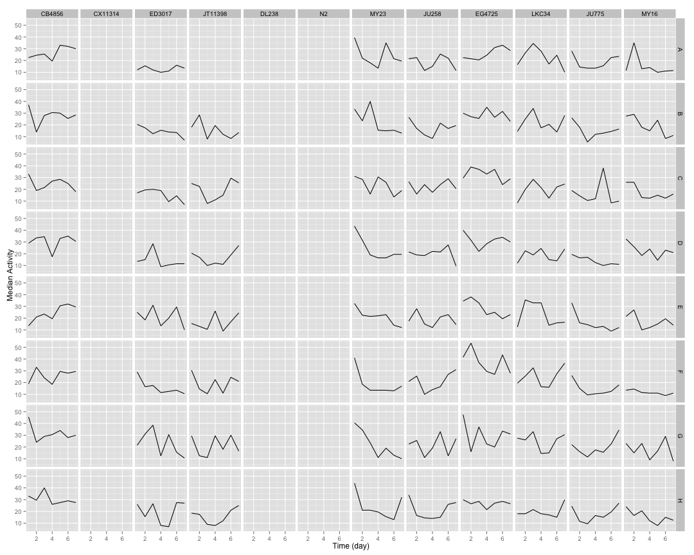 

## Well Total Data ##

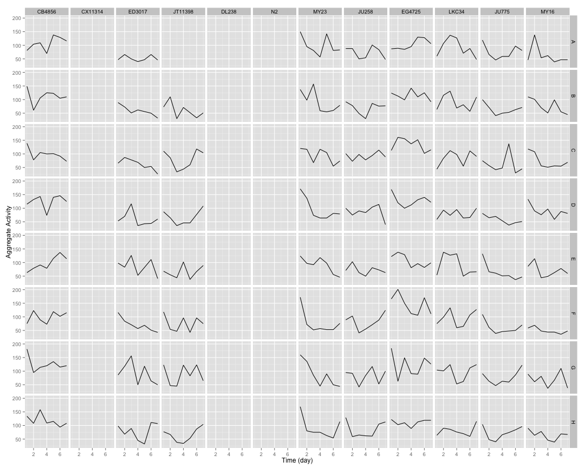 

## Well Normalized Data ##


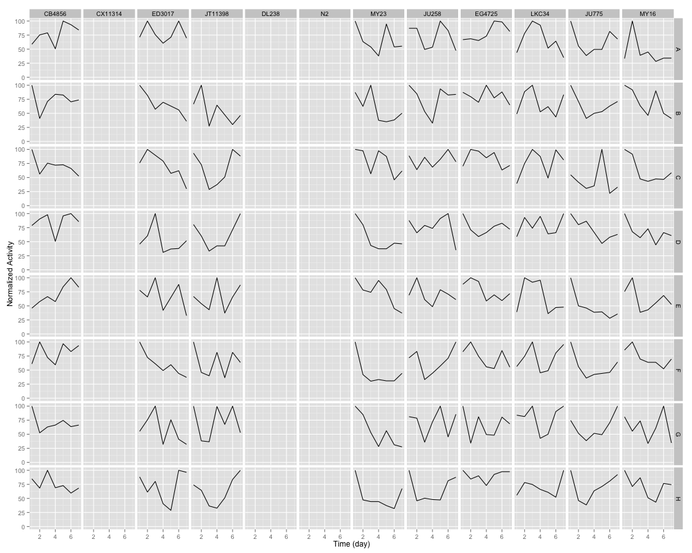 

## Setting Top of Curve by Well ##


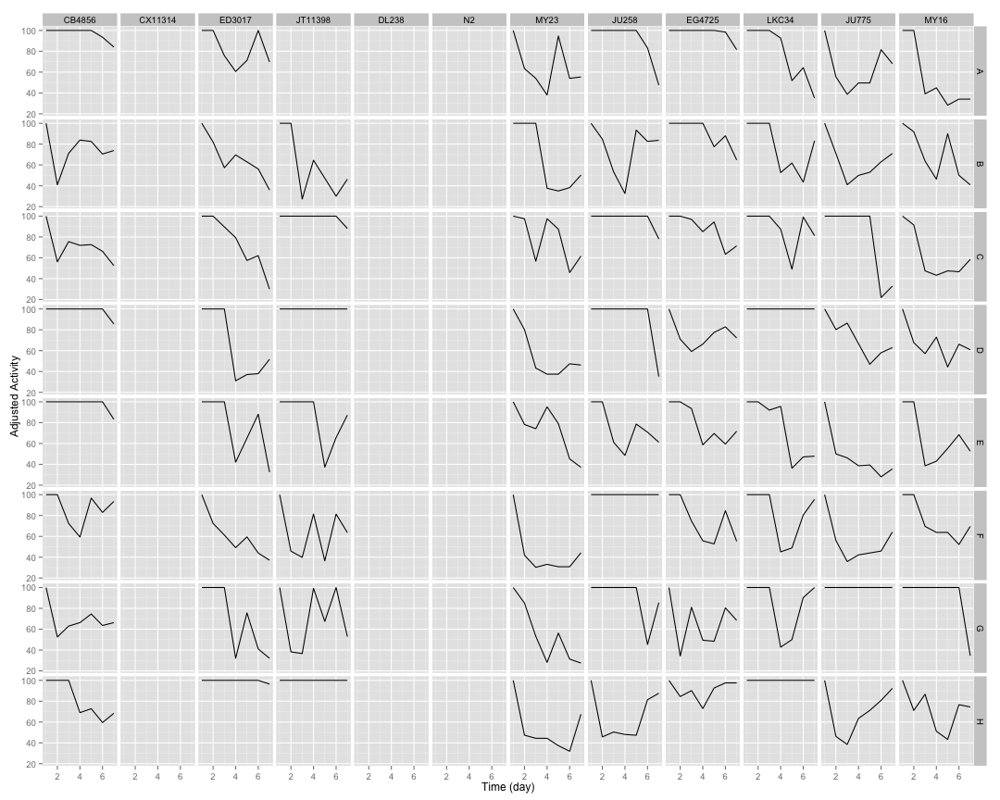 

## Well Curve Fitting ##


```
## Error in nlm(well_twoplog, c(2, 1), well.df, y, x): non-finite value supplied by 'nlm'
```

```
##     strain row     bparam       cparam
## 1   CB4856   A  0.1409035 17329.164576
## 2   CB4856   B  0.1734309  1746.219794
## 3   CB4856   C  0.7383140    11.717669
## 4   CB4856   D  0.2050261 20257.995472
## 5   CB4856   E -1.0545705     1.394554
## 6   CB4856   F  0.1661296 17722.978074
## 7   CB4856   G  0.4664073    19.997052
## 8   CB4856   H  0.6102317    21.364983
## 9  CX11314   A  5.5885835     5.437710
## 10 CX11314   B  0.0000000     0.000000
## 11 CX11314   C  0.0000000     0.000000
## 12 CX11314   D  0.0000000     0.000000
## 13 CX11314   E  0.0000000     0.000000
## 14 CX11314   F  0.0000000     0.000000
## 15 CX11314   G  0.0000000     0.000000
## 16 CX11314   H  0.0000000     0.000000
## 17  ED3017   A  0.0000000     0.000000
## 18  ED3017   B  0.0000000     0.000000
## 19  ED3017   C  0.0000000     0.000000
## 20  ED3017   D  0.0000000     0.000000
## 21  ED3017   E  0.0000000     0.000000
## 22  ED3017   F  0.0000000     0.000000
## 23  ED3017   G  0.0000000     0.000000
## 24  ED3017   H  0.0000000     0.000000
## 25 JT11398   A  0.0000000     0.000000
## 26 JT11398   B  0.0000000     0.000000
## 27 JT11398   C  0.0000000     0.000000
## 28 JT11398   D  0.0000000     0.000000
## 29 JT11398   E  0.0000000     0.000000
## 30 JT11398   F  0.0000000     0.000000
## 31 JT11398   G  0.0000000     0.000000
## 32 JT11398   H  0.0000000     0.000000
## 33   DL238   A  0.0000000     0.000000
## 34   DL238   B  0.0000000     0.000000
## 35   DL238   C  0.0000000     0.000000
## 36   DL238   D  0.0000000     0.000000
## 37   DL238   E  0.0000000     0.000000
## 38   DL238   F  0.0000000     0.000000
## 39   DL238   G  0.0000000     0.000000
## 40   DL238   H  0.0000000     0.000000
## 41      N2   A  0.0000000     0.000000
## 42      N2   B  0.0000000     0.000000
## 43      N2   C  0.0000000     0.000000
## 44      N2   D  0.0000000     0.000000
## 45      N2   E  0.0000000     0.000000
## 46      N2   F  0.0000000     0.000000
## 47      N2   G  0.0000000     0.000000
## 48      N2   H  0.0000000     0.000000
## 49    MY23   A  0.0000000     0.000000
## 50    MY23   B  0.0000000     0.000000
## 51    MY23   C  0.0000000     0.000000
## 52    MY23   D  0.0000000     0.000000
## 53    MY23   E  0.0000000     0.000000
## 54    MY23   F  0.0000000     0.000000
## 55    MY23   G  0.0000000     0.000000
## 56    MY23   H  0.0000000     0.000000
## 57   JU258   A  0.0000000     0.000000
## 58   JU258   B  0.0000000     0.000000
## 59   JU258   C  0.0000000     0.000000
## 60   JU258   D  0.0000000     0.000000
## 61   JU258   E  0.0000000     0.000000
## 62   JU258   F  0.0000000     0.000000
## 63   JU258   G  0.0000000     0.000000
## 64   JU258   H  0.0000000     0.000000
## 65  EG4725   A  0.0000000     0.000000
## 66  EG4725   B  0.0000000     0.000000
## 67  EG4725   C  0.0000000     0.000000
## 68  EG4725   D  0.0000000     0.000000
## 69  EG4725   E  0.0000000     0.000000
## 70  EG4725   F  0.0000000     0.000000
## 71  EG4725   G  0.0000000     0.000000
## 72  EG4725   H  0.0000000     0.000000
## 73   LKC34   A  0.0000000     0.000000
## 74   LKC34   B  0.0000000     0.000000
## 75   LKC34   C  0.0000000     0.000000
## 76   LKC34   D  0.0000000     0.000000
## 77   LKC34   E  0.0000000     0.000000
## 78   LKC34   F  0.0000000     0.000000
## 79   LKC34   G  0.0000000     0.000000
## 80   LKC34   H  0.0000000     0.000000
## 81   JU775   A  0.0000000     0.000000
## 82   JU775   B  0.0000000     0.000000
## 83   JU775   C  0.0000000     0.000000
## 84   JU775   D  0.0000000     0.000000
## 85   JU775   E  0.0000000     0.000000
## 86   JU775   F  0.0000000     0.000000
## 87   JU775   G  0.0000000     0.000000
## 88   JU775   H  0.0000000     0.000000
## 89    MY16   A  0.0000000     0.000000
## 90    MY16   B  0.0000000     0.000000
## 91    MY16   C  0.0000000     0.000000
## 92    MY16   D  0.0000000     0.000000
## 93    MY16   E  0.0000000     0.000000
## 94    MY16   F  0.0000000     0.000000
## 95    MY16   G  0.0000000     0.000000
## 96    MY16   H  0.0000000     0.000000
```

## 2 Parameter Logistic Function Fits by Well ##


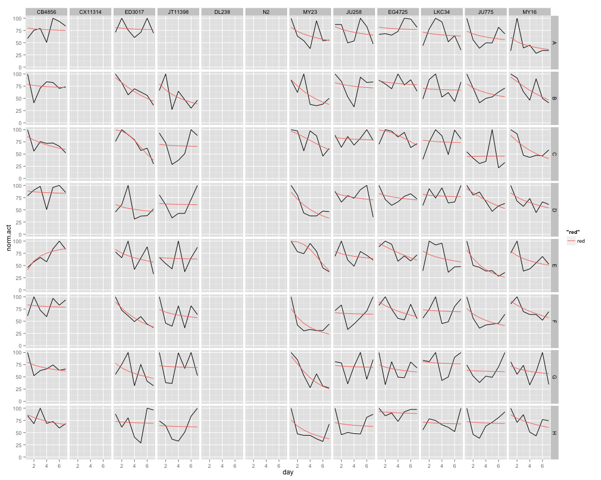 

## Strain Mean Data ##


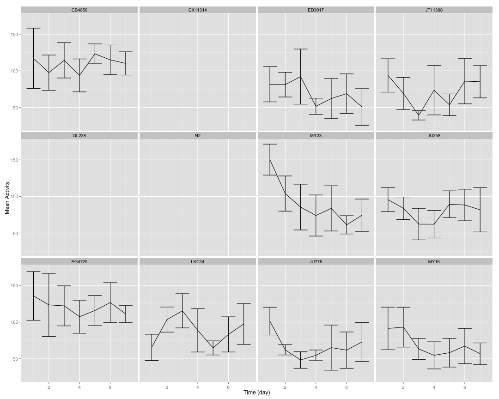 

## Strain Median Data ##

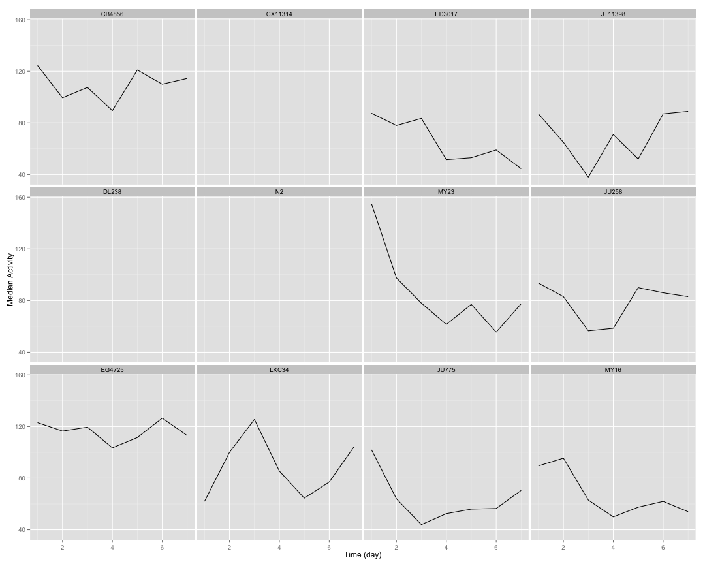 

## Strain Total Data ##

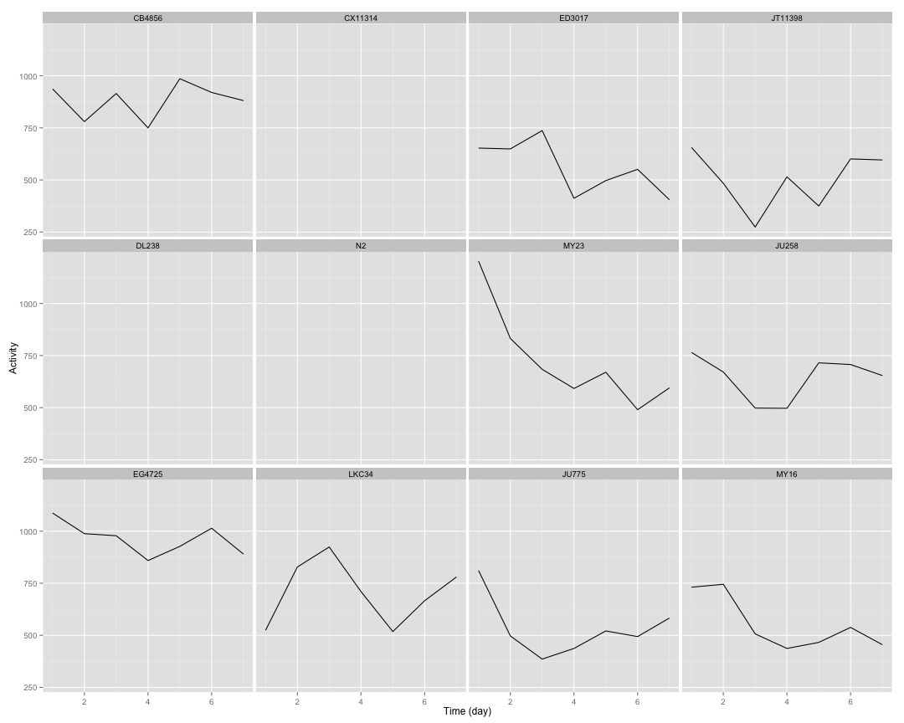 

## Strain Normalized Data ##


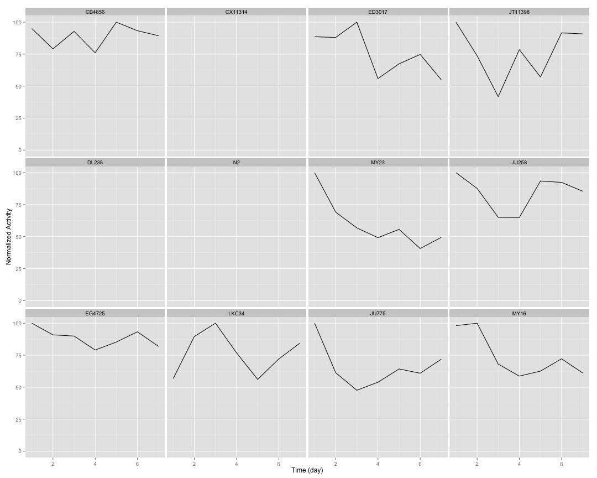 

## Setting Top of Curve by Strain ##


## Strain Curve Fitting ##


```
##     strain    bparam       cparam
## 1   CB4856 0.2373159 27428.603788
## 2  CX11314 0.4571150    12.030694
## 3   ED3017 1.3140881     9.265795
## 4  JT11398 0.1639126 14475.570061
## 5    DL238 0.5364415    19.860385
## 6       N2 1.9306414     2.659252
## 7     MY23 1.1429640     4.977077
## 8    JU258 0.2430726  3298.117731
## 9   EG4725 0.6638536    79.843121
## 10   LKC34 0.1318833 25068.280381
## 11   JU775 0.5164195    11.926610
## 12    MY16 1.1620848     9.125554
```

## 2 Parameter Logistic Function Fits by Strain ##


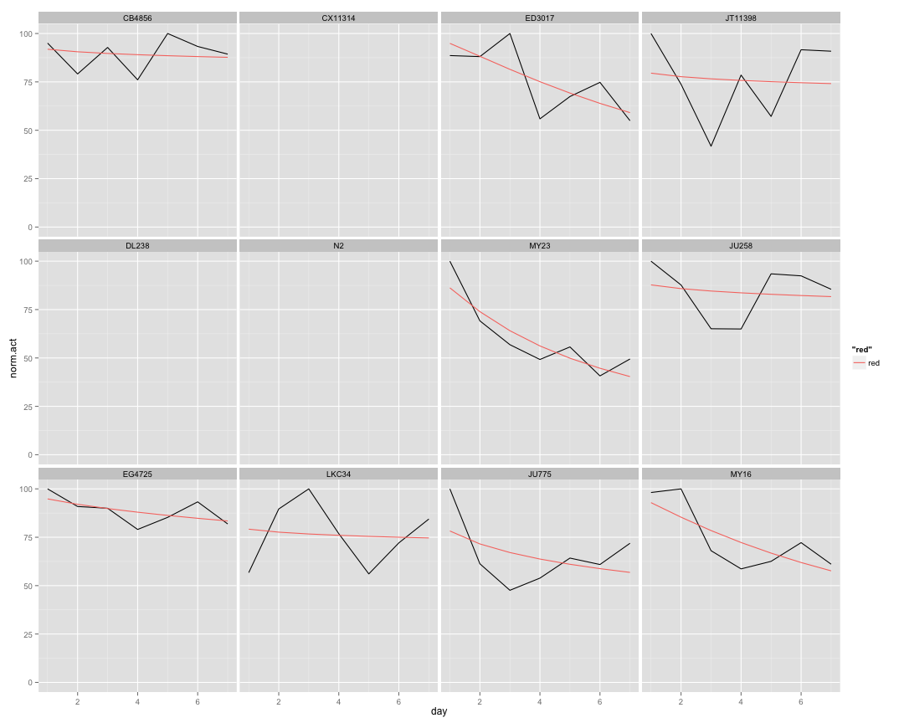 

## Implementing NLS ##


