```
## [1] "p05_daf3"
```


## Raw Activity ##

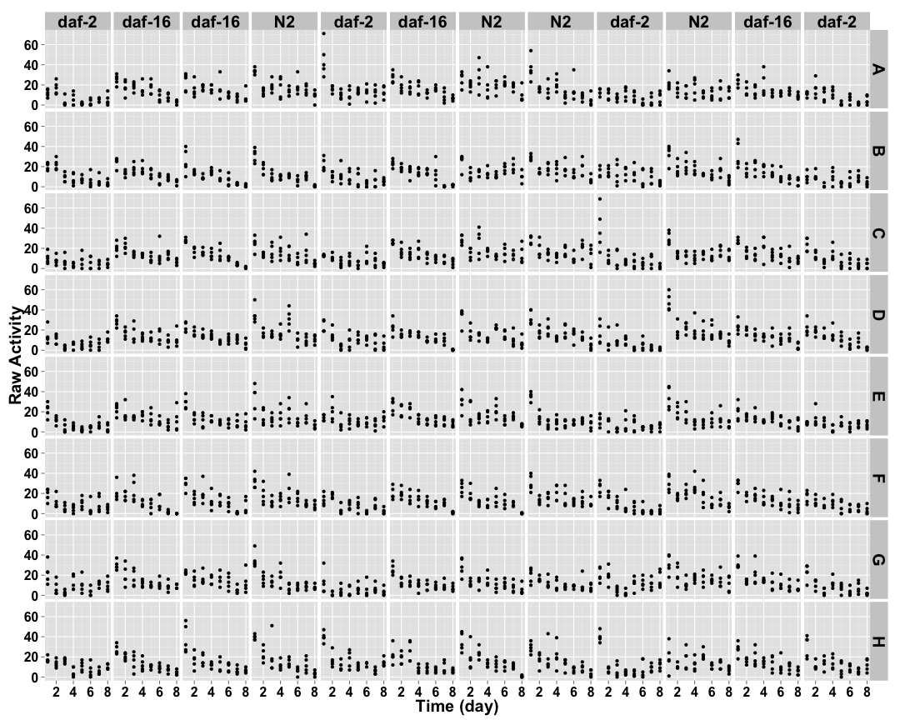 

## Cleaned Data ##


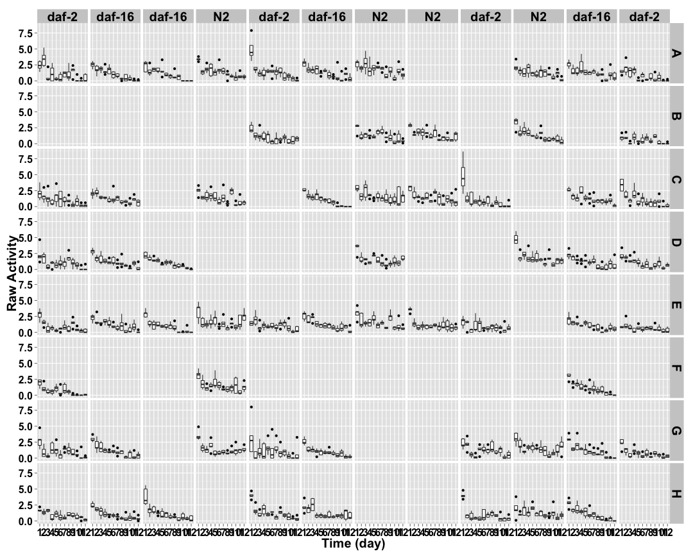 


## Well Mean Data ##

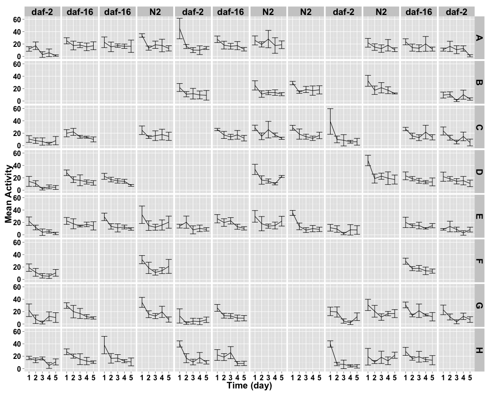 

## Well Median Data ##

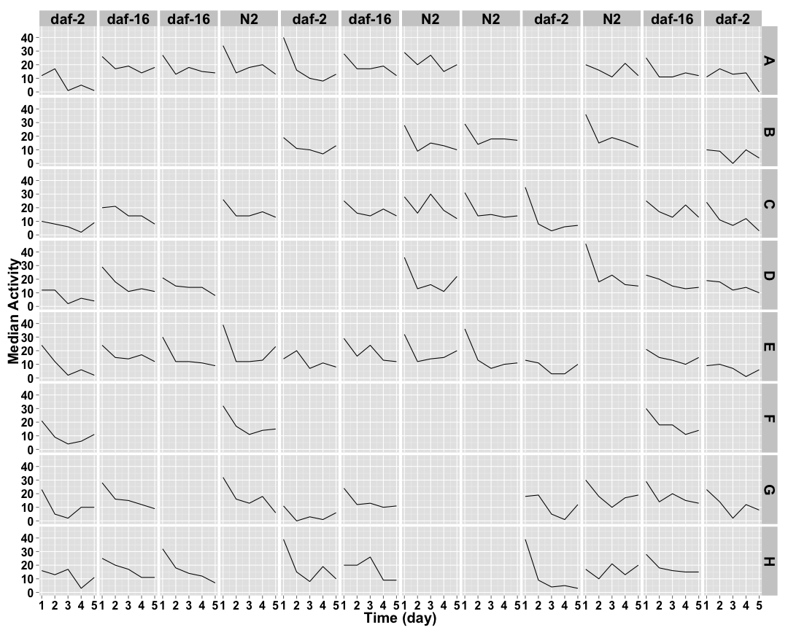 

## Well Total Data ##

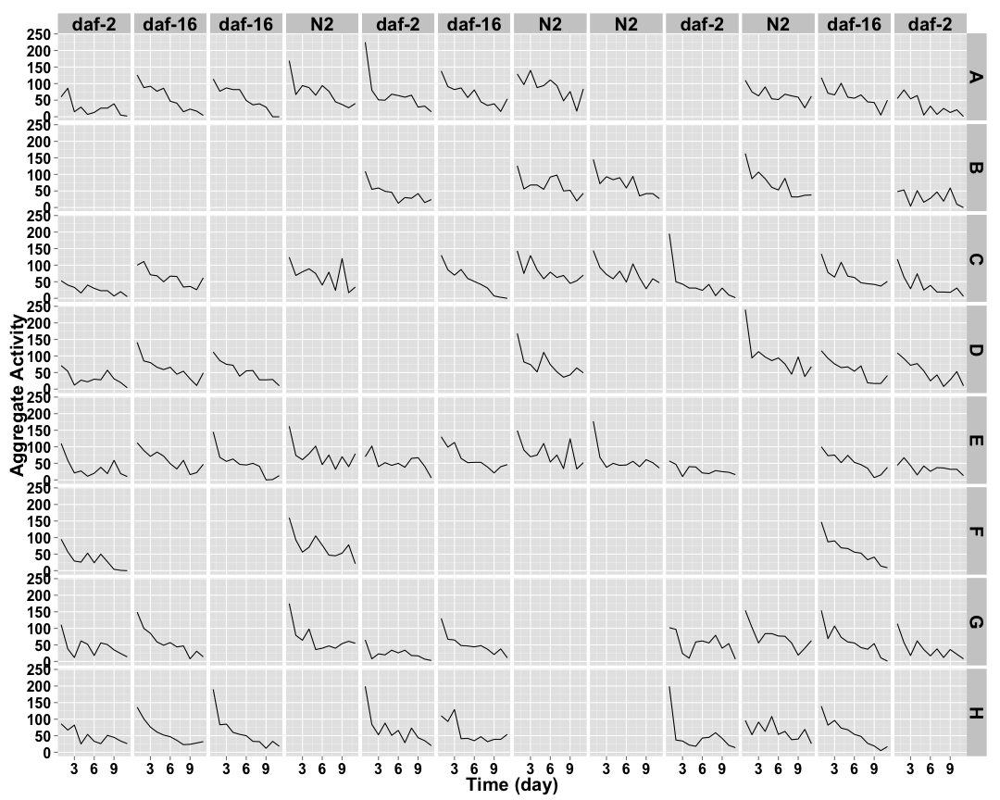 

## Well Normalized Data ##


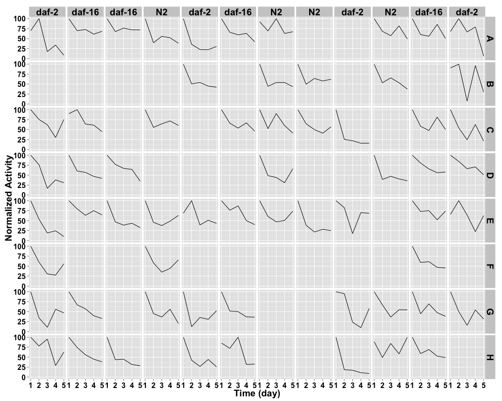 

## Setting Top of Curve by Well ##


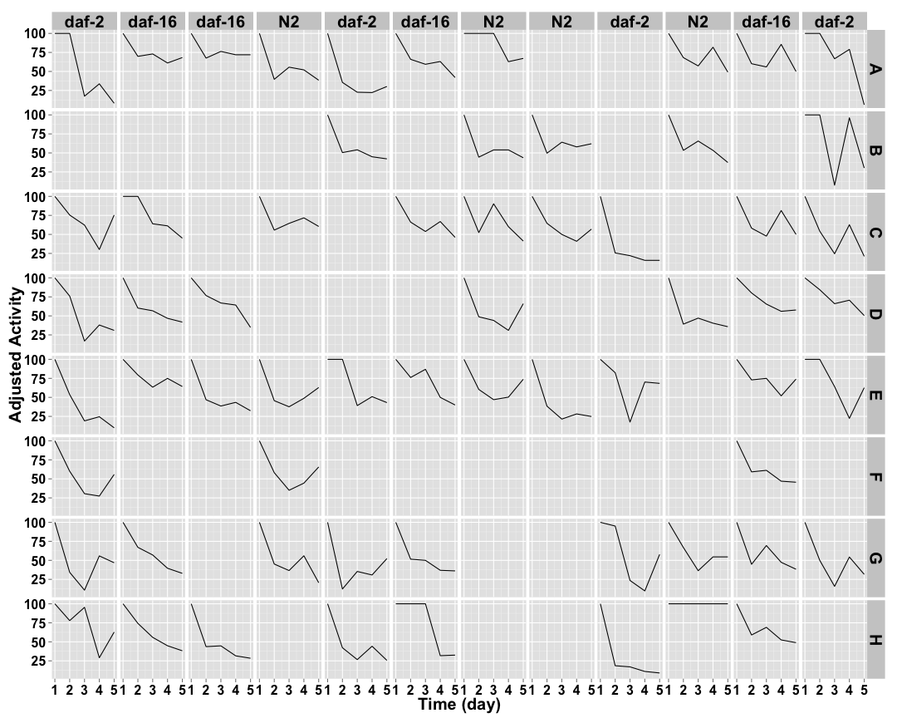 

## Well Curve Fitting ##


| col|row |    bparam|   cparam|
|---:|:---|---------:|--------:|
|   1|A   | 1.4558344| 2.685096|
|   1|B   | 0.0000000| 0.000000|
|   1|C   | 1.4001356| 5.060793|
|   1|D   | 0.9194857| 3.894506|
|   1|E   | 1.3103539| 2.350627|
|   1|F   | 1.4974972| 3.030852|
|   1|G   | 0.8581753| 2.694532|
|   1|H   | 1.2118391| 6.168270|
|   2|A   | 2.3394574| 4.825725|
|   2|B   | 0.0000000| 0.000000|
|   2|C   | 1.3021432| 6.360453|
|   2|D   | 1.2736914| 4.026591|
|   2|E   | 1.6074997| 5.652854|
|   2|F   | 0.0000000| 0.000000|
|   2|G   | 1.6426859| 3.598937|
|   2|H   | 1.6609065| 3.801158|
|   3|A   | 2.6617440| 5.434640|
|   3|B   | 0.0000000| 0.000000|
|   3|C   | 0.0000000| 0.000000|
|   3|D   | 1.7076883| 4.863338|
|   3|E   | 1.5222222| 2.840336|
|   3|F   | 0.0000000| 0.000000|
|   3|G   | 0.0000000| 0.000000|
|   3|H   | 1.6001709| 2.607595|
|   4|A   | 1.0948985| 3.755853|
|   4|B   | 0.0000000| 0.000000|
|   4|C   | 0.9756372| 6.268784|
|   4|D   | 0.0000000| 0.000000|
|   4|E   | 0.8070498| 3.899715|
|   4|F   | 0.9990751| 4.062498|
|   4|G   | 1.0551996| 2.936236|
|   4|H   | 0.0000000| 0.000000|
|   5|A   | 1.3491890| 2.193347|
|   5|B   | 1.3057001| 3.288419|
|   5|C   | 0.0000000| 0.000000|
|   5|D   | 0.0000000| 0.000000|
|   5|E   | 0.7950430| 5.364176|
|   5|F   | 0.0000000| 0.000000|
|   5|G   | 0.9162177| 2.406143|
|   5|H   | 1.2546733| 2.569342|
|   6|A   | 1.3646765| 4.663936|
|   6|B   | 0.0000000| 0.000000|
|   6|C   | 2.0038443| 4.086582|
|   6|D   | 0.0000000| 0.000000|
|   6|E   | 1.6248245| 4.990490|
|   6|F   | 0.0000000| 0.000000|
|   6|G   | 1.2873736| 3.254037|
|   6|H   | 1.3320081| 4.419292|
|   7|A   | 1.4084563| 8.350751|
|   7|B   | 0.7984559| 5.671429|
|   7|C   | 1.0035947| 6.276584|
|   7|D   | 0.9777984| 3.624099|
|   7|E   | 0.8306535| 5.661311|
|   7|F   | 0.0000000| 0.000000|
|   7|G   | 0.0000000| 0.000000|
|   7|H   | 0.0000000| 0.000000|
|   8|A   | 0.0000000| 0.000000|
|   8|B   | 1.1684664| 4.897519|
|   8|C   | 0.9295992| 5.003474|
|   8|D   | 0.0000000| 0.000000|
|   8|E   | 1.0356961| 2.290301|
|   8|F   | 0.0000000| 0.000000|
|   8|G   | 0.0000000| 0.000000|
|   8|H   | 0.0000000| 0.000000|
|   9|A   | 0.0000000| 0.000000|
|   9|B   | 0.0000000| 0.000000|
|   9|C   | 2.2217733| 1.841920|
|   9|D   | 0.0000000| 0.000000|
|   9|E   | 0.9837725| 5.307735|
|   9|F   | 0.0000000| 0.000000|
|   9|G   | 0.8338762| 5.509731|
|   9|H   | 1.6853538| 1.734884|
|  10|A   | 0.8561826| 8.084706|
|  10|B   | 1.3236677| 4.012033|
|  10|C   | 0.0000000| 0.000000|
|  10|D   | 1.0429148| 3.084491|
|  10|E   | 0.0000000| 0.000000|
|  10|F   | 0.0000000| 0.000000|
|  10|G   | 1.0637447| 4.510368|
|  10|H   | 0.9242580| 7.881879|
|  11|A   | 1.2407877| 5.571790|
|  11|B   | 0.0000000| 0.000000|
|  11|C   | 1.1104031| 4.971655|
|  11|D   | 1.6856962| 5.128766|
|  11|E   | 1.7142369| 5.505887|
|  11|F   | 1.5615211| 3.871777|
|  11|G   | 1.5017262| 3.580823|
|  11|H   | 1.8129849| 4.082060|
|  12|A   | 2.4721592| 4.297407|
|  12|B   | 0.7805188| 5.452062|
|  12|C   | 1.4960415| 2.849076|
|  12|D   | 1.9159212| 4.813869|
|  12|E   | 0.7899624| 5.751549|
|  12|F   | 0.0000000| 0.000000|
|  12|G   | 1.3492943| 2.617268|
|  12|H   | 0.0000000| 0.000000|

## 2 Parameter Logistic Function Fits by Well ##


 

## Strain Mean Data ##


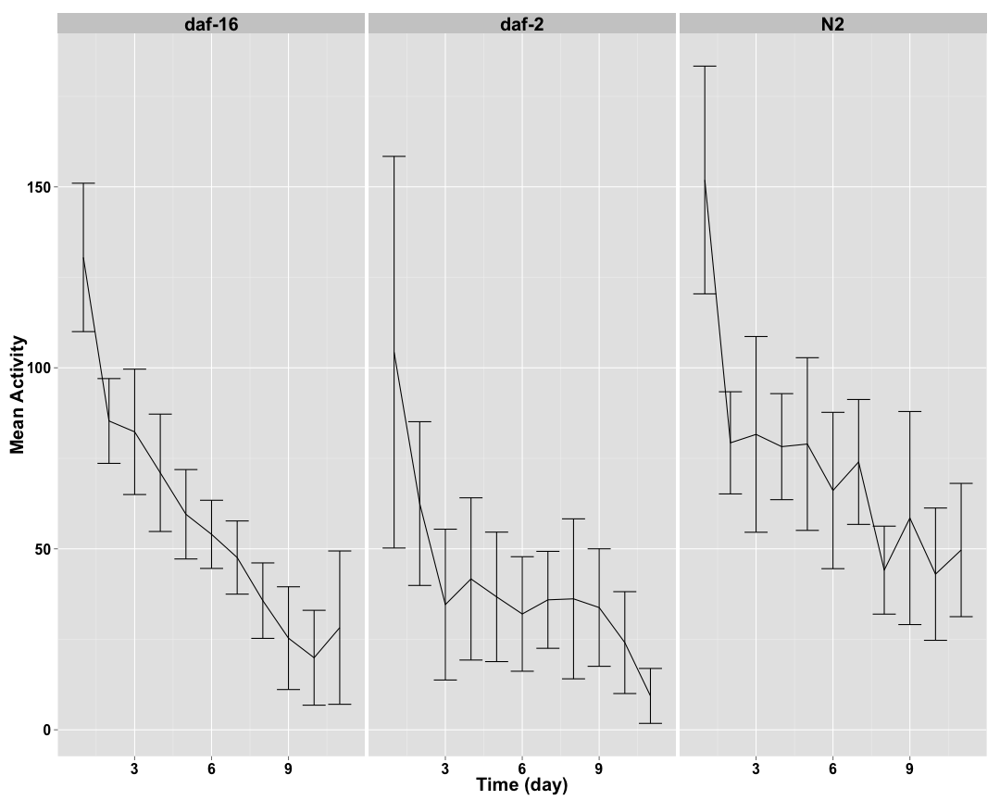 

## Strain Median Data ##

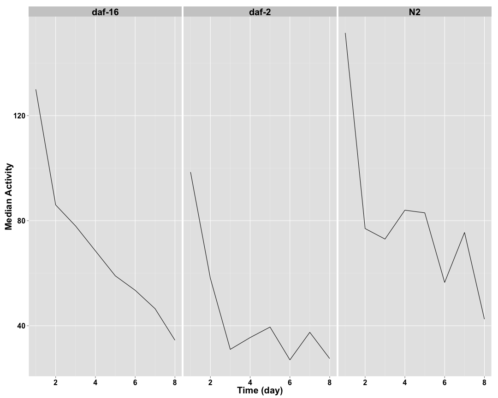 

## Strain Total Data ##

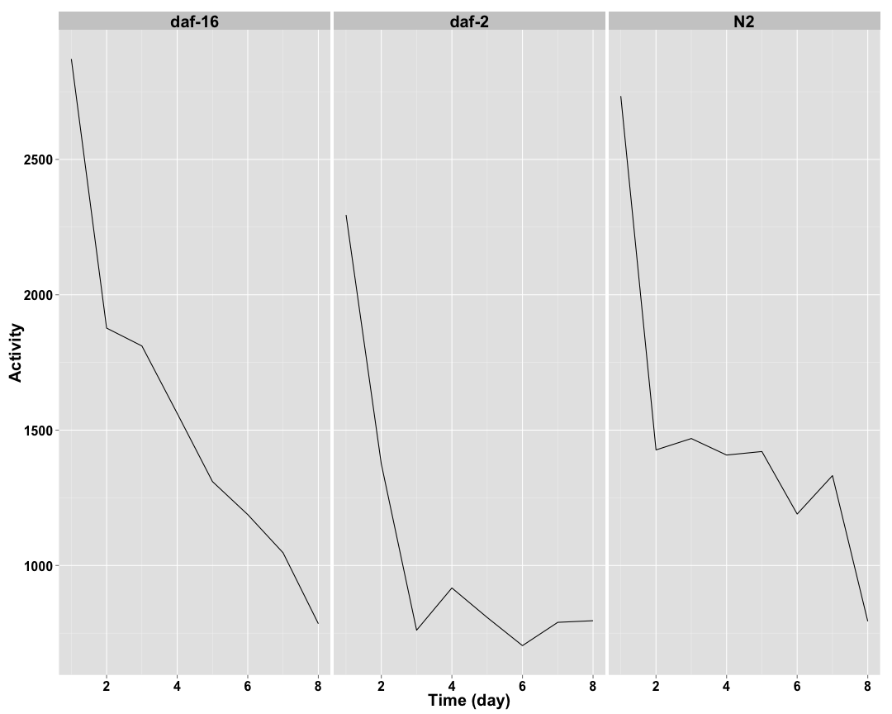 

## Strain Normalized Data ##


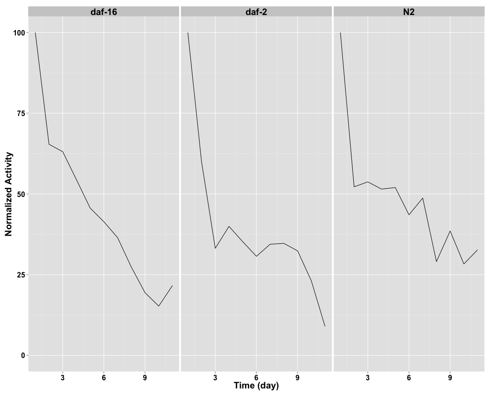 

## Setting Top of Curve by Strain ##


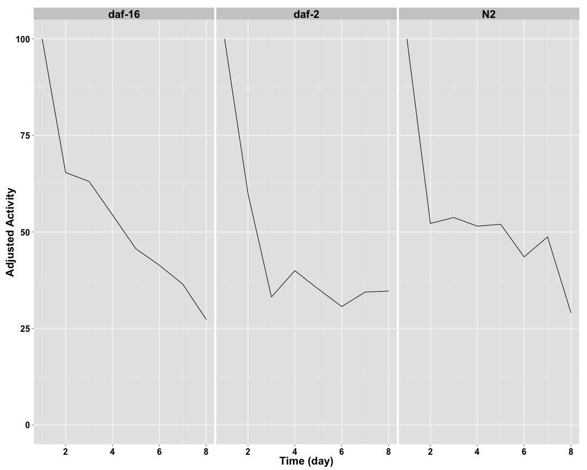 

## Strain Curve Fitting ##


|strain |    bparam|   cparam|
|:------|---------:|--------:|
|daf-2  | 1.2132717| 3.204350|
|daf-16 | 1.5409145| 4.284090|
|N2     | 0.9690598| 4.525893|

## 2 Parameter Logistic Function Fits by Strain ##


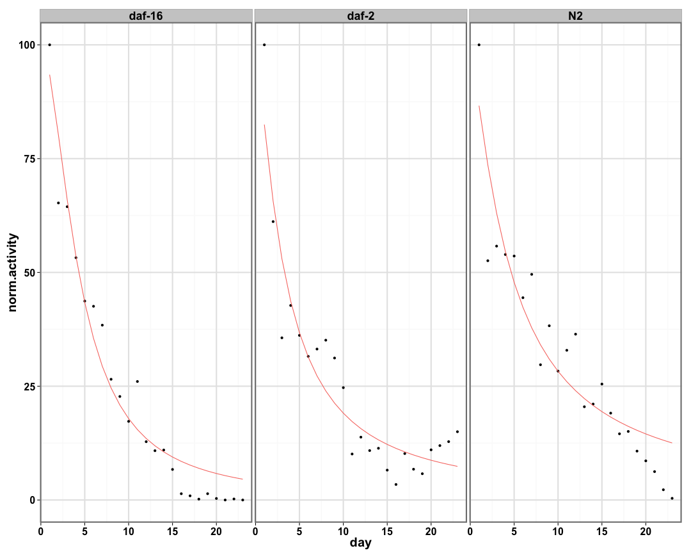 
