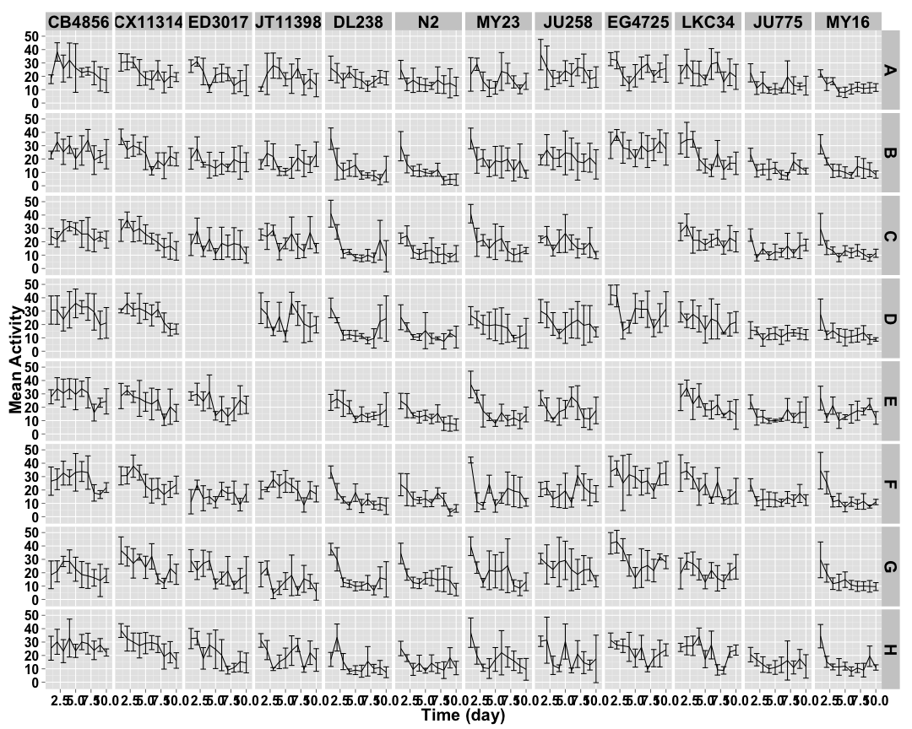
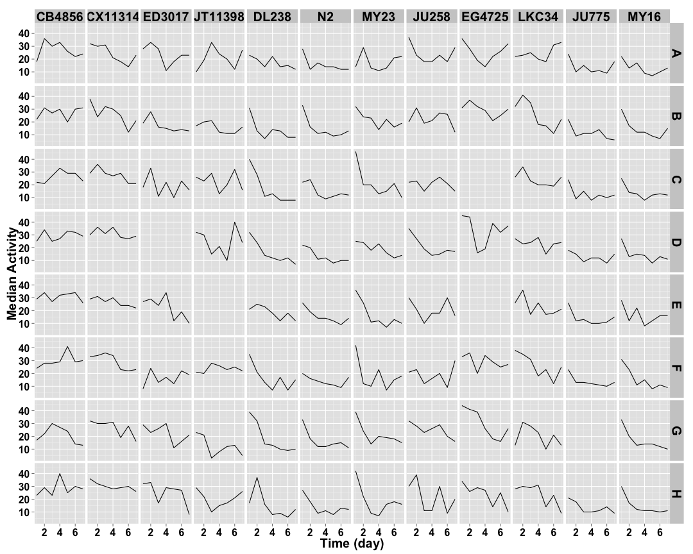
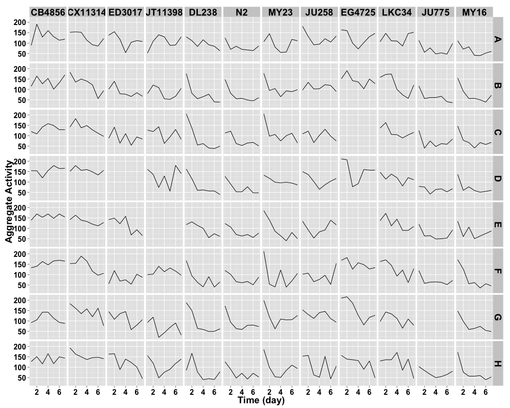
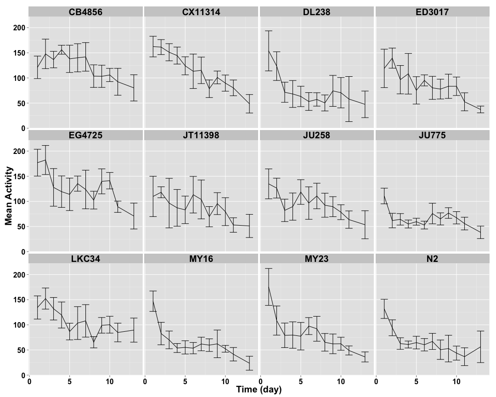
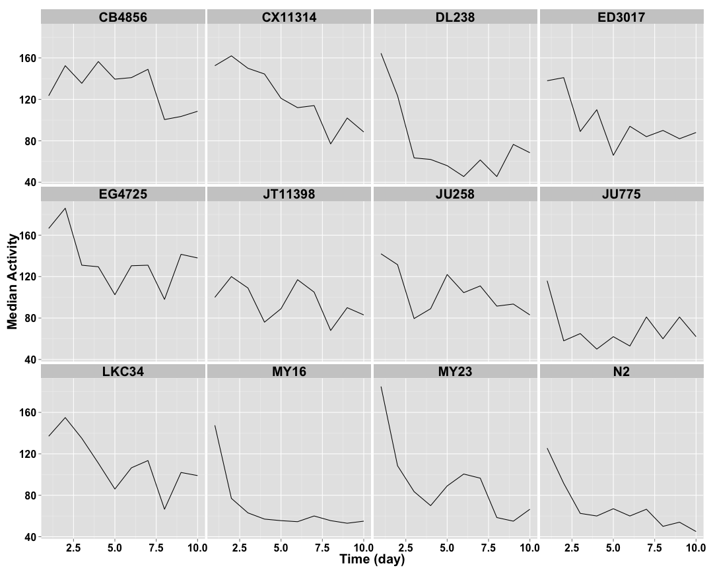
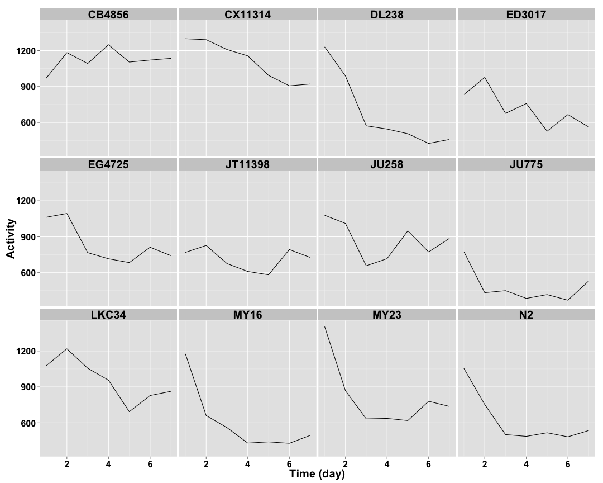

```
## [1] "p04_3mgmL"
```


## Raw Activity ##

 

## Cleaned Data ##


 


## Well Mean Data ##

 

## Well Median Data ##

 

## Well Total Data ##

 

## Well Normalized Data ##


 

## Setting Top of Curve by Well ##


 

## Well Curve Fitting ##


| col|row |    bparam|       cparam|
|---:|:---|---------:|------------:|
|   1|A   | 0.0954516| 20063.147560|
|   1|B   | 0.1665823| 17874.381414|
|   1|C   | 0.1947408| 21707.532255|
|   1|D   | 3.6123602|    12.010804|
|   1|E   | 0.3072523| 18731.631705|
|   1|F   | 0.2842899| 19514.872087|
|   1|G   | 2.5313582|     8.515353|
|   1|H   | 0.1927631| 17980.427334|
|   2|A   | 1.6702375|     9.214255|
|   2|B   | 1.7511010|     6.110240|
|   2|C   | 1.4368688|     8.559924|
|   2|D   | 0.4960874|   158.396531|
|   2|E   | 0.9806655|    18.203250|
|   2|F   | 2.2173380|     7.097466|
|   2|G   | 1.5483228|     8.911225|
|   2|H   | 0.7645943|    21.665147|
|   3|A   | 0.8322537|    11.577305|
|   3|B   | 0.9312523|     6.391817|
|   3|C   | 0.4179029|    14.322862|
|   3|D   | 0.0000000|     0.000000|
|   3|E   | 2.6398175|     6.176285|
|   3|F   | 0.0829792| 18023.233969|
|   3|G   | 1.3960304|     9.030897|
|   3|H   | 2.1309933|     6.263943|
|   4|A   | 0.1289435| 17691.786695|
|   4|B   | 0.4711846|    20.354152|
|   4|C   | 0.8092439|    15.144753|
|   4|D   | 0.2099883|   178.462837|
|   4|E   | 0.0000000|     0.000000|
|   4|F   | 0.1739105| 18868.284516|
|   4|G   | 0.8810932|     4.604666|
|   4|H   | 0.3416458|    32.660818|
|   5|A   | 1.4096896|     8.412299|
|   5|B   | 1.4582933|     2.644923|
|   5|C   | 2.1328166|     2.616771|
|   5|D   | 1.6645615|     3.232409|
|   5|E   | 2.3062035|     6.037590|
|   5|F   | 1.3051520|     3.040987|
|   5|G   | 1.9376559|     3.078144|
|   5|H   | 0.9597868|     2.858188|
|   6|A   | 0.7111143|     8.102962|
|   6|B   | 1.3123214|     3.030103|
|   6|C   | 1.3991437|     5.155489|
|   6|D   | 1.2403624|     4.113568|
|   6|E   | 1.1316108|     6.215595|
|   6|F   | 0.9747069|     6.825018|
|   6|G   | 1.0225995|     3.468460|
|   6|H   | 1.1332128|     4.339565|
|   7|A   | 0.3819058|    20.443008|
|   7|B   | 0.8389069|     5.023129|
|   7|C   | 1.0252024|     3.764863|
|   7|D   | 1.0420515|    12.427372|
|   7|E   | 1.7890304|     3.329734|
|   7|F   | 0.9557944|     2.379522|
|   7|G   | 0.6690073|     5.878456|
|   7|H   | 0.8059227|     3.666172|
|   8|A   | 0.6235293|    11.353629|
|   8|B   | 0.1702114| 23745.804625|
|   8|C   | 0.4234148|    59.710730|
|   8|D   | 0.8000657|    11.646949|
|   8|E   | 0.1114700| 23375.754380|
|   8|F   | 0.0501299| 19616.569202|
|   8|G   | 1.2081537|    14.526144|
|   8|H   | 1.0513952|     6.569407|
|   9|A   | 0.5709554|    26.537847|
|   9|B   | 0.7025163|    17.692540|
|   9|C   | 0.0000000|     0.000000|
|   9|D   | 0.6284271|    15.155678|
|   9|E   | 0.0000000|     0.000000|
|   9|F   | 0.9548325|    18.288027|
|   9|G   | 1.8079413|     6.087737|
|   9|H   | 2.6186728|     6.720761|
|  10|A   | 0.1666474| 17204.506722|
|  10|B   | 2.0344051|     5.937099|
|  10|C   | 0.8114034|    11.441696|
|  10|D   | 0.8478069|    20.177951|
|  10|E   | 1.0983371|     8.510538|
|  10|F   | 1.4597604|     7.676474|
|  10|G   | 1.2314180|     9.396968|
|  10|H   | 1.8619755|     6.975175|
|  11|A   | 0.5811647|     7.935029|
|  11|B   | 1.1361272|     3.921342|
|  11|C   | 0.5780357|     5.175883|
|  11|D   | 0.5914517|    41.556739|
|  11|E   | 0.6882526|     5.521185|
|  11|F   | 0.7516589|     5.546962|
|  11|G   | 0.0000000|     0.000000|
|  11|H   | 0.7430398|    10.717755|
|  12|A   | 1.1793311|     4.655907|
|  12|B   | 1.3508184|     3.040875|
|  12|C   | 1.0809377|     3.420311|
|  12|D   | 1.0559497|     3.595604|
|  12|E   | 0.7019774|     6.539684|
|  12|F   | 1.8764509|     2.982882|
|  12|G   | 1.3228159|     3.657634|
|  12|H   | 1.4375202|     2.567031|

## 2 Parameter Logistic Function Fits by Well ##


 

## Strain Mean Data ##


 

## Strain Median Data ##

 

## Strain Total Data ##

 

## Strain Normalized Data ##


 

## Setting Top of Curve by Strain ##


 

## Strain Curve Fitting ##


|strain  |    bparam|       cparam|
|:-------|---------:|------------:|
|CB4856  | 0.2474862| 24684.805689|
|CX11314 | 2.1140514|     9.723261|
|ED3017  | 1.1837834|     8.860947|
|JT11398 | 0.4282124|   248.600797|
|DL238   | 1.5920245|     3.887360|
|N2      | 1.0906509|     4.714389|
|MY23    | 0.8959595|     4.782003|
|JU258   | 0.5954150|    37.437761|
|EG4725  | 1.0534516|    11.331535|
|LKC34   | 1.2939791|    10.571546|
|JU775   | 0.7089460|     6.752904|
|MY16    | 1.2338120|     3.410281|

## 2 Parameter Logistic Function Fits by Strain ##


 
