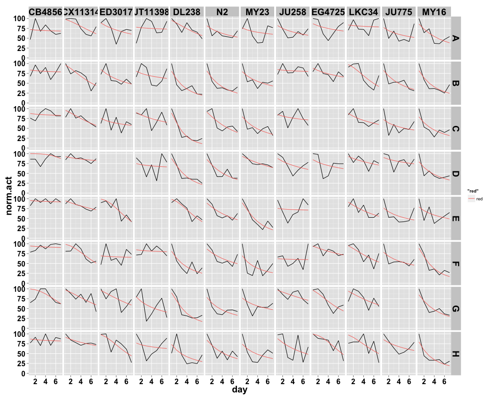
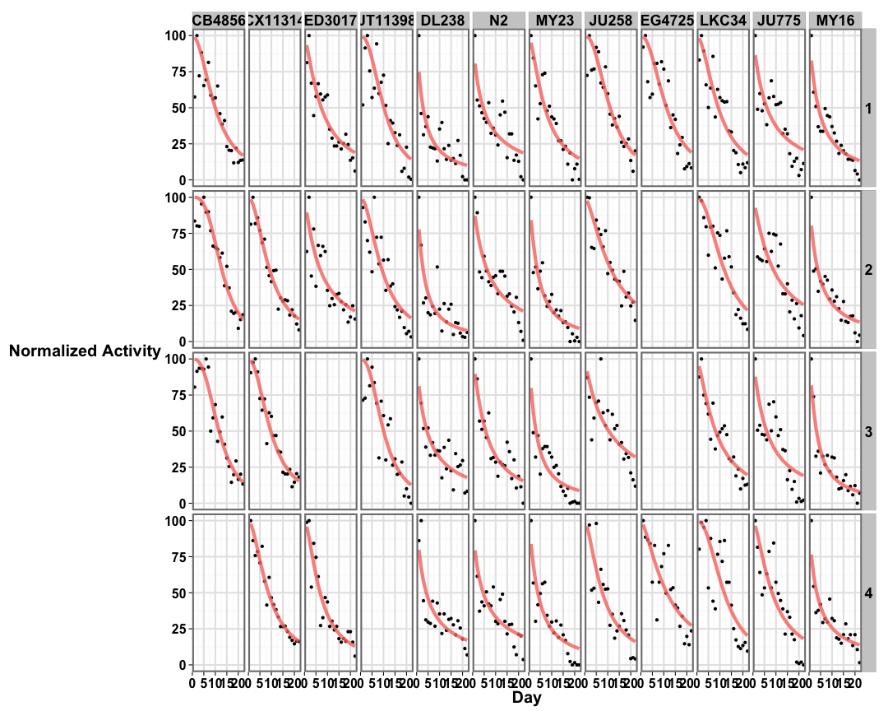
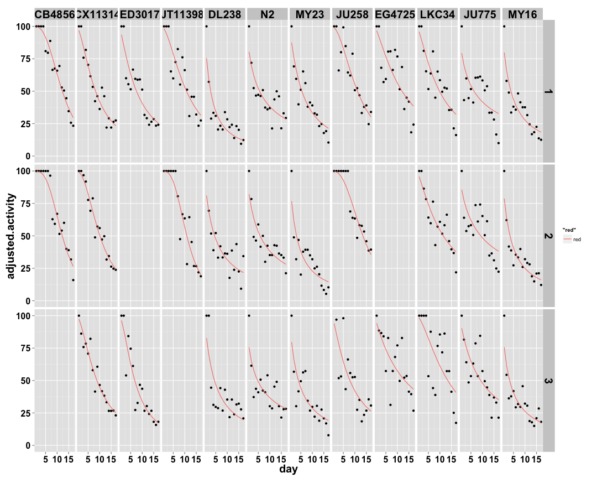
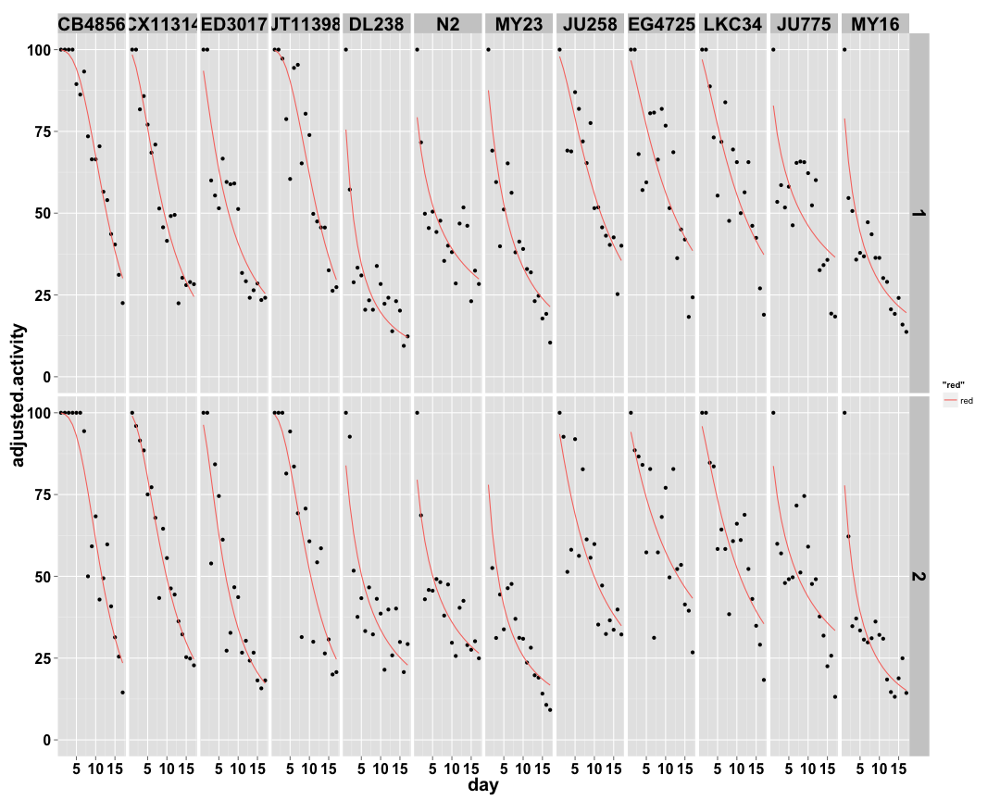
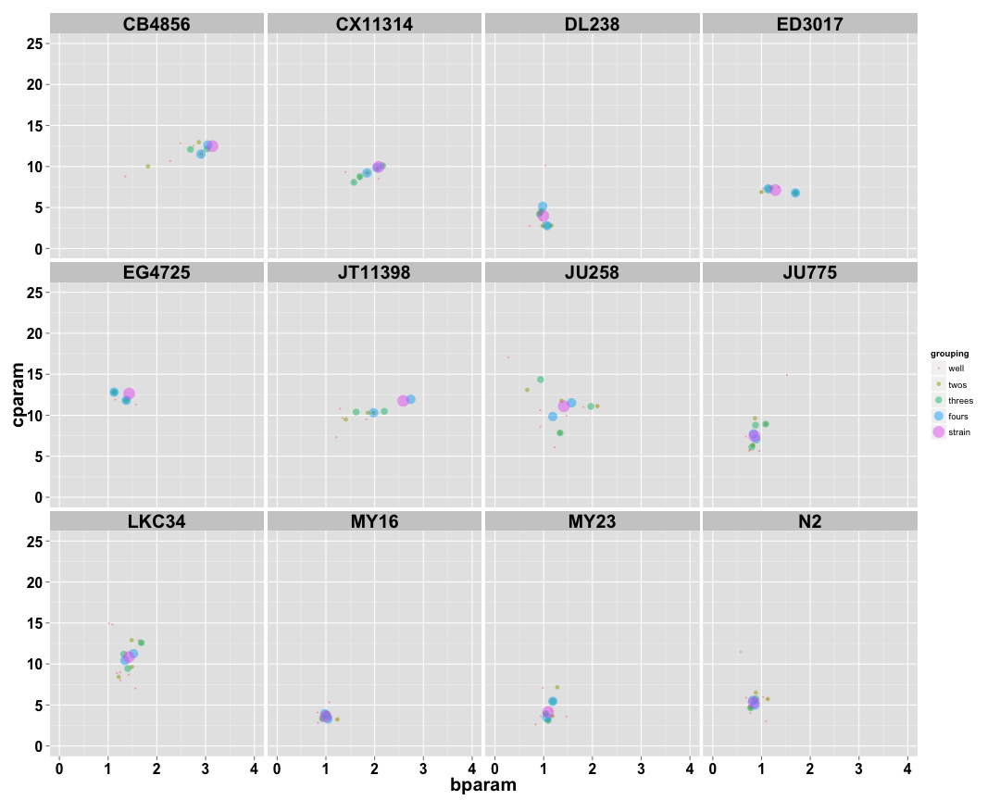

```
## [1] "p04_3mgmL"
```


## Individual Well Fits ##

 

## Two Wells Fits ##

 

## Three Wells Fits ##

 

## Four Wells Fits ##

 

## Strain Fits ##

 

## Distribution of Parameters ##

 
