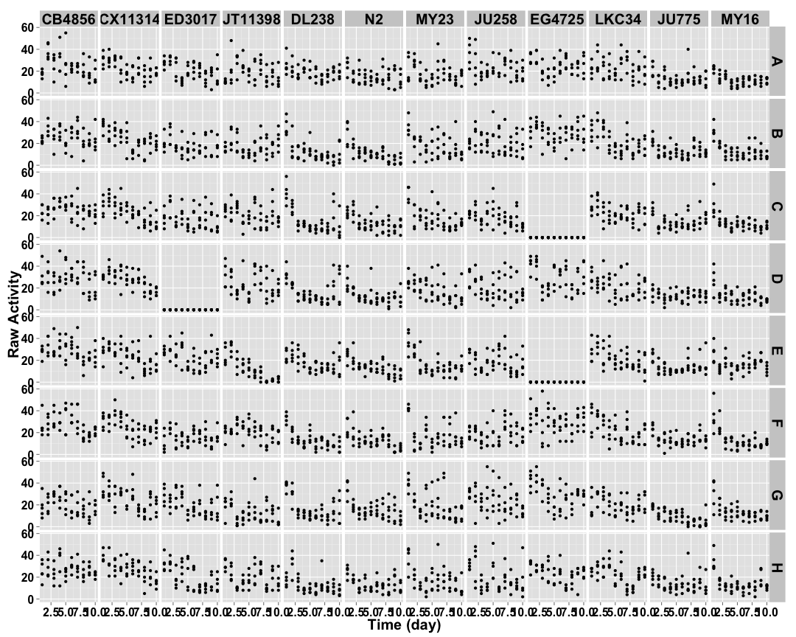
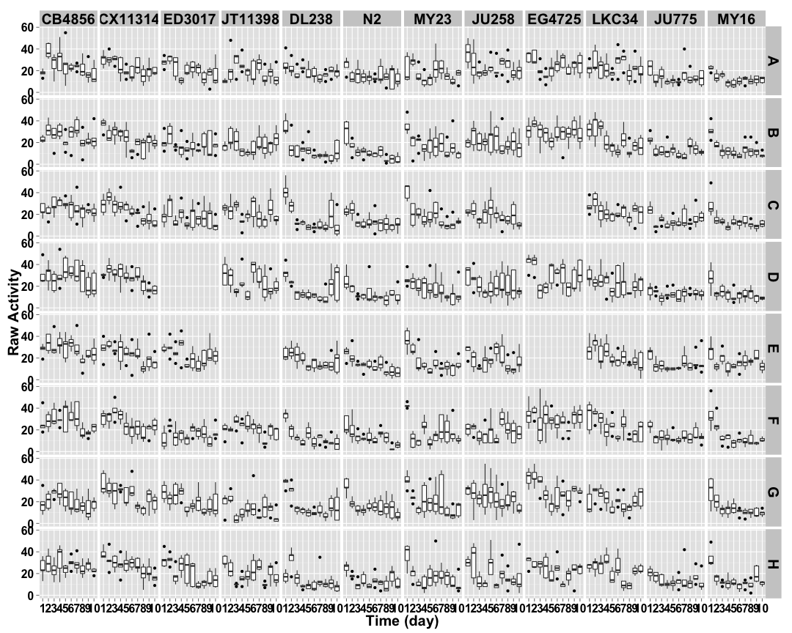
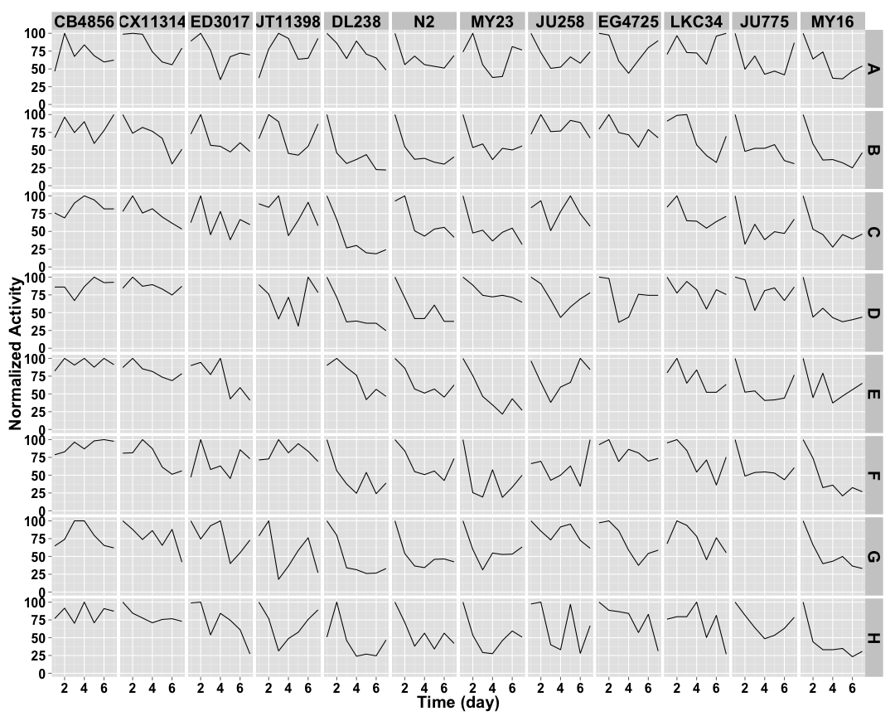
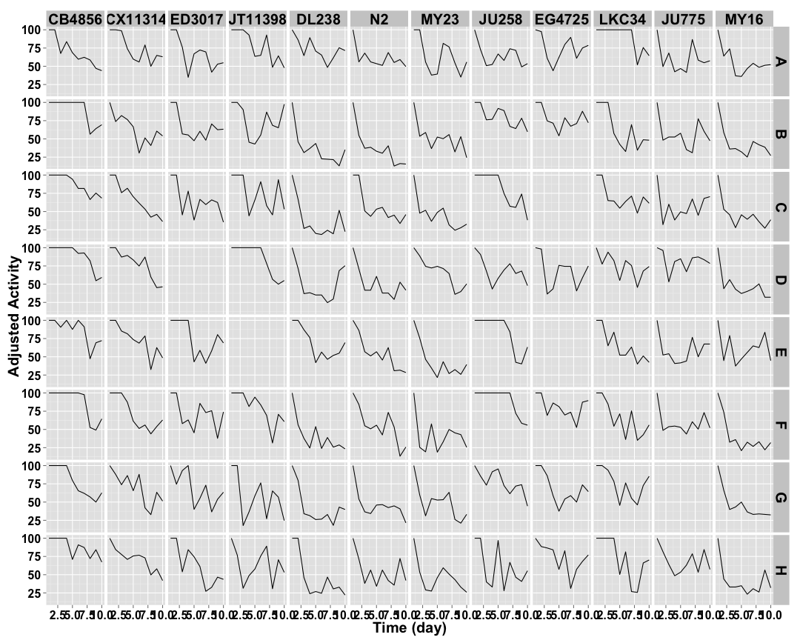
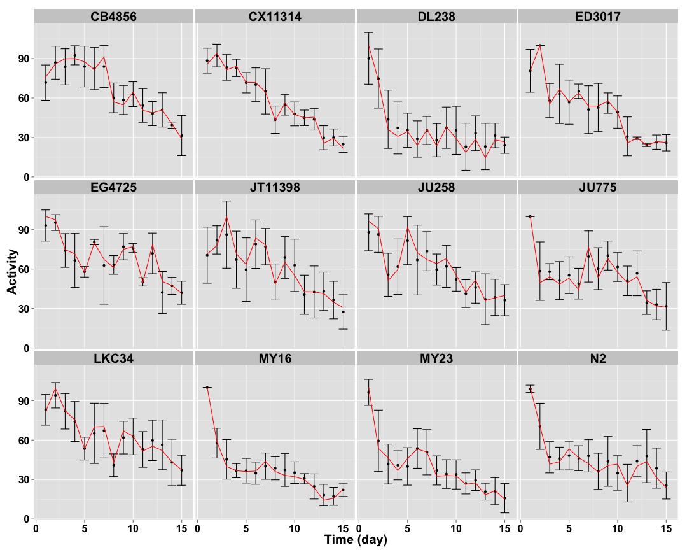
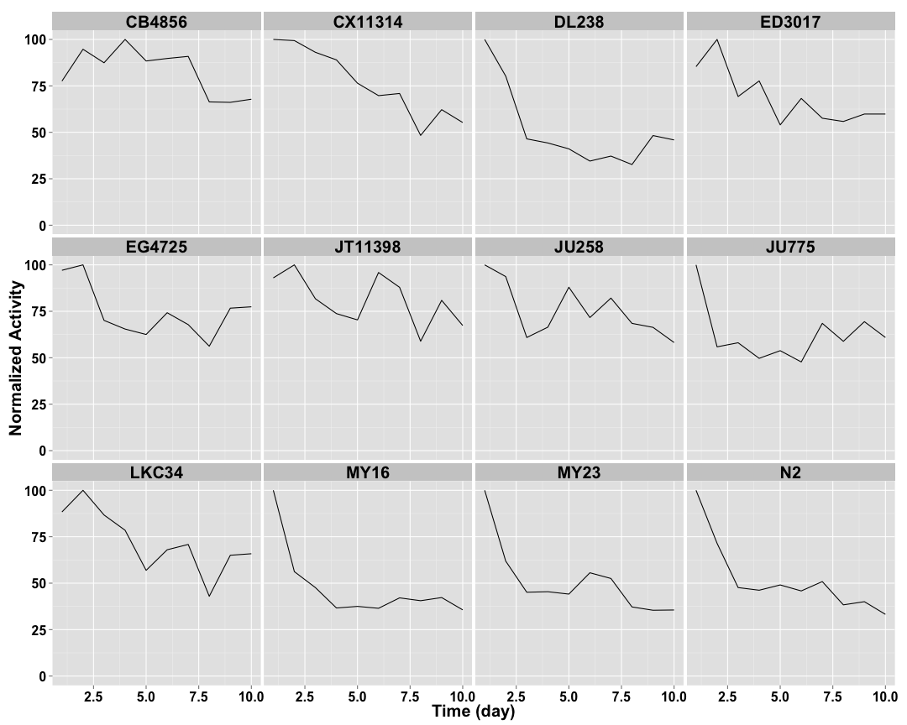
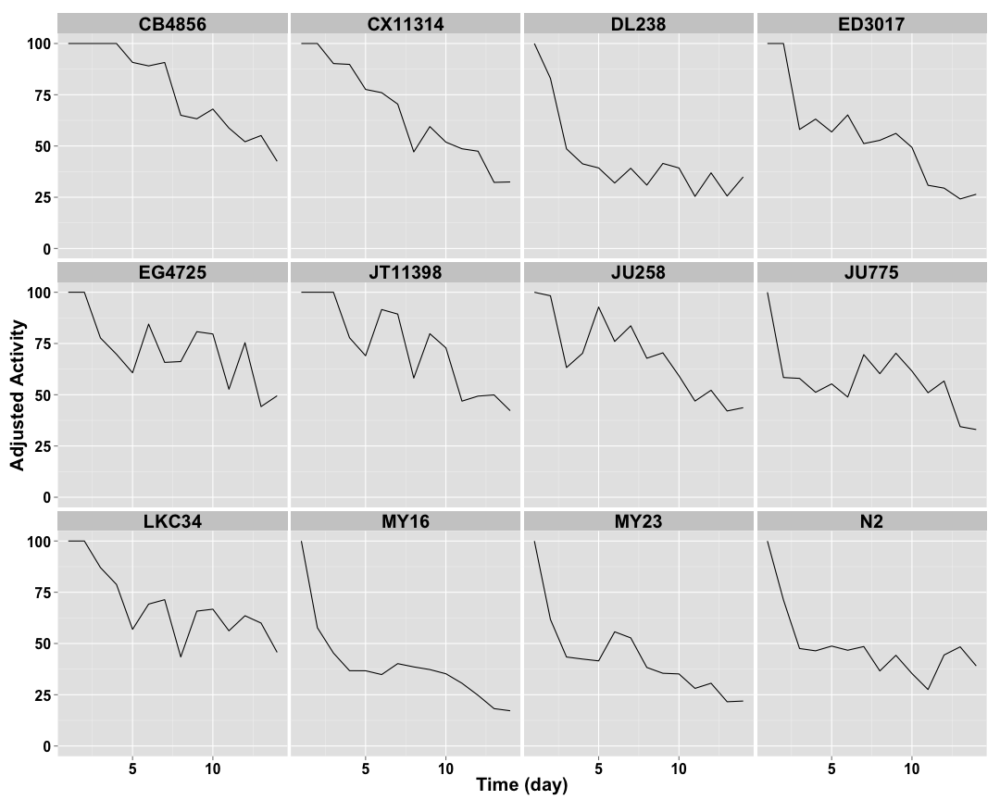

```
## [1] "p04_3mgmL"
```


## Normalized Activity ##

 

## Cleaned Data ##


 


## Well Data ##

 

## Well Normalized Data ##


 

## Setting Top of Curve by Well ##


 

## Well Curve Fitting ##


| col|row |    bparam|      cparam|
|---:|:---|---------:|-----------:|
|   1|A   | 0.7990510|   10.341194|
|   1|B   | 1.7191583|   11.184360|
|   1|C   | 1.5828436|   15.050915|
|   1|D   | 2.0063387|   13.587483|
|   1|E   | 2.4561019|   12.493135|
|   1|F   | 2.6974757|   11.317829|
|   1|G   | 2.0550796|    9.571563|
|   1|H   | 0.0000000|    0.000000|
|   2|A   | 0.0000000|    0.000000|
|   2|B   | 0.0000000|    0.000000|
|   2|C   | 1.5693167|    8.066577|
|   2|D   | 2.2979709|   10.036327|
|   2|E   | 1.7931488|    9.348100|
|   2|F   | 1.5153403|    8.652921|
|   2|G   | 1.3711852|    9.412091|
|   2|H   | 1.9872374|    8.527673|
|   3|A   | 1.3992774|    7.413408|
|   3|B   | 0.9452507|    7.590472|
|   3|C   | 0.9154030|    7.036602|
|   3|D   | 0.0000000|    0.000000|
|   3|E   | 0.0000000|    0.000000|
|   3|F   | 0.0000000|    0.000000|
|   3|G   | 0.0000000|    0.000000|
|   3|H   | 1.6806723|    6.788222|
|   4|A   | 1.3084729|    9.950385|
|   4|B   | 0.8891242|   11.461311|
|   4|C   | 0.9411662|   13.097295|
|   4|D   | 0.9606277|    7.825385|
|   4|E   | 0.0000000|    0.000000|
|   4|F   | 1.7414316|   10.648784|
|   4|G   | 0.0000000|    0.000000|
|   4|H   | 0.0000000|    0.000000|
|   5|A   | 0.0000000|    0.000000|
|   5|B   | 1.0246657|    2.769213|
|   5|C   | 1.1452368|    2.800481|
|   5|D   | 0.0000000|    0.000000|
|   5|E   | 0.9914941|   10.463705|
|   5|F   | 1.0254024|    3.167023|
|   5|G   | 0.9734132|    3.530797|
|   5|H   | 0.8121762|    2.829502|
|   6|A   | 0.4510488|   15.152443|
|   6|B   | 1.1436124|    3.019948|
|   6|C   | 1.0293541|    5.964940|
|   6|D   | 0.5777696|    6.424432|
|   6|E   | 1.2175503|    5.614673|
|   6|F   | 0.0000000|    0.000000|
|   6|G   | 0.7374568|    4.007765|
|   6|H   | 0.7087182|    5.992505|
|   7|A   | 0.7725528|    7.828289|
|   7|B   | 1.0880369|    4.561329|
|   7|C   | 1.0922211|    3.673796|
|   7|D   | 0.0000000|    0.000000|
|   7|E   | 1.3603292|    3.617978|
|   7|F   | 0.7211028|    2.590023|
|   7|G   | 1.0329349|    4.295187|
|   7|H   | 0.8194067|    3.697007|
|   8|A   | 0.0000000|    0.000000|
|   8|B   | 1.7788721|   11.603245|
|   8|C   | 1.3685014|   10.136997|
|   8|D   | 0.8415326|   11.509372|
|   8|E   | 0.8221655|    9.219349|
|   8|F   | 0.0694504| 1424.204005|
|   8|G   | 1.7353106|   11.136786|
|   8|H   | 1.3542732|    5.935433|
|   9|A   | 0.8680235|   14.856142|
|   9|B   | 0.8403554|   16.368395|
|   9|C   | 0.0000000|    0.000000|
|   9|D   | 0.0000000|    0.000000|
|   9|E   | 0.0000000|    0.000000|
|   9|F   | 0.0000000|    0.000000|
|   9|G   | 0.0000000|    0.000000|
|   9|H   | 0.8868725|   15.810623|
|  10|A   | 0.6828874|   24.158405|
|  10|B   | 1.3246349|    7.356574|
|  10|C   | 0.8695790|   10.898714|
|  10|D   | 0.6404472|   28.517654|
|  10|E   | 1.1088416|    8.340584|
|  10|F   | 1.0840039|    9.322959|
|  10|G   | 0.3681399|   76.346807|
|  10|H   | 0.8712856|   10.636559|
|  11|A   | 0.5582241|    9.559954|
|  11|B   | 0.6020521|    6.472806|
|  11|C   | 0.4845575|    7.048202|
|  11|D   | 0.9643625|   20.841775|
|  11|E   | 0.7176061|    6.299027|
|  11|F   | 0.4869940|    9.466943|
|  11|G   | 0.0000000|    0.000000|
|  11|H   | 0.8889929|    9.972732|
|  12|A   | 1.0063697|    5.419878|
|  12|B   | 0.9257631|    3.449340|
|  12|C   | 0.9972213|    3.586379|
|  12|D   | 0.7871538|    4.129305|
|  12|E   | 0.0000000|    0.000000|
|  12|F   | 1.2648282|    3.234601|
|  12|G   | 1.0797432|    3.950527|
|  12|H   | 0.9259548|    2.840012|

## 2 Parameter Logistic Function Fits by Well ##


 

## Strain Data ##


 

## Strain Normalized Data ##


 

## Setting Top of Curve by Strain ##


 

## Strain Curve Fitting ##


|strain  |    bparam|    cparam|
|:-------|---------:|---------:|
|CB4856  | 2.5148295| 12.527843|
|CX11314 | 2.0558941|  9.953721|
|ED3017  | 1.2309923|  7.189563|
|JT11398 | 2.0594933| 12.327055|
|DL238   | 1.0052641|  4.602996|
|N2      | 0.8029332|  5.518069|
|MY23    | 0.9830360|  4.435008|
|JU258   | 1.4427577| 12.498489|
|EG4725  | 0.9928595| 16.817648|
|LKC34   | 0.9970428| 13.866807|
|JU775   | 0.6217058|  9.716921|
|MY16    | 0.9779670|  3.714876|

## 2 Parameter Logistic Function Fits by Strain ##


 
