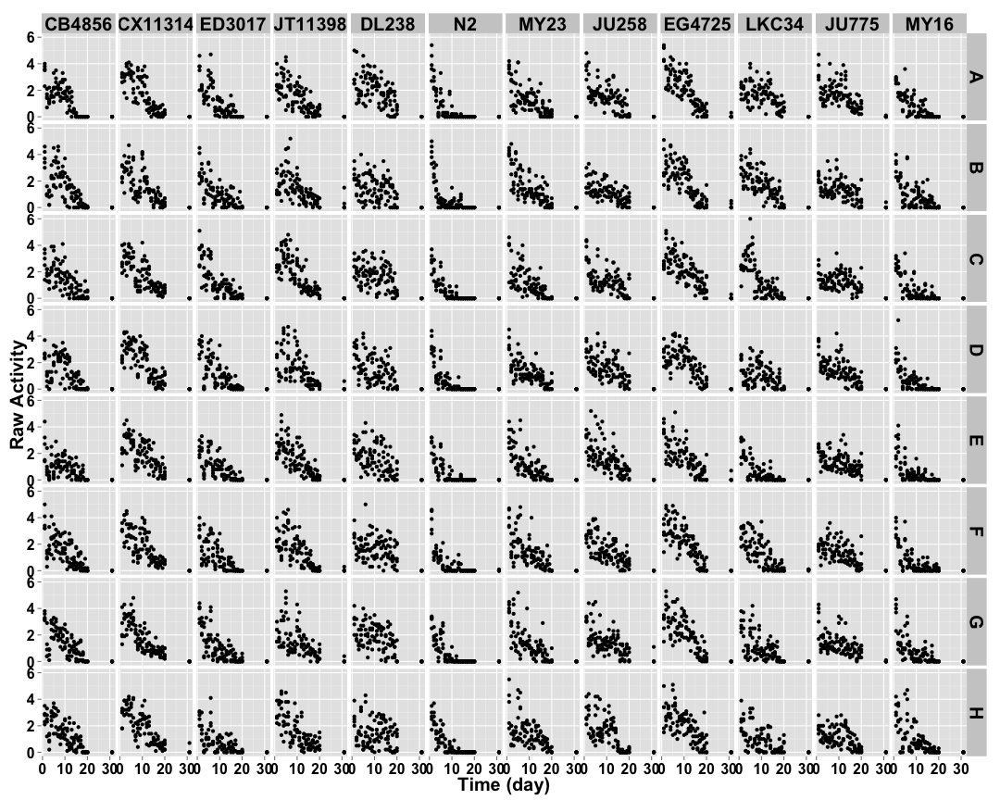
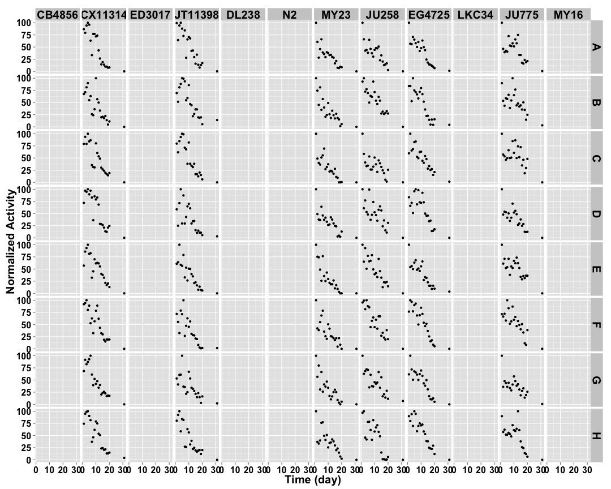
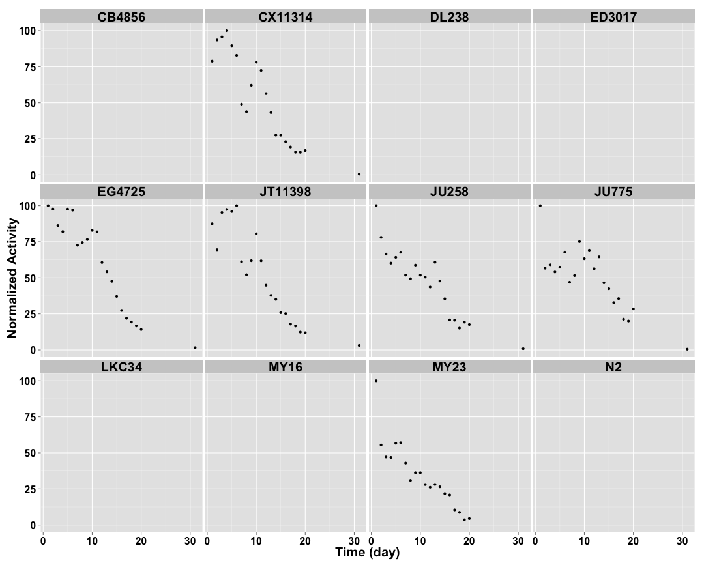
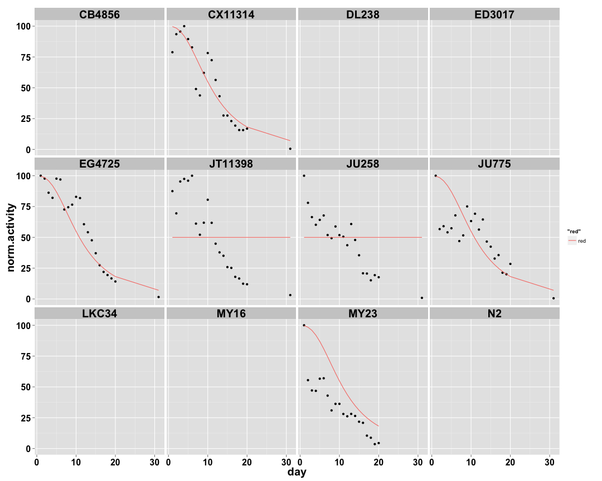

```
## [1] "p03_2mgmL"
```


## Raw Activity ##

 

## Cleaned Data ##


 


## Well Mean Data ##

 

## Well Median Data ##

 

## Well Total Data ##

 

## Well Normalized Data ##


 

## Setting Top of Curve by Well ##


 

## Well Curve Fitting ##


| col|row |    bparam|    cparam|
|---:|:---|---------:|---------:|
|   1|A   | 0.0000000|  0.000000|
|   1|B   | 0.0000000|  0.000000|
|   1|C   | 0.0000000|  0.000000|
|   1|D   | 0.0000000|  0.000000|
|   1|E   | 0.0000000|  0.000000|
|   1|F   | 0.0000000|  0.000000|
|   1|G   | 0.0000000|  0.000000|
|   1|H   | 0.0000000|  0.000000|
|   2|A   | 3.0690179| 10.284111|
|   2|B   | 1.3783571|  7.275508|
|   2|C   | 1.9003889|  9.510196|
|   2|D   | 3.5502377| 12.025622|
|   2|E   | 1.8944826| 10.711932|
|   2|F   | 1.9684143| 10.489479|
|   2|G   | 2.3869041|  9.459292|
|   2|H   | 2.4091691| 10.649331|
|   3|A   | 0.0000000|  0.000000|
|   3|B   | 0.0000000|  0.000000|
|   3|C   | 0.0000000|  0.000000|
|   3|D   | 0.0000000|  0.000000|
|   3|E   | 0.0000000|  0.000000|
|   3|F   | 0.0000000|  0.000000|
|   3|G   | 0.0000000|  0.000000|
|   3|H   | 0.0000000|  0.000000|
|   4|A   | 2.5860943| 10.434903|
|   4|B   | 3.1267855| 11.243648|
|   4|C   | 3.2275424| 10.340547|
|   4|D   | 0.9064619|  5.609769|
|   4|E   | 1.4817489|  6.752864|
|   4|F   | 1.2296493|  6.291758|
|   4|G   | 0.7824392|  4.166510|
|   4|H   | 1.8834976|  7.885126|
|   5|A   | 0.0000000|  0.000000|
|   5|B   | 0.0000000|  0.000000|
|   5|C   | 0.0000000|  0.000000|
|   5|D   | 0.0000000|  0.000000|
|   5|E   | 0.0000000|  0.000000|
|   5|F   | 0.0000000|  0.000000|
|   5|G   | 0.0000000|  0.000000|
|   5|H   | 0.0000000|  0.000000|
|   6|A   | 0.0000000|  0.000000|
|   6|B   | 0.0000000|  0.000000|
|   6|C   | 0.0000000|  0.000000|
|   6|D   | 0.0000000|  0.000000|
|   6|E   | 0.0000000|  0.000000|
|   6|F   | 0.0000000|  0.000000|
|   6|G   | 0.0000000|  0.000000|
|   6|H   | 0.0000000|  0.000000|
|   7|A   | 1.0652413|  4.105519|
|   7|B   | 1.3442351|  5.056111|
|   7|C   | 1.1609612|  4.028871|
|   7|D   | 1.0060539|  3.987851|
|   7|E   | 1.6096252|  5.024189|
|   7|F   | 1.1052326|  4.607918|
|   7|G   | 1.3619891|  4.605118|
|   7|H   | 0.9146650|  4.915429|
|   8|A   | 0.9857872|  5.056441|
|   8|B   | 1.5027485| 11.403885|
|   8|C   | 0.8890943|  3.820420|
|   8|D   | 1.0417230|  9.033377|
|   8|E   | 1.5109829|  9.190021|
|   8|F   | 1.8918117| 11.311707|
|   8|G   | 1.0802623|  7.281745|
|   8|H   | 1.7526114|  9.054248|
|   9|A   | 1.3024358|  7.026843|
|   9|B   | 2.6574061| 10.448563|
|   9|C   | 1.4742475|  9.771346|
|   9|D   | 4.0080457| 13.725567|
|   9|E   | 1.1320637|  6.333189|
|   9|F   | 3.0002432| 11.912089|
|   9|G   | 1.5015262|  8.565608|
|   9|H   | 2.7108219| 12.302126|
|  10|A   | 0.0000000|  0.000000|
|  10|B   | 0.0000000|  0.000000|
|  10|C   | 0.0000000|  0.000000|
|  10|D   | 0.0000000|  0.000000|
|  10|E   | 0.0000000|  0.000000|
|  10|F   | 0.0000000|  0.000000|
|  10|G   | 0.0000000|  0.000000|
|  10|H   | 0.0000000|  0.000000|
|  11|A   | 0.7310270|  6.379412|
|  11|B   | 0.6850902|  9.203075|
|  11|C   | 0.6208490| 11.975830|
|  11|D   | 0.8789740|  5.442916|
|  11|E   | 0.8147947|  9.812964|
|  11|F   | 1.4047700| 11.443741|
|  11|G   | 0.7223993|  3.893765|
|  11|H   | 0.8492732|  8.558190|
|  12|A   | 0.0000000|  0.000000|
|  12|B   | 0.0000000|  0.000000|
|  12|C   | 0.0000000|  0.000000|
|  12|D   | 0.0000000|  0.000000|
|  12|E   | 0.0000000|  0.000000|
|  12|F   | 0.0000000|  0.000000|
|  12|G   | 0.0000000|  0.000000|
|  12|H   | 0.0000000|  0.000000|

## 2 Parameter Logistic Function Fits by Well ##


 

## Strain Mean Data ##


 

## Strain Median Data ##

 

## Strain Total Data ##

 

## Strain Normalized Data ##


 

## Setting Top of Curve by Strain ##


 

## Strain Curve Fitting ##


|strain  |   bparam|    cparam|
|:-------|--------:|---------:|
|CB4856  | 0.000000|  0.000000|
|CX11314 | 2.440165| 10.807001|
|ED3017  | 0.000000|  0.000000|
|JT11398 | 2.913147| 11.035009|
|DL238   | 0.000000|  0.000000|
|N2      | 0.000000|  0.000000|
|MY23    | 2.000000|  2.000000|
|JU258   | 1.193946|  7.938125|
|EG4725  | 3.693693| 12.983363|
|LKC34   | 0.000000|  0.000000|
|JU775   | 0.832768|  8.664671|
|MY16    | 0.000000|  0.000000|

## 2 Parameter Logistic Function Fits by Strain ##


 
