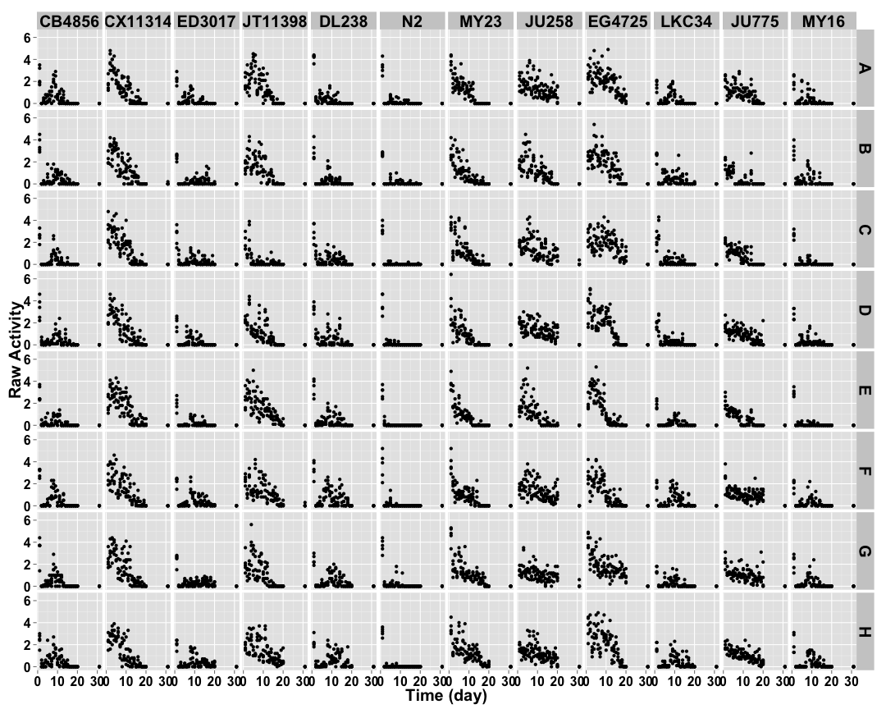
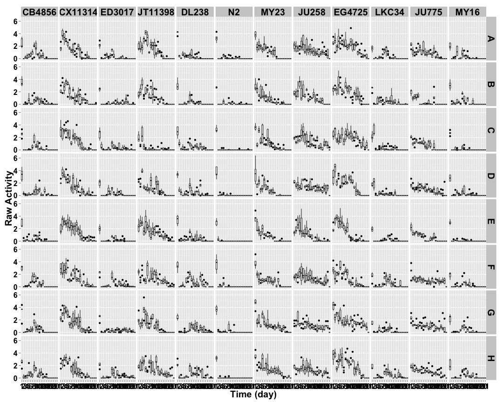
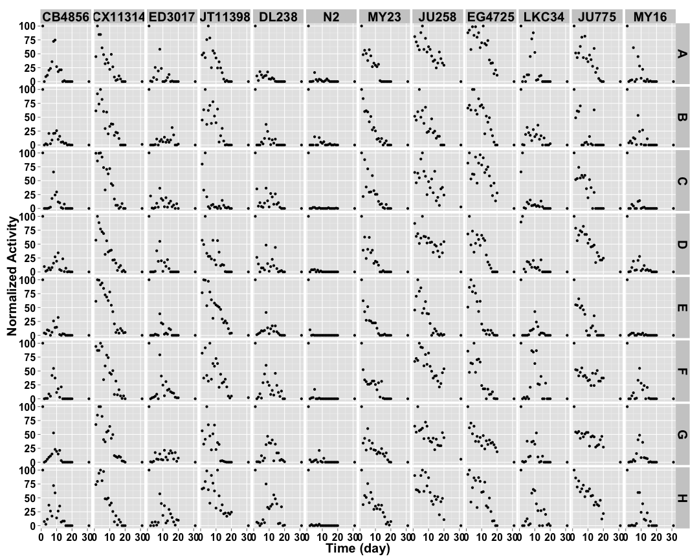
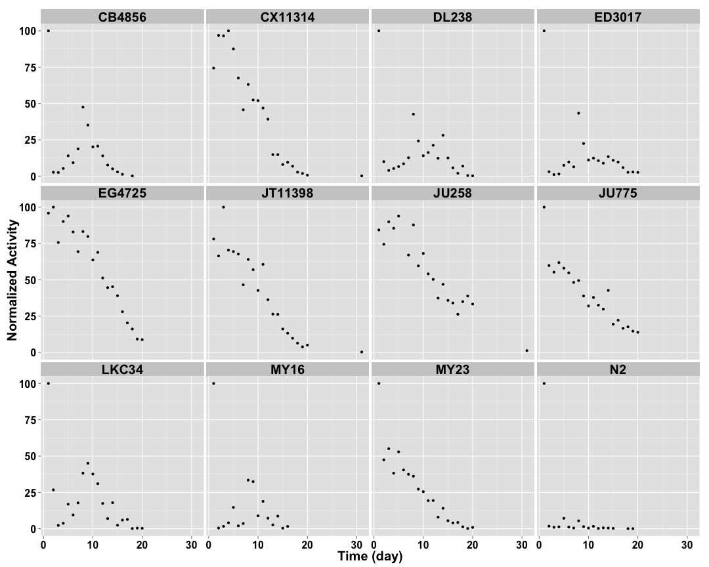
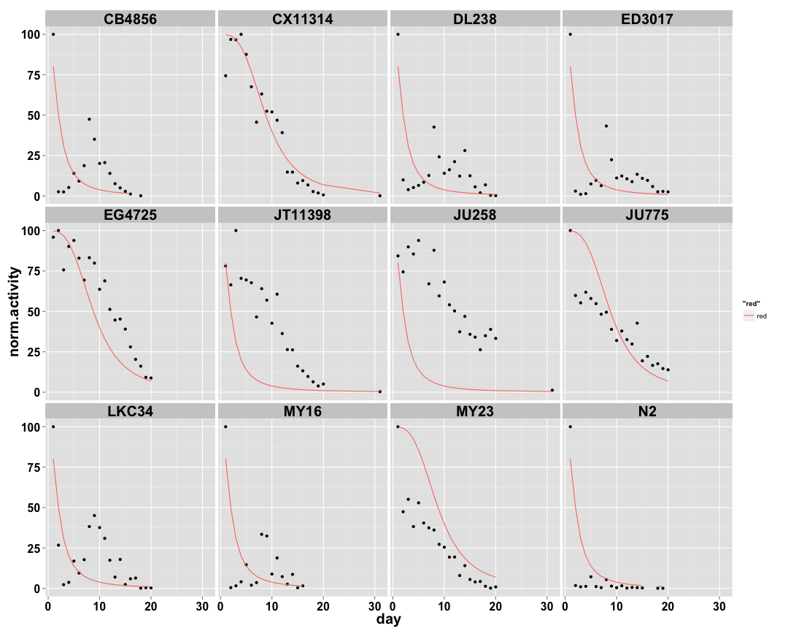

```
## [1] "p03_4mgmL"
```
 
## Raw Activity ##


 

## Cleaned Data ##


 


## Well Mean Data ##

 

## Well Median Data ##

 

## Well Total Data ##

 

## Well Normalized Data ##


 

## Setting Top of Curve by Well ##


 

## Well Curve Fitting ##


|strain  |row |    bparam|    cparam|
|:-------|:---|---------:|---------:|
|CB4856  |A   | 0.0000000|  0.000000|
|CB4856  |B   | 0.0000000|  0.000000|
|CB4856  |C   | 0.0000000|  0.000000|
|CB4856  |D   | 0.0000000|  0.000000|
|CB4856  |E   | 0.0000000|  0.000000|
|CB4856  |F   | 0.0000000|  0.000000|
|CB4856  |G   | 0.0000000|  0.000000|
|CB4856  |H   | 0.0000000|  0.000000|
|CX11314 |A   | 0.0000000|  0.000000|
|CX11314 |B   | 0.0000000|  0.000000|
|CX11314 |C   | 3.5195132|  9.254232|
|CX11314 |D   | 0.0000000|  0.000000|
|CX11314 |E   | 4.5196473| 10.433030|
|CX11314 |F   | 0.0000000|  0.000000|
|CX11314 |G   | 0.0000000|  0.000000|
|CX11314 |H   | 3.7237817|  8.439869|
|ED3017  |A   | 0.0000000|  0.000000|
|ED3017  |B   | 0.0000000|  0.000000|
|ED3017  |C   | 0.0000000|  0.000000|
|ED3017  |D   | 0.0000000|  0.000000|
|ED3017  |E   | 0.0000000|  0.000000|
|ED3017  |F   | 0.0000000|  0.000000|
|ED3017  |G   | 0.0000000|  0.000000|
|ED3017  |H   | 0.0000000|  0.000000|
|JT11398 |A   | 1.4338233|  5.787810|
|JT11398 |B   | 1.6629687|  6.492903|
|JT11398 |C   | 0.0000000|  0.000000|
|JT11398 |D   | 1.1250268|  3.286522|
|JT11398 |E   | 2.1353663|  9.391624|
|JT11398 |F   | 0.9674161|  6.703142|
|JT11398 |G   | 1.1114132|  3.882486|
|JT11398 |H   | 1.6149330| 10.185014|
|DL238   |A   | 0.0000000|  0.000000|
|DL238   |B   | 0.0000000|  0.000000|
|DL238   |C   | 0.0000000|  0.000000|
|DL238   |D   | 0.0000000|  0.000000|
|DL238   |E   | 0.0000000|  0.000000|
|DL238   |F   | 0.0000000|  0.000000|
|DL238   |G   | 0.0000000|  0.000000|
|DL238   |H   | 0.0000000|  0.000000|
|N2      |A   | 0.0000000|  0.000000|
|N2      |B   | 0.0000000|  0.000000|
|N2      |C   | 0.0000000|  0.000000|
|N2      |D   | 0.0000000|  0.000000|
|N2      |E   | 0.0000000|  0.000000|
|N2      |F   | 0.0000000|  0.000000|
|N2      |G   | 0.0000000|  0.000000|
|N2      |H   | 0.0000000|  0.000000|
|MY23    |A   | 1.4938484|  4.041878|
|MY23    |B   | 2.1033522|  5.161822|
|MY23    |C   | 1.4556747|  4.128970|
|MY23    |D   | 0.0000000|  0.000000|
|MY23    |E   | 1.7118462|  3.157026|
|MY23    |F   | 1.3080267|  2.802202|
|MY23    |G   | 0.0000000|  0.000000|
|MY23    |H   | 1.1057237|  4.928138|
|JU258   |A   | 1.0200528| 11.441678|
|JU258   |B   | 1.1159186|  4.918812|
|JU258   |C   | 0.8094850|  7.617016|
|JU258   |D   | 0.6683689| 12.213512|
|JU258   |E   | 3.0402132|  7.040281|
|JU258   |F   | 1.5787926| 12.915687|
|JU258   |G   | 0.6472096|  8.228651|
|JU258   |H   | 1.4510665| 13.550719|
|EG4725  |A   | 4.1169897| 14.204296|
|EG4725  |B   | 0.0000000|  0.000000|
|EG4725  |C   | 1.0883269| 16.209828|
|EG4725  |D   | 1.4827258|  6.858417|
|EG4725  |E   | 0.0000000|  0.000000|
|EG4725  |F   | 0.0000000|  0.000000|
|EG4725  |G   | 0.8864034|  6.084303|
|EG4725  |H   | 2.0867543| 10.536181|
|LKC34   |A   | 0.0000000|  0.000000|
|LKC34   |B   | 0.0000000|  0.000000|
|LKC34   |C   | 0.0000000|  0.000000|
|LKC34   |D   | 0.0000000|  0.000000|
|LKC34   |E   | 0.0000000|  0.000000|
|LKC34   |F   | 0.0000000|  0.000000|
|LKC34   |G   | 0.0000000|  0.000000|
|LKC34   |H   | 0.0000000|  0.000000|
|JU775   |A   | 1.1387928|  6.206845|
|JU775   |B   | 0.0000000|  0.000000|
|JU775   |C   | 1.6309073|  5.717464|
|JU775   |D   | 1.3571060| 10.219800|
|JU775   |E   | 0.0000000|  0.000000|
|JU775   |F   | 0.6029569|  5.074582|
|JU775   |G   | 0.6201977|  6.555116|
|JU775   |H   | 1.2159747| 11.149675|
|MY16    |A   | 0.0000000|  0.000000|
|MY16    |B   | 0.0000000|  0.000000|
|MY16    |C   | 0.0000000|  0.000000|
|MY16    |D   | 0.0000000|  0.000000|
|MY16    |E   | 0.0000000|  0.000000|
|MY16    |F   | 0.0000000|  0.000000|
|MY16    |G   | 0.0000000|  0.000000|
|MY16    |H   | 0.0000000|  0.000000|

## 2 Parameter Logistic Function Fits by Well ##


 

## Strain Mean Data ##


 

## Strain Median Data ##

 

## Strain Total Data ##

 

## Strain Normalized Data ##


 

## Setting Top of Curve by Strain ##


 

## Strain Curve Fitting ##


|strain  |    bparam|    cparam|
|:-------|---------:|---------:|
|CB4856  | 0.0000000|  0.000000|
|CX11314 | 3.8965420|  9.524727|
|ED3017  | 0.0000000|  0.000000|
|JT11398 | 2.9613624|  9.974224|
|DL238   | 0.0000000|  0.000000|
|N2      | 0.0000000|  0.000000|
|MY23    | 1.4269511|  3.846494|
|JU258   | 2.2409987| 12.294187|
|EG4725  | 1.8476339| 11.631810|
|LKC34   | 0.0000000|  0.000000|
|JU775   | 0.9649487|  6.898603|
|MY16    | 0.0000000|  0.000000|

## 2 Parameter Logistic Function Fits by Strain ##


 
