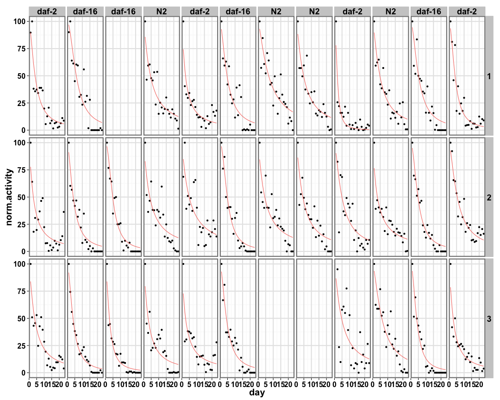
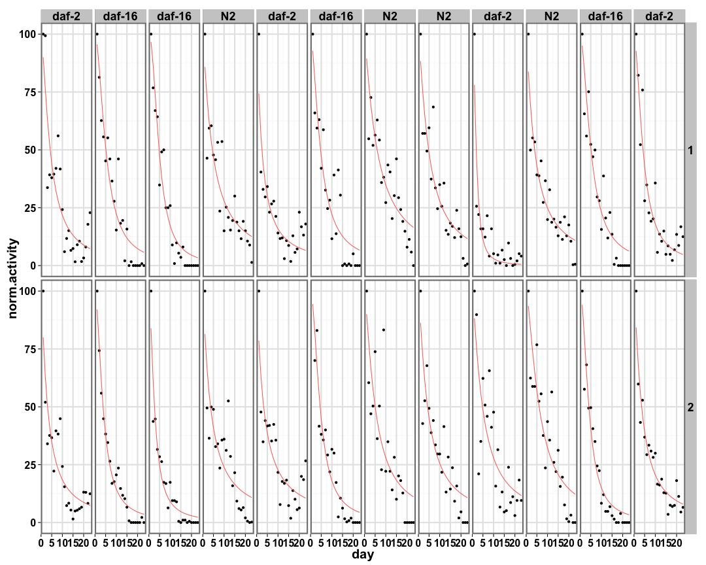
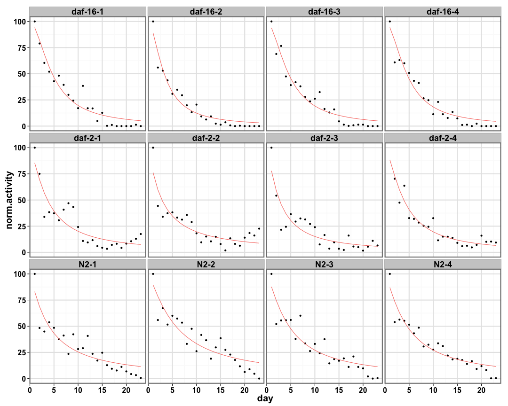
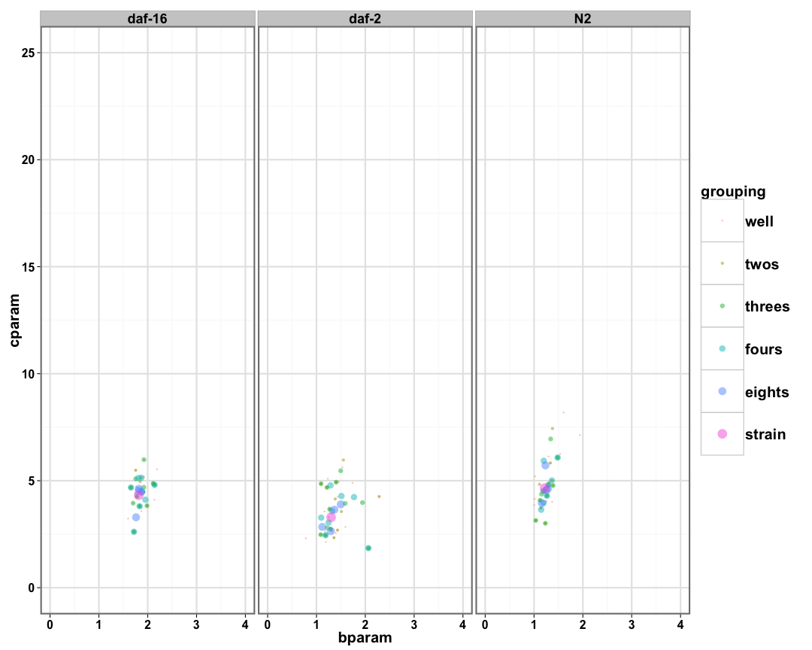
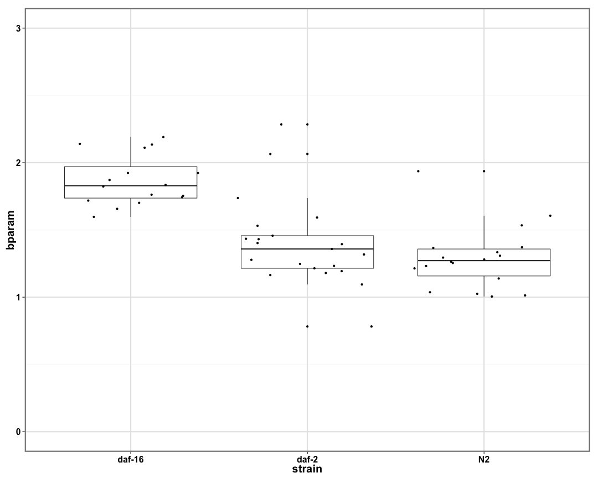
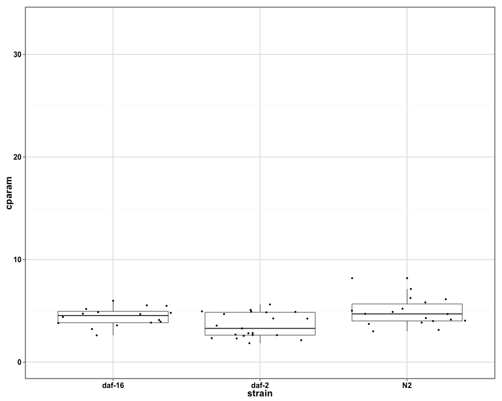
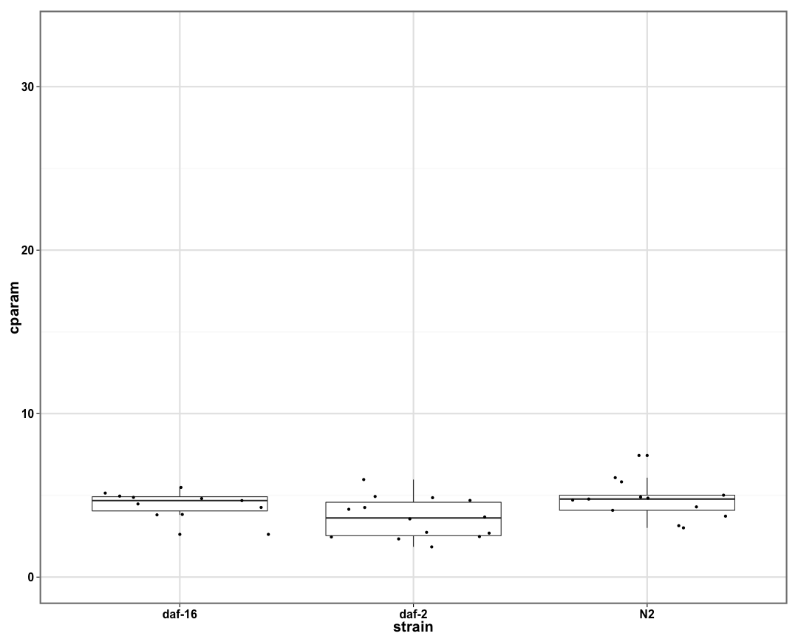
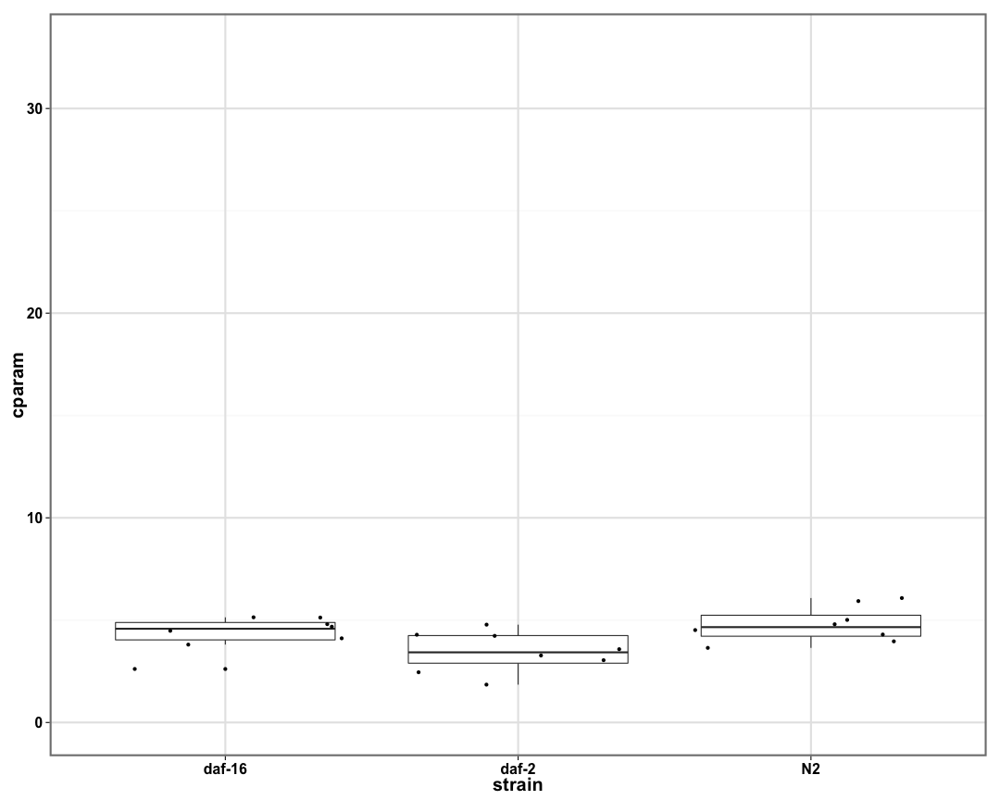
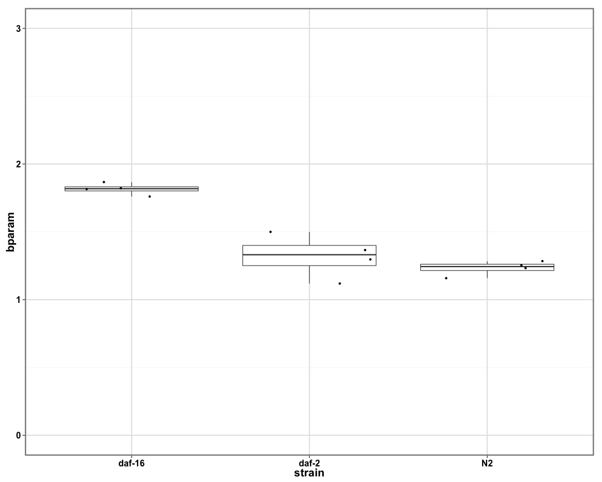
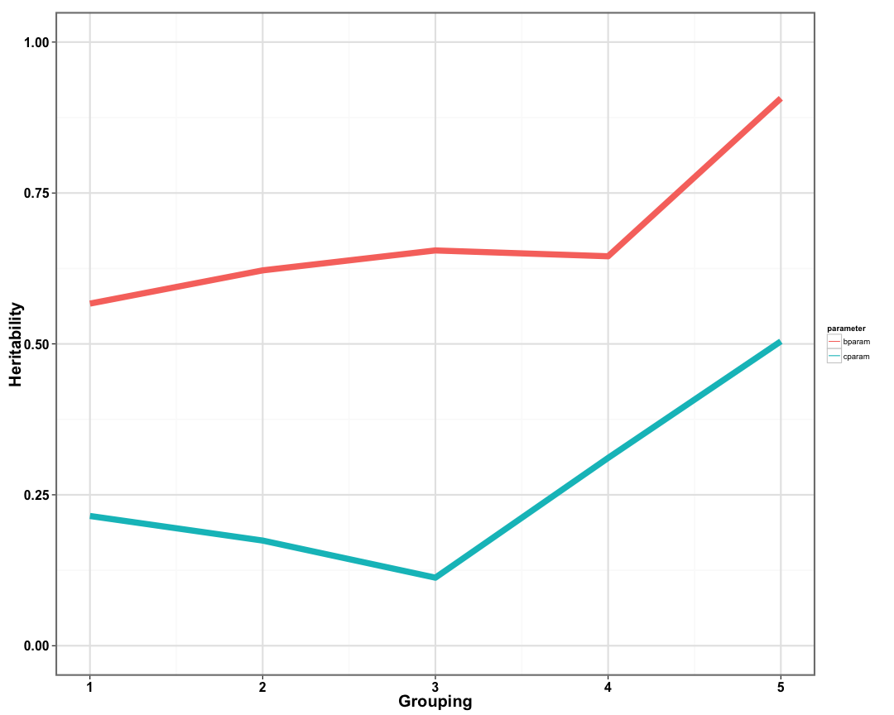

```
## [1] "p05_daf3"
```


```
## Error in `$<-.data.frame`(`*tmp*`, "day", value = c(1, 1, 1, 1, 1, 1, : replacement has 8160 rows, data has 1632
```

```
## Error in order(raw.df$col, raw.df$row, raw.df$day): argument 3 is not a vector
```

```
## Error in `$<-.data.frame`(`*tmp*`, "strain", value = c("daf-2", "daf-2", : replacement has 8160 rows, data has 7680
```

```
## Error in `$<-.data.frame`(`*tmp*`, "uniqueStrain", value = c("daf-2-1", : replacement has 8160 rows, data has 7680
```

```
## Error in `$<-.data.frame`(`*tmp*`, "num", value = c(5, 5, 5, 5, 5, 5, : replacement has 8160 rows, data has 7680
```


```
## Error in `$<-.data.frame`(`*tmp*`, "strain", value = c("daf-2", "daf-2", : replacement has 1632 rows, data has 1536
```

```
## Error in `$<-.data.frame`(`*tmp*`, "uniqueStrain", value = c("daf-2-1", : replacement has 1632 rows, data has 1536
```

## Individual Well Fits ##

 

## Two Wells Fits ##


```
## Error in `$<-.data.frame`(`*tmp*`, "grouping", value = c(1L, 1L, 1L, 1L, : replacement has 1632 rows, data has 1536
```

```
## Error in eval(expr, envir, enclos): unknown column 'strain'
```

 

## Three Wells Fits ##


```
## Error in `$<-.data.frame`(`*tmp*`, "grouping", value = c(1, 1, 1, 1, 1, : replacement has 1632 rows, data has 1536
```

```
## Error in eval(expr, envir, enclos): unknown column 'strain'
```

 

## Four Wells Fits ##


```
## Error in `$<-.data.frame`(`*tmp*`, "grouping", value = c(1L, 1L, 1L, 1L, : replacement has 1632 rows, data has 1536
```

```
## Error in eval(expr, envir, enclos): unknown column 'strain'
```

 

## Eight Wells Fits ##


```
## Error in `$<-.data.frame`(`*tmp*`, "grouping", value = c(1, 1, 1, 1, 1, : replacement has 1632 rows, data has 1536
```

```
## Error in eval(expr, envir, enclos): unknown column 'strain'
```

 

## Strain Fits ##


```
## Error in eval(expr, envir, enclos): unknown column 'strain'
```

 

## Distribution of Parameters ##

           


```
## Error in names(pdata.melted) = c("pheno", "strain"): 'names' attribute [2] must be the same length as the vector [1]
```

## Heritability of Parameters ##

 
