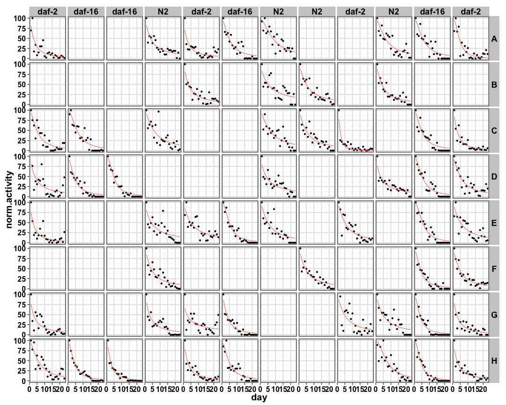
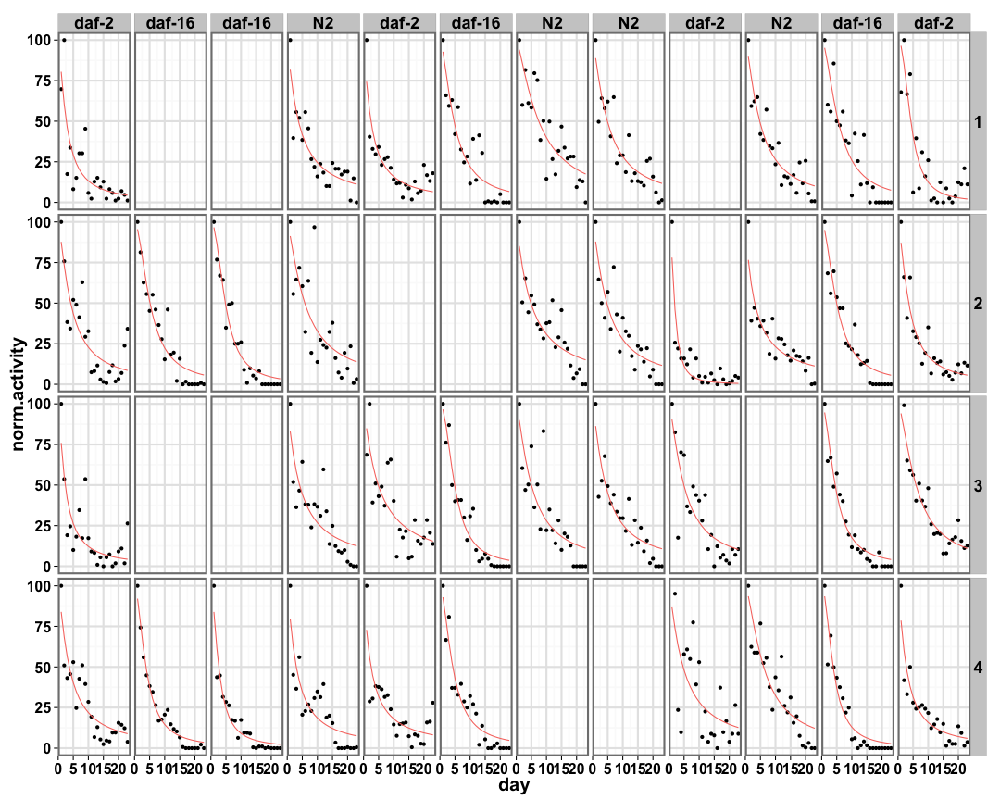

```
## [1] "p05_daf3"
```


## Individual Well Fits ##

 

## Two Wells Fits ##


```
## [1] "Processing iteration 1 out of 120."
## [1] "Processing iteration 2 out of 120."
## [1] "Processing iteration 3 out of 120."
## [1] "Processing iteration 4 out of 120."
## [1] "Processing iteration 5 out of 120."
## [1] "Processing iteration 6 out of 120."
## [1] "Processing iteration 7 out of 120."
## [1] "Processing iteration 8 out of 120."
## [1] "Processing iteration 9 out of 120."
## [1] "Processing iteration 10 out of 120."
## [1] "Processing iteration 11 out of 120."
## [1] "Processing iteration 12 out of 120."
## [1] "Processing iteration 13 out of 120."
## [1] "Processing iteration 14 out of 120."
## [1] "Processing iteration 15 out of 120."
## [1] "Processing iteration 16 out of 120."
## [1] "Processing iteration 17 out of 120."
## [1] "Processing iteration 18 out of 120."
## [1] "Processing iteration 19 out of 120."
## [1] "Processing iteration 20 out of 120."
## [1] "Processing iteration 21 out of 120."
## [1] "Processing iteration 22 out of 120."
## [1] "Processing iteration 23 out of 120."
## [1] "Processing iteration 24 out of 120."
## [1] "Processing iteration 25 out of 120."
## [1] "Processing iteration 26 out of 120."
## [1] "Processing iteration 27 out of 120."
## [1] "Processing iteration 28 out of 120."
## [1] "Processing iteration 29 out of 120."
## [1] "Processing iteration 30 out of 120."
## [1] "Processing iteration 31 out of 120."
## [1] "Processing iteration 32 out of 120."
## [1] "Processing iteration 33 out of 120."
## [1] "Processing iteration 34 out of 120."
## [1] "Processing iteration 35 out of 120."
## [1] "Processing iteration 36 out of 120."
## [1] "Processing iteration 37 out of 120."
## [1] "Processing iteration 38 out of 120."
## [1] "Processing iteration 39 out of 120."
## [1] "Processing iteration 40 out of 120."
## [1] "Processing iteration 41 out of 120."
## [1] "Processing iteration 42 out of 120."
## [1] "Processing iteration 43 out of 120."
## [1] "Processing iteration 44 out of 120."
## [1] "Processing iteration 45 out of 120."
## [1] "Processing iteration 46 out of 120."
## [1] "Processing iteration 47 out of 120."
## [1] "Processing iteration 48 out of 120."
## [1] "Processing iteration 49 out of 120."
## [1] "Processing iteration 50 out of 120."
## [1] "Processing iteration 51 out of 120."
## [1] "Processing iteration 52 out of 120."
## [1] "Processing iteration 53 out of 120."
## [1] "Processing iteration 54 out of 120."
## [1] "Processing iteration 55 out of 120."
## [1] "Processing iteration 56 out of 120."
## [1] "Processing iteration 57 out of 120."
## [1] "Processing iteration 58 out of 120."
## [1] "Processing iteration 59 out of 120."
## [1] "Processing iteration 60 out of 120."
## [1] "Processing iteration 61 out of 120."
## [1] "Processing iteration 62 out of 120."
## [1] "Processing iteration 63 out of 120."
## [1] "Processing iteration 64 out of 120."
## [1] "Processing iteration 65 out of 120."
## [1] "Processing iteration 66 out of 120."
## [1] "Processing iteration 67 out of 120."
## [1] "Processing iteration 68 out of 120."
## [1] "Processing iteration 69 out of 120."
## [1] "Processing iteration 70 out of 120."
## [1] "Processing iteration 71 out of 120."
## [1] "Processing iteration 72 out of 120."
## [1] "Processing iteration 73 out of 120."
## [1] "Processing iteration 74 out of 120."
## [1] "Processing iteration 75 out of 120."
## [1] "Processing iteration 76 out of 120."
## [1] "Processing iteration 77 out of 120."
## [1] "Processing iteration 78 out of 120."
## [1] "Processing iteration 79 out of 120."
## [1] "Processing iteration 80 out of 120."
## [1] "Processing iteration 81 out of 120."
## [1] "Processing iteration 82 out of 120."
## [1] "Processing iteration 83 out of 120."
## [1] "Processing iteration 84 out of 120."
## [1] "Processing iteration 85 out of 120."
## [1] "Processing iteration 86 out of 120."
## [1] "Processing iteration 87 out of 120."
## [1] "Processing iteration 88 out of 120."
## [1] "Processing iteration 89 out of 120."
## [1] "Processing iteration 90 out of 120."
## [1] "Processing iteration 91 out of 120."
## [1] "Processing iteration 92 out of 120."
## [1] "Processing iteration 93 out of 120."
## [1] "Processing iteration 94 out of 120."
## [1] "Processing iteration 95 out of 120."
## [1] "Processing iteration 96 out of 120."
## [1] "Processing iteration 97 out of 120."
## [1] "Processing iteration 98 out of 120."
## [1] "Processing iteration 99 out of 120."
## [1] "Processing iteration 100 out of 120."
## [1] "Processing iteration 101 out of 120."
## [1] "Processing iteration 102 out of 120."
## [1] "Processing iteration 103 out of 120."
## [1] "Processing iteration 104 out of 120."
## [1] "Processing iteration 105 out of 120."
## [1] "Processing iteration 106 out of 120."
## [1] "Processing iteration 107 out of 120."
## [1] "Processing iteration 108 out of 120."
## [1] "Processing iteration 109 out of 120."
## [1] "Processing iteration 110 out of 120."
## [1] "Processing iteration 111 out of 120."
## [1] "Processing iteration 112 out of 120."
## [1] "Processing iteration 113 out of 120."
## [1] "Processing iteration 114 out of 120."
## [1] "Processing iteration 115 out of 120."
## [1] "Processing iteration 116 out of 120."
## [1] "Processing iteration 117 out of 120."
## [1] "Processing iteration 118 out of 120."
## [1] "Processing iteration 119 out of 120."
## [1] "Processing iteration 120 out of 120."
## [1] "Processing iteration 1 out of 465."
## [1] "Processing iteration 2 out of 465."
## [1] "Processing iteration 3 out of 465."
## [1] "Processing iteration 4 out of 465."
## [1] "Processing iteration 5 out of 465."
## [1] "Processing iteration 6 out of 465."
## [1] "Processing iteration 7 out of 465."
## [1] "Processing iteration 8 out of 465."
## [1] "Processing iteration 9 out of 465."
## [1] "Processing iteration 10 out of 465."
## [1] "Processing iteration 11 out of 465."
## [1] "Processing iteration 12 out of 465."
## [1] "Processing iteration 13 out of 465."
## [1] "Processing iteration 14 out of 465."
## [1] "Processing iteration 15 out of 465."
## [1] "Processing iteration 16 out of 465."
## [1] "Processing iteration 17 out of 465."
## [1] "Processing iteration 18 out of 465."
## [1] "Processing iteration 19 out of 465."
## [1] "Processing iteration 20 out of 465."
## [1] "Processing iteration 21 out of 465."
## [1] "Processing iteration 22 out of 465."
## [1] "Processing iteration 23 out of 465."
## [1] "Processing iteration 24 out of 465."
## [1] "Processing iteration 25 out of 465."
## [1] "Processing iteration 26 out of 465."
## [1] "Processing iteration 27 out of 465."
## [1] "Processing iteration 28 out of 465."
## [1] "Processing iteration 29 out of 465."
## [1] "Processing iteration 30 out of 465."
## [1] "Processing iteration 31 out of 465."
## [1] "Processing iteration 32 out of 465."
## [1] "Processing iteration 33 out of 465."
## [1] "Processing iteration 34 out of 465."
## [1] "Processing iteration 35 out of 465."
## [1] "Processing iteration 36 out of 465."
## [1] "Processing iteration 37 out of 465."
## [1] "Processing iteration 38 out of 465."
## [1] "Processing iteration 39 out of 465."
## [1] "Processing iteration 40 out of 465."
## [1] "Processing iteration 41 out of 465."
## [1] "Processing iteration 42 out of 465."
## [1] "Processing iteration 43 out of 465."
## [1] "Processing iteration 44 out of 465."
## [1] "Processing iteration 45 out of 465."
## [1] "Processing iteration 46 out of 465."
## [1] "Processing iteration 47 out of 465."
## [1] "Processing iteration 48 out of 465."
## [1] "Processing iteration 49 out of 465."
## [1] "Processing iteration 50 out of 465."
## [1] "Processing iteration 51 out of 465."
## [1] "Processing iteration 52 out of 465."
## [1] "Processing iteration 53 out of 465."
## [1] "Processing iteration 54 out of 465."
## [1] "Processing iteration 55 out of 465."
## [1] "Processing iteration 56 out of 465."
## [1] "Processing iteration 57 out of 465."
## [1] "Processing iteration 58 out of 465."
## [1] "Processing iteration 59 out of 465."
## [1] "Processing iteration 60 out of 465."
## [1] "Processing iteration 61 out of 465."
## [1] "Processing iteration 62 out of 465."
## [1] "Processing iteration 63 out of 465."
## [1] "Processing iteration 64 out of 465."
## [1] "Processing iteration 65 out of 465."
## [1] "Processing iteration 66 out of 465."
## [1] "Processing iteration 67 out of 465."
## [1] "Processing iteration 68 out of 465."
## [1] "Processing iteration 69 out of 465."
## [1] "Processing iteration 70 out of 465."
## [1] "Processing iteration 71 out of 465."
## [1] "Processing iteration 72 out of 465."
## [1] "Processing iteration 73 out of 465."
## [1] "Processing iteration 74 out of 465."
## [1] "Processing iteration 75 out of 465."
## [1] "Processing iteration 76 out of 465."
## [1] "Processing iteration 77 out of 465."
## [1] "Processing iteration 78 out of 465."
## [1] "Processing iteration 79 out of 465."
## [1] "Processing iteration 80 out of 465."
## [1] "Processing iteration 81 out of 465."
## [1] "Processing iteration 82 out of 465."
## [1] "Processing iteration 83 out of 465."
## [1] "Processing iteration 84 out of 465."
## [1] "Processing iteration 85 out of 465."
## [1] "Processing iteration 86 out of 465."
## [1] "Processing iteration 87 out of 465."
## [1] "Processing iteration 88 out of 465."
## [1] "Processing iteration 89 out of 465."
## [1] "Processing iteration 90 out of 465."
## [1] "Processing iteration 91 out of 465."
## [1] "Processing iteration 92 out of 465."
## [1] "Processing iteration 93 out of 465."
## [1] "Processing iteration 94 out of 465."
## [1] "Processing iteration 95 out of 465."
## [1] "Processing iteration 96 out of 465."
## [1] "Processing iteration 97 out of 465."
## [1] "Processing iteration 98 out of 465."
## [1] "Processing iteration 99 out of 465."
## [1] "Processing iteration 100 out of 465."
## [1] "Processing iteration 101 out of 465."
## [1] "Processing iteration 102 out of 465."
## [1] "Processing iteration 103 out of 465."
## [1] "Processing iteration 104 out of 465."
## [1] "Processing iteration 105 out of 465."
## [1] "Processing iteration 106 out of 465."
## [1] "Processing iteration 107 out of 465."
## [1] "Processing iteration 108 out of 465."
## [1] "Processing iteration 109 out of 465."
## [1] "Processing iteration 110 out of 465."
## [1] "Processing iteration 111 out of 465."
## [1] "Processing iteration 112 out of 465."
## [1] "Processing iteration 113 out of 465."
## [1] "Processing iteration 114 out of 465."
## [1] "Processing iteration 115 out of 465."
## [1] "Processing iteration 116 out of 465."
## [1] "Processing iteration 117 out of 465."
## [1] "Processing iteration 118 out of 465."
## [1] "Processing iteration 119 out of 465."
## [1] "Processing iteration 120 out of 465."
## [1] "Processing iteration 121 out of 465."
## [1] "Processing iteration 122 out of 465."
## [1] "Processing iteration 123 out of 465."
## [1] "Processing iteration 124 out of 465."
## [1] "Processing iteration 125 out of 465."
## [1] "Processing iteration 126 out of 465."
## [1] "Processing iteration 127 out of 465."
## [1] "Processing iteration 128 out of 465."
## [1] "Processing iteration 129 out of 465."
## [1] "Processing iteration 130 out of 465."
## [1] "Processing iteration 131 out of 465."
## [1] "Processing iteration 132 out of 465."
## [1] "Processing iteration 133 out of 465."
## [1] "Processing iteration 134 out of 465."
## [1] "Processing iteration 135 out of 465."
## [1] "Processing iteration 136 out of 465."
## [1] "Processing iteration 137 out of 465."
## [1] "Processing iteration 138 out of 465."
## [1] "Processing iteration 139 out of 465."
## [1] "Processing iteration 140 out of 465."
## [1] "Processing iteration 141 out of 465."
## [1] "Processing iteration 142 out of 465."
## [1] "Processing iteration 143 out of 465."
## [1] "Processing iteration 144 out of 465."
## [1] "Processing iteration 145 out of 465."
## [1] "Processing iteration 146 out of 465."
## [1] "Processing iteration 147 out of 465."
## [1] "Processing iteration 148 out of 465."
## [1] "Processing iteration 149 out of 465."
## [1] "Processing iteration 150 out of 465."
## [1] "Processing iteration 151 out of 465."
## [1] "Processing iteration 152 out of 465."
## [1] "Processing iteration 153 out of 465."
## [1] "Processing iteration 154 out of 465."
## [1] "Processing iteration 155 out of 465."
## [1] "Processing iteration 156 out of 465."
## [1] "Processing iteration 157 out of 465."
## [1] "Processing iteration 158 out of 465."
## [1] "Processing iteration 159 out of 465."
## [1] "Processing iteration 160 out of 465."
## [1] "Processing iteration 161 out of 465."
## [1] "Processing iteration 162 out of 465."
## [1] "Processing iteration 163 out of 465."
## [1] "Processing iteration 164 out of 465."
## [1] "Processing iteration 165 out of 465."
## [1] "Processing iteration 166 out of 465."
## [1] "Processing iteration 167 out of 465."
## [1] "Processing iteration 168 out of 465."
## [1] "Processing iteration 169 out of 465."
## [1] "Processing iteration 170 out of 465."
## [1] "Processing iteration 171 out of 465."
## [1] "Processing iteration 172 out of 465."
## [1] "Processing iteration 173 out of 465."
## [1] "Processing iteration 174 out of 465."
## [1] "Processing iteration 175 out of 465."
## [1] "Processing iteration 176 out of 465."
## [1] "Processing iteration 177 out of 465."
## [1] "Processing iteration 178 out of 465."
## [1] "Processing iteration 179 out of 465."
## [1] "Processing iteration 180 out of 465."
## [1] "Processing iteration 181 out of 465."
## [1] "Processing iteration 182 out of 465."
## [1] "Processing iteration 183 out of 465."
## [1] "Processing iteration 184 out of 465."
## [1] "Processing iteration 185 out of 465."
## [1] "Processing iteration 186 out of 465."
## [1] "Processing iteration 187 out of 465."
## [1] "Processing iteration 188 out of 465."
## [1] "Processing iteration 189 out of 465."
## [1] "Processing iteration 190 out of 465."
## [1] "Processing iteration 191 out of 465."
## [1] "Processing iteration 192 out of 465."
## [1] "Processing iteration 193 out of 465."
## [1] "Processing iteration 194 out of 465."
## [1] "Processing iteration 195 out of 465."
## [1] "Processing iteration 196 out of 465."
## [1] "Processing iteration 197 out of 465."
## [1] "Processing iteration 198 out of 465."
## [1] "Processing iteration 199 out of 465."
## [1] "Processing iteration 200 out of 465."
## [1] "Processing iteration 201 out of 465."
## [1] "Processing iteration 202 out of 465."
## [1] "Processing iteration 203 out of 465."
## [1] "Processing iteration 204 out of 465."
## [1] "Processing iteration 205 out of 465."
## [1] "Processing iteration 206 out of 465."
## [1] "Processing iteration 207 out of 465."
## [1] "Processing iteration 208 out of 465."
## [1] "Processing iteration 209 out of 465."
## [1] "Processing iteration 210 out of 465."
## [1] "Processing iteration 211 out of 465."
## [1] "Processing iteration 212 out of 465."
## [1] "Processing iteration 213 out of 465."
## [1] "Processing iteration 214 out of 465."
## [1] "Processing iteration 215 out of 465."
## [1] "Processing iteration 216 out of 465."
## [1] "Processing iteration 217 out of 465."
## [1] "Processing iteration 218 out of 465."
## [1] "Processing iteration 219 out of 465."
## [1] "Processing iteration 220 out of 465."
## [1] "Processing iteration 221 out of 465."
## [1] "Processing iteration 222 out of 465."
## [1] "Processing iteration 223 out of 465."
## [1] "Processing iteration 224 out of 465."
## [1] "Processing iteration 225 out of 465."
## [1] "Processing iteration 226 out of 465."
## [1] "Processing iteration 227 out of 465."
## [1] "Processing iteration 228 out of 465."
## [1] "Processing iteration 229 out of 465."
## [1] "Processing iteration 230 out of 465."
## [1] "Processing iteration 231 out of 465."
## [1] "Processing iteration 232 out of 465."
## [1] "Processing iteration 233 out of 465."
## [1] "Processing iteration 234 out of 465."
## [1] "Processing iteration 235 out of 465."
## [1] "Processing iteration 236 out of 465."
## [1] "Processing iteration 237 out of 465."
## [1] "Processing iteration 238 out of 465."
## [1] "Processing iteration 239 out of 465."
## [1] "Processing iteration 240 out of 465."
## [1] "Processing iteration 241 out of 465."
## [1] "Processing iteration 242 out of 465."
## [1] "Processing iteration 243 out of 465."
## [1] "Processing iteration 244 out of 465."
## [1] "Processing iteration 245 out of 465."
## [1] "Processing iteration 246 out of 465."
## [1] "Processing iteration 247 out of 465."
## [1] "Processing iteration 248 out of 465."
## [1] "Processing iteration 249 out of 465."
## [1] "Processing iteration 250 out of 465."
## [1] "Processing iteration 251 out of 465."
## [1] "Processing iteration 252 out of 465."
## [1] "Processing iteration 253 out of 465."
## [1] "Processing iteration 254 out of 465."
## [1] "Processing iteration 255 out of 465."
## [1] "Processing iteration 256 out of 465."
## [1] "Processing iteration 257 out of 465."
## [1] "Processing iteration 258 out of 465."
## [1] "Processing iteration 259 out of 465."
## [1] "Processing iteration 260 out of 465."
## [1] "Processing iteration 261 out of 465."
## [1] "Processing iteration 262 out of 465."
## [1] "Processing iteration 263 out of 465."
## [1] "Processing iteration 264 out of 465."
## [1] "Processing iteration 265 out of 465."
## [1] "Processing iteration 266 out of 465."
## [1] "Processing iteration 267 out of 465."
## [1] "Processing iteration 268 out of 465."
## [1] "Processing iteration 269 out of 465."
## [1] "Processing iteration 270 out of 465."
## [1] "Processing iteration 271 out of 465."
## [1] "Processing iteration 272 out of 465."
## [1] "Processing iteration 273 out of 465."
## [1] "Processing iteration 274 out of 465."
## [1] "Processing iteration 275 out of 465."
## [1] "Processing iteration 276 out of 465."
## [1] "Processing iteration 277 out of 465."
## [1] "Processing iteration 278 out of 465."
## [1] "Processing iteration 279 out of 465."
## [1] "Processing iteration 280 out of 465."
## [1] "Processing iteration 281 out of 465."
## [1] "Processing iteration 282 out of 465."
## [1] "Processing iteration 283 out of 465."
## [1] "Processing iteration 284 out of 465."
## [1] "Processing iteration 285 out of 465."
## [1] "Processing iteration 286 out of 465."
## [1] "Processing iteration 287 out of 465."
## [1] "Processing iteration 288 out of 465."
## [1] "Processing iteration 289 out of 465."
## [1] "Processing iteration 290 out of 465."
## [1] "Processing iteration 291 out of 465."
## [1] "Processing iteration 292 out of 465."
## [1] "Processing iteration 293 out of 465."
## [1] "Processing iteration 294 out of 465."
## [1] "Processing iteration 295 out of 465."
## [1] "Processing iteration 296 out of 465."
## [1] "Processing iteration 297 out of 465."
## [1] "Processing iteration 298 out of 465."
## [1] "Processing iteration 299 out of 465."
## [1] "Processing iteration 300 out of 465."
## [1] "Processing iteration 301 out of 465."
## [1] "Processing iteration 302 out of 465."
## [1] "Processing iteration 303 out of 465."
## [1] "Processing iteration 304 out of 465."
## [1] "Processing iteration 305 out of 465."
## [1] "Processing iteration 306 out of 465."
## [1] "Processing iteration 307 out of 465."
## [1] "Processing iteration 308 out of 465."
## [1] "Processing iteration 309 out of 465."
## [1] "Processing iteration 310 out of 465."
## [1] "Processing iteration 311 out of 465."
## [1] "Processing iteration 312 out of 465."
## [1] "Processing iteration 313 out of 465."
## [1] "Processing iteration 314 out of 465."
## [1] "Processing iteration 315 out of 465."
## [1] "Processing iteration 316 out of 465."
## [1] "Processing iteration 317 out of 465."
## [1] "Processing iteration 318 out of 465."
## [1] "Processing iteration 319 out of 465."
## [1] "Processing iteration 320 out of 465."
## [1] "Processing iteration 321 out of 465."
## [1] "Processing iteration 322 out of 465."
## [1] "Processing iteration 323 out of 465."
## [1] "Processing iteration 324 out of 465."
## [1] "Processing iteration 325 out of 465."
## [1] "Processing iteration 326 out of 465."
## [1] "Processing iteration 327 out of 465."
## [1] "Processing iteration 328 out of 465."
## [1] "Processing iteration 329 out of 465."
## [1] "Processing iteration 330 out of 465."
## [1] "Processing iteration 331 out of 465."
## [1] "Processing iteration 332 out of 465."
## [1] "Processing iteration 333 out of 465."
## [1] "Processing iteration 334 out of 465."
## [1] "Processing iteration 335 out of 465."
## [1] "Processing iteration 336 out of 465."
## [1] "Processing iteration 337 out of 465."
## [1] "Processing iteration 338 out of 465."
## [1] "Processing iteration 339 out of 465."
## [1] "Processing iteration 340 out of 465."
## [1] "Processing iteration 341 out of 465."
## [1] "Processing iteration 342 out of 465."
## [1] "Processing iteration 343 out of 465."
## [1] "Processing iteration 344 out of 465."
## [1] "Processing iteration 345 out of 465."
## [1] "Processing iteration 346 out of 465."
## [1] "Processing iteration 347 out of 465."
## [1] "Processing iteration 348 out of 465."
## [1] "Processing iteration 349 out of 465."
## [1] "Processing iteration 350 out of 465."
## [1] "Processing iteration 351 out of 465."
## [1] "Processing iteration 352 out of 465."
## [1] "Processing iteration 353 out of 465."
## [1] "Processing iteration 354 out of 465."
## [1] "Processing iteration 355 out of 465."
## [1] "Processing iteration 356 out of 465."
## [1] "Processing iteration 357 out of 465."
## [1] "Processing iteration 358 out of 465."
## [1] "Processing iteration 359 out of 465."
## [1] "Processing iteration 360 out of 465."
## [1] "Processing iteration 361 out of 465."
## [1] "Processing iteration 362 out of 465."
## [1] "Processing iteration 363 out of 465."
## [1] "Processing iteration 364 out of 465."
## [1] "Processing iteration 365 out of 465."
## [1] "Processing iteration 366 out of 465."
## [1] "Processing iteration 367 out of 465."
## [1] "Processing iteration 368 out of 465."
## [1] "Processing iteration 369 out of 465."
## [1] "Processing iteration 370 out of 465."
## [1] "Processing iteration 371 out of 465."
## [1] "Processing iteration 372 out of 465."
## [1] "Processing iteration 373 out of 465."
## [1] "Processing iteration 374 out of 465."
## [1] "Processing iteration 375 out of 465."
## [1] "Processing iteration 376 out of 465."
## [1] "Processing iteration 377 out of 465."
## [1] "Processing iteration 378 out of 465."
## [1] "Processing iteration 379 out of 465."
## [1] "Processing iteration 380 out of 465."
## [1] "Processing iteration 381 out of 465."
## [1] "Processing iteration 382 out of 465."
## [1] "Processing iteration 383 out of 465."
## [1] "Processing iteration 384 out of 465."
## [1] "Processing iteration 385 out of 465."
## [1] "Processing iteration 386 out of 465."
## [1] "Processing iteration 387 out of 465."
## [1] "Processing iteration 388 out of 465."
## [1] "Processing iteration 389 out of 465."
## [1] "Processing iteration 390 out of 465."
## [1] "Processing iteration 391 out of 465."
## [1] "Processing iteration 392 out of 465."
## [1] "Processing iteration 393 out of 465."
## [1] "Processing iteration 394 out of 465."
## [1] "Processing iteration 395 out of 465."
## [1] "Processing iteration 396 out of 465."
## [1] "Processing iteration 397 out of 465."
## [1] "Processing iteration 398 out of 465."
## [1] "Processing iteration 399 out of 465."
## [1] "Processing iteration 400 out of 465."
## [1] "Processing iteration 401 out of 465."
## [1] "Processing iteration 402 out of 465."
## [1] "Processing iteration 403 out of 465."
## [1] "Processing iteration 404 out of 465."
## [1] "Processing iteration 405 out of 465."
## [1] "Processing iteration 406 out of 465."
## [1] "Processing iteration 407 out of 465."
## [1] "Processing iteration 408 out of 465."
## [1] "Processing iteration 409 out of 465."
## [1] "Processing iteration 410 out of 465."
## [1] "Processing iteration 411 out of 465."
## [1] "Processing iteration 412 out of 465."
## [1] "Processing iteration 413 out of 465."
## [1] "Processing iteration 414 out of 465."
## [1] "Processing iteration 415 out of 465."
## [1] "Processing iteration 416 out of 465."
## [1] "Processing iteration 417 out of 465."
## [1] "Processing iteration 418 out of 465."
## [1] "Processing iteration 419 out of 465."
## [1] "Processing iteration 420 out of 465."
## [1] "Processing iteration 421 out of 465."
## [1] "Processing iteration 422 out of 465."
## [1] "Processing iteration 423 out of 465."
## [1] "Processing iteration 424 out of 465."
## [1] "Processing iteration 425 out of 465."
## [1] "Processing iteration 426 out of 465."
## [1] "Processing iteration 427 out of 465."
## [1] "Processing iteration 428 out of 465."
## [1] "Processing iteration 429 out of 465."
## [1] "Processing iteration 430 out of 465."
## [1] "Processing iteration 431 out of 465."
## [1] "Processing iteration 432 out of 465."
## [1] "Processing iteration 433 out of 465."
## [1] "Processing iteration 434 out of 465."
## [1] "Processing iteration 435 out of 465."
## [1] "Processing iteration 436 out of 465."
## [1] "Processing iteration 437 out of 465."
## [1] "Processing iteration 438 out of 465."
## [1] "Processing iteration 439 out of 465."
## [1] "Processing iteration 440 out of 465."
## [1] "Processing iteration 441 out of 465."
## [1] "Processing iteration 442 out of 465."
## [1] "Processing iteration 443 out of 465."
## [1] "Processing iteration 444 out of 465."
## [1] "Processing iteration 445 out of 465."
## [1] "Processing iteration 446 out of 465."
## [1] "Processing iteration 447 out of 465."
## [1] "Processing iteration 448 out of 465."
## [1] "Processing iteration 449 out of 465."
## [1] "Processing iteration 450 out of 465."
## [1] "Processing iteration 451 out of 465."
## [1] "Processing iteration 452 out of 465."
## [1] "Processing iteration 453 out of 465."
## [1] "Processing iteration 454 out of 465."
## [1] "Processing iteration 455 out of 465."
## [1] "Processing iteration 456 out of 465."
## [1] "Processing iteration 457 out of 465."
## [1] "Processing iteration 458 out of 465."
## [1] "Processing iteration 459 out of 465."
## [1] "Processing iteration 460 out of 465."
## [1] "Processing iteration 461 out of 465."
## [1] "Processing iteration 462 out of 465."
## [1] "Processing iteration 463 out of 465."
## [1] "Processing iteration 464 out of 465."
## [1] "Processing iteration 465 out of 465."
## [1] "Processing iteration 1 out of 465."
## [1] "Processing iteration 2 out of 465."
## [1] "Processing iteration 3 out of 465."
## [1] "Processing iteration 4 out of 465."
## [1] "Processing iteration 5 out of 465."
## [1] "Processing iteration 6 out of 465."
## [1] "Processing iteration 7 out of 465."
## [1] "Processing iteration 8 out of 465."
## [1] "Processing iteration 9 out of 465."
## [1] "Processing iteration 10 out of 465."
## [1] "Processing iteration 11 out of 465."
## [1] "Processing iteration 12 out of 465."
## [1] "Processing iteration 13 out of 465."
## [1] "Processing iteration 14 out of 465."
## [1] "Processing iteration 15 out of 465."
## [1] "Processing iteration 16 out of 465."
## [1] "Processing iteration 17 out of 465."
## [1] "Processing iteration 18 out of 465."
## [1] "Processing iteration 19 out of 465."
## [1] "Processing iteration 20 out of 465."
## [1] "Processing iteration 21 out of 465."
## [1] "Processing iteration 22 out of 465."
## [1] "Processing iteration 23 out of 465."
## [1] "Processing iteration 24 out of 465."
## [1] "Processing iteration 25 out of 465."
## [1] "Processing iteration 26 out of 465."
## [1] "Processing iteration 27 out of 465."
## [1] "Processing iteration 28 out of 465."
## [1] "Processing iteration 29 out of 465."
## [1] "Processing iteration 30 out of 465."
## [1] "Processing iteration 31 out of 465."
## [1] "Processing iteration 32 out of 465."
## [1] "Processing iteration 33 out of 465."
## [1] "Processing iteration 34 out of 465."
## [1] "Processing iteration 35 out of 465."
## [1] "Processing iteration 36 out of 465."
## [1] "Processing iteration 37 out of 465."
## [1] "Processing iteration 38 out of 465."
## [1] "Processing iteration 39 out of 465."
## [1] "Processing iteration 40 out of 465."
## [1] "Processing iteration 41 out of 465."
## [1] "Processing iteration 42 out of 465."
## [1] "Processing iteration 43 out of 465."
## [1] "Processing iteration 44 out of 465."
## [1] "Processing iteration 45 out of 465."
## [1] "Processing iteration 46 out of 465."
## [1] "Processing iteration 47 out of 465."
## [1] "Processing iteration 48 out of 465."
## [1] "Processing iteration 49 out of 465."
## [1] "Processing iteration 50 out of 465."
## [1] "Processing iteration 51 out of 465."
## [1] "Processing iteration 52 out of 465."
## [1] "Processing iteration 53 out of 465."
## [1] "Processing iteration 54 out of 465."
## [1] "Processing iteration 55 out of 465."
## [1] "Processing iteration 56 out of 465."
## [1] "Processing iteration 57 out of 465."
## [1] "Processing iteration 58 out of 465."
## [1] "Processing iteration 59 out of 465."
## [1] "Processing iteration 60 out of 465."
## [1] "Processing iteration 61 out of 465."
## [1] "Processing iteration 62 out of 465."
## [1] "Processing iteration 63 out of 465."
## [1] "Processing iteration 64 out of 465."
## [1] "Processing iteration 65 out of 465."
## [1] "Processing iteration 66 out of 465."
## [1] "Processing iteration 67 out of 465."
## [1] "Processing iteration 68 out of 465."
## [1] "Processing iteration 69 out of 465."
## [1] "Processing iteration 70 out of 465."
## [1] "Processing iteration 71 out of 465."
## [1] "Processing iteration 72 out of 465."
## [1] "Processing iteration 73 out of 465."
## [1] "Processing iteration 74 out of 465."
## [1] "Processing iteration 75 out of 465."
## [1] "Processing iteration 76 out of 465."
## [1] "Processing iteration 77 out of 465."
## [1] "Processing iteration 78 out of 465."
## [1] "Processing iteration 79 out of 465."
## [1] "Processing iteration 80 out of 465."
## [1] "Processing iteration 81 out of 465."
## [1] "Processing iteration 82 out of 465."
## [1] "Processing iteration 83 out of 465."
## [1] "Processing iteration 84 out of 465."
## [1] "Processing iteration 85 out of 465."
## [1] "Processing iteration 86 out of 465."
## [1] "Processing iteration 87 out of 465."
## [1] "Processing iteration 88 out of 465."
## [1] "Processing iteration 89 out of 465."
## [1] "Processing iteration 90 out of 465."
## [1] "Processing iteration 91 out of 465."
## [1] "Processing iteration 92 out of 465."
## [1] "Processing iteration 93 out of 465."
## [1] "Processing iteration 94 out of 465."
## [1] "Processing iteration 95 out of 465."
## [1] "Processing iteration 96 out of 465."
## [1] "Processing iteration 97 out of 465."
## [1] "Processing iteration 98 out of 465."
## [1] "Processing iteration 99 out of 465."
## [1] "Processing iteration 100 out of 465."
## [1] "Processing iteration 101 out of 465."
## [1] "Processing iteration 102 out of 465."
## [1] "Processing iteration 103 out of 465."
## [1] "Processing iteration 104 out of 465."
## [1] "Processing iteration 105 out of 465."
## [1] "Processing iteration 106 out of 465."
## [1] "Processing iteration 107 out of 465."
## [1] "Processing iteration 108 out of 465."
## [1] "Processing iteration 109 out of 465."
## [1] "Processing iteration 110 out of 465."
## [1] "Processing iteration 111 out of 465."
## [1] "Processing iteration 112 out of 465."
## [1] "Processing iteration 113 out of 465."
## [1] "Processing iteration 114 out of 465."
## [1] "Processing iteration 115 out of 465."
## [1] "Processing iteration 116 out of 465."
## [1] "Processing iteration 117 out of 465."
## [1] "Processing iteration 118 out of 465."
## [1] "Processing iteration 119 out of 465."
## [1] "Processing iteration 120 out of 465."
## [1] "Processing iteration 121 out of 465."
## [1] "Processing iteration 122 out of 465."
## [1] "Processing iteration 123 out of 465."
## [1] "Processing iteration 124 out of 465."
## [1] "Processing iteration 125 out of 465."
## [1] "Processing iteration 126 out of 465."
## [1] "Processing iteration 127 out of 465."
## [1] "Processing iteration 128 out of 465."
## [1] "Processing iteration 129 out of 465."
## [1] "Processing iteration 130 out of 465."
## [1] "Processing iteration 131 out of 465."
## [1] "Processing iteration 132 out of 465."
## [1] "Processing iteration 133 out of 465."
## [1] "Processing iteration 134 out of 465."
## [1] "Processing iteration 135 out of 465."
## [1] "Processing iteration 136 out of 465."
## [1] "Processing iteration 137 out of 465."
## [1] "Processing iteration 138 out of 465."
## [1] "Processing iteration 139 out of 465."
## [1] "Processing iteration 140 out of 465."
## [1] "Processing iteration 141 out of 465."
## [1] "Processing iteration 142 out of 465."
## [1] "Processing iteration 143 out of 465."
## [1] "Processing iteration 144 out of 465."
## [1] "Processing iteration 145 out of 465."
## [1] "Processing iteration 146 out of 465."
## [1] "Processing iteration 147 out of 465."
## [1] "Processing iteration 148 out of 465."
## [1] "Processing iteration 149 out of 465."
## [1] "Processing iteration 150 out of 465."
## [1] "Processing iteration 151 out of 465."
## [1] "Processing iteration 152 out of 465."
## [1] "Processing iteration 153 out of 465."
## [1] "Processing iteration 154 out of 465."
## [1] "Processing iteration 155 out of 465."
## [1] "Processing iteration 156 out of 465."
## [1] "Processing iteration 157 out of 465."
## [1] "Processing iteration 158 out of 465."
## [1] "Processing iteration 159 out of 465."
## [1] "Processing iteration 160 out of 465."
## [1] "Processing iteration 161 out of 465."
## [1] "Processing iteration 162 out of 465."
## [1] "Processing iteration 163 out of 465."
## [1] "Processing iteration 164 out of 465."
## [1] "Processing iteration 165 out of 465."
## [1] "Processing iteration 166 out of 465."
## [1] "Processing iteration 167 out of 465."
## [1] "Processing iteration 168 out of 465."
## [1] "Processing iteration 169 out of 465."
## [1] "Processing iteration 170 out of 465."
## [1] "Processing iteration 171 out of 465."
## [1] "Processing iteration 172 out of 465."
## [1] "Processing iteration 173 out of 465."
## [1] "Processing iteration 174 out of 465."
## [1] "Processing iteration 175 out of 465."
## [1] "Processing iteration 176 out of 465."
## [1] "Processing iteration 177 out of 465."
## [1] "Processing iteration 178 out of 465."
## [1] "Processing iteration 179 out of 465."
## [1] "Processing iteration 180 out of 465."
## [1] "Processing iteration 181 out of 465."
## [1] "Processing iteration 182 out of 465."
## [1] "Processing iteration 183 out of 465."
## [1] "Processing iteration 184 out of 465."
## [1] "Processing iteration 185 out of 465."
## [1] "Processing iteration 186 out of 465."
## [1] "Processing iteration 187 out of 465."
## [1] "Processing iteration 188 out of 465."
## [1] "Processing iteration 189 out of 465."
## [1] "Processing iteration 190 out of 465."
## [1] "Processing iteration 191 out of 465."
## [1] "Processing iteration 192 out of 465."
## [1] "Processing iteration 193 out of 465."
## [1] "Processing iteration 194 out of 465."
## [1] "Processing iteration 195 out of 465."
## [1] "Processing iteration 196 out of 465."
## [1] "Processing iteration 197 out of 465."
## [1] "Processing iteration 198 out of 465."
## [1] "Processing iteration 199 out of 465."
## [1] "Processing iteration 200 out of 465."
## [1] "Processing iteration 201 out of 465."
## [1] "Processing iteration 202 out of 465."
## [1] "Processing iteration 203 out of 465."
## [1] "Processing iteration 204 out of 465."
## [1] "Processing iteration 205 out of 465."
## [1] "Processing iteration 206 out of 465."
## [1] "Processing iteration 207 out of 465."
## [1] "Processing iteration 208 out of 465."
## [1] "Processing iteration 209 out of 465."
## [1] "Processing iteration 210 out of 465."
## [1] "Processing iteration 211 out of 465."
## [1] "Processing iteration 212 out of 465."
## [1] "Processing iteration 213 out of 465."
## [1] "Processing iteration 214 out of 465."
## [1] "Processing iteration 215 out of 465."
## [1] "Processing iteration 216 out of 465."
## [1] "Processing iteration 217 out of 465."
## [1] "Processing iteration 218 out of 465."
## [1] "Processing iteration 219 out of 465."
## [1] "Processing iteration 220 out of 465."
## [1] "Processing iteration 221 out of 465."
## [1] "Processing iteration 222 out of 465."
## [1] "Processing iteration 223 out of 465."
## [1] "Processing iteration 224 out of 465."
## [1] "Processing iteration 225 out of 465."
## [1] "Processing iteration 226 out of 465."
## [1] "Processing iteration 227 out of 465."
## [1] "Processing iteration 228 out of 465."
## [1] "Processing iteration 229 out of 465."
## [1] "Processing iteration 230 out of 465."
## [1] "Processing iteration 231 out of 465."
## [1] "Processing iteration 232 out of 465."
## [1] "Processing iteration 233 out of 465."
## [1] "Processing iteration 234 out of 465."
## [1] "Processing iteration 235 out of 465."
## [1] "Processing iteration 236 out of 465."
## [1] "Processing iteration 237 out of 465."
## [1] "Processing iteration 238 out of 465."
## [1] "Processing iteration 239 out of 465."
## [1] "Processing iteration 240 out of 465."
## [1] "Processing iteration 241 out of 465."
## [1] "Processing iteration 242 out of 465."
## [1] "Processing iteration 243 out of 465."
## [1] "Processing iteration 244 out of 465."
## [1] "Processing iteration 245 out of 465."
## [1] "Processing iteration 246 out of 465."
## [1] "Processing iteration 247 out of 465."
## [1] "Processing iteration 248 out of 465."
## [1] "Processing iteration 249 out of 465."
## [1] "Processing iteration 250 out of 465."
## [1] "Processing iteration 251 out of 465."
## [1] "Processing iteration 252 out of 465."
## [1] "Processing iteration 253 out of 465."
## [1] "Processing iteration 254 out of 465."
## [1] "Processing iteration 255 out of 465."
## [1] "Processing iteration 256 out of 465."
## [1] "Processing iteration 257 out of 465."
## [1] "Processing iteration 258 out of 465."
## [1] "Processing iteration 259 out of 465."
## [1] "Processing iteration 260 out of 465."
## [1] "Processing iteration 261 out of 465."
## [1] "Processing iteration 262 out of 465."
## [1] "Processing iteration 263 out of 465."
## [1] "Processing iteration 264 out of 465."
## [1] "Processing iteration 265 out of 465."
## [1] "Processing iteration 266 out of 465."
## [1] "Processing iteration 267 out of 465."
## [1] "Processing iteration 268 out of 465."
## [1] "Processing iteration 269 out of 465."
## [1] "Processing iteration 270 out of 465."
## [1] "Processing iteration 271 out of 465."
## [1] "Processing iteration 272 out of 465."
## [1] "Processing iteration 273 out of 465."
## [1] "Processing iteration 274 out of 465."
## [1] "Processing iteration 275 out of 465."
## [1] "Processing iteration 276 out of 465."
## [1] "Processing iteration 277 out of 465."
## [1] "Processing iteration 278 out of 465."
## [1] "Processing iteration 279 out of 465."
## [1] "Processing iteration 280 out of 465."
## [1] "Processing iteration 281 out of 465."
## [1] "Processing iteration 282 out of 465."
## [1] "Processing iteration 283 out of 465."
## [1] "Processing iteration 284 out of 465."
## [1] "Processing iteration 285 out of 465."
## [1] "Processing iteration 286 out of 465."
## [1] "Processing iteration 287 out of 465."
## [1] "Processing iteration 288 out of 465."
## [1] "Processing iteration 289 out of 465."
## [1] "Processing iteration 290 out of 465."
## [1] "Processing iteration 291 out of 465."
## [1] "Processing iteration 292 out of 465."
## [1] "Processing iteration 293 out of 465."
## [1] "Processing iteration 294 out of 465."
## [1] "Processing iteration 295 out of 465."
## [1] "Processing iteration 296 out of 465."
## [1] "Processing iteration 297 out of 465."
## [1] "Processing iteration 298 out of 465."
## [1] "Processing iteration 299 out of 465."
## [1] "Processing iteration 300 out of 465."
## [1] "Processing iteration 301 out of 465."
## [1] "Processing iteration 302 out of 465."
## [1] "Processing iteration 303 out of 465."
## [1] "Processing iteration 304 out of 465."
## [1] "Processing iteration 305 out of 465."
## [1] "Processing iteration 306 out of 465."
## [1] "Processing iteration 307 out of 465."
## [1] "Processing iteration 308 out of 465."
## [1] "Processing iteration 309 out of 465."
## [1] "Processing iteration 310 out of 465."
## [1] "Processing iteration 311 out of 465."
## [1] "Processing iteration 312 out of 465."
## [1] "Processing iteration 313 out of 465."
## [1] "Processing iteration 314 out of 465."
## [1] "Processing iteration 315 out of 465."
## [1] "Processing iteration 316 out of 465."
## [1] "Processing iteration 317 out of 465."
## [1] "Processing iteration 318 out of 465."
## [1] "Processing iteration 319 out of 465."
## [1] "Processing iteration 320 out of 465."
## [1] "Processing iteration 321 out of 465."
## [1] "Processing iteration 322 out of 465."
## [1] "Processing iteration 323 out of 465."
## [1] "Processing iteration 324 out of 465."
## [1] "Processing iteration 325 out of 465."
## [1] "Processing iteration 326 out of 465."
## [1] "Processing iteration 327 out of 465."
## [1] "Processing iteration 328 out of 465."
## [1] "Processing iteration 329 out of 465."
## [1] "Processing iteration 330 out of 465."
## [1] "Processing iteration 331 out of 465."
## [1] "Processing iteration 332 out of 465."
## [1] "Processing iteration 333 out of 465."
## [1] "Processing iteration 334 out of 465."
## [1] "Processing iteration 335 out of 465."
## [1] "Processing iteration 336 out of 465."
## [1] "Processing iteration 337 out of 465."
## [1] "Processing iteration 338 out of 465."
## [1] "Processing iteration 339 out of 465."
## [1] "Processing iteration 340 out of 465."
## [1] "Processing iteration 341 out of 465."
## [1] "Processing iteration 342 out of 465."
## [1] "Processing iteration 343 out of 465."
## [1] "Processing iteration 344 out of 465."
## [1] "Processing iteration 345 out of 465."
## [1] "Processing iteration 346 out of 465."
## [1] "Processing iteration 347 out of 465."
## [1] "Processing iteration 348 out of 465."
## [1] "Processing iteration 349 out of 465."
## [1] "Processing iteration 350 out of 465."
## [1] "Processing iteration 351 out of 465."
## [1] "Processing iteration 352 out of 465."
## [1] "Processing iteration 353 out of 465."
## [1] "Processing iteration 354 out of 465."
## [1] "Processing iteration 355 out of 465."
## [1] "Processing iteration 356 out of 465."
## [1] "Processing iteration 357 out of 465."
## [1] "Processing iteration 358 out of 465."
## [1] "Processing iteration 359 out of 465."
## [1] "Processing iteration 360 out of 465."
## [1] "Processing iteration 361 out of 465."
## [1] "Processing iteration 362 out of 465."
## [1] "Processing iteration 363 out of 465."
## [1] "Processing iteration 364 out of 465."
## [1] "Processing iteration 365 out of 465."
## [1] "Processing iteration 366 out of 465."
## [1] "Processing iteration 367 out of 465."
## [1] "Processing iteration 368 out of 465."
## [1] "Processing iteration 369 out of 465."
## [1] "Processing iteration 370 out of 465."
## [1] "Processing iteration 371 out of 465."
## [1] "Processing iteration 372 out of 465."
## [1] "Processing iteration 373 out of 465."
## [1] "Processing iteration 374 out of 465."
## [1] "Processing iteration 375 out of 465."
## [1] "Processing iteration 376 out of 465."
## [1] "Processing iteration 377 out of 465."
## [1] "Processing iteration 378 out of 465."
## [1] "Processing iteration 379 out of 465."
## [1] "Processing iteration 380 out of 465."
## [1] "Processing iteration 381 out of 465."
## [1] "Processing iteration 382 out of 465."
## [1] "Processing iteration 383 out of 465."
## [1] "Processing iteration 384 out of 465."
## [1] "Processing iteration 385 out of 465."
## [1] "Processing iteration 386 out of 465."
## [1] "Processing iteration 387 out of 465."
## [1] "Processing iteration 388 out of 465."
## [1] "Processing iteration 389 out of 465."
## [1] "Processing iteration 390 out of 465."
## [1] "Processing iteration 391 out of 465."
## [1] "Processing iteration 392 out of 465."
## [1] "Processing iteration 393 out of 465."
## [1] "Processing iteration 394 out of 465."
## [1] "Processing iteration 395 out of 465."
## [1] "Processing iteration 396 out of 465."
## [1] "Processing iteration 397 out of 465."
## [1] "Processing iteration 398 out of 465."
## [1] "Processing iteration 399 out of 465."
## [1] "Processing iteration 400 out of 465."
## [1] "Processing iteration 401 out of 465."
## [1] "Processing iteration 402 out of 465."
## [1] "Processing iteration 403 out of 465."
## [1] "Processing iteration 404 out of 465."
## [1] "Processing iteration 405 out of 465."
## [1] "Processing iteration 406 out of 465."
## [1] "Processing iteration 407 out of 465."
## [1] "Processing iteration 408 out of 465."
## [1] "Processing iteration 409 out of 465."
## [1] "Processing iteration 410 out of 465."
## [1] "Processing iteration 411 out of 465."
## [1] "Processing iteration 412 out of 465."
## [1] "Processing iteration 413 out of 465."
## [1] "Processing iteration 414 out of 465."
## [1] "Processing iteration 415 out of 465."
## [1] "Processing iteration 416 out of 465."
## [1] "Processing iteration 417 out of 465."
## [1] "Processing iteration 418 out of 465."
## [1] "Processing iteration 419 out of 465."
## [1] "Processing iteration 420 out of 465."
## [1] "Processing iteration 421 out of 465."
## [1] "Processing iteration 422 out of 465."
## [1] "Processing iteration 423 out of 465."
## [1] "Processing iteration 424 out of 465."
## [1] "Processing iteration 425 out of 465."
## [1] "Processing iteration 426 out of 465."
## [1] "Processing iteration 427 out of 465."
## [1] "Processing iteration 428 out of 465."
## [1] "Processing iteration 429 out of 465."
## [1] "Processing iteration 430 out of 465."
## [1] "Processing iteration 431 out of 465."
## [1] "Processing iteration 432 out of 465."
## [1] "Processing iteration 433 out of 465."
## [1] "Processing iteration 434 out of 465."
## [1] "Processing iteration 435 out of 465."
## [1] "Processing iteration 436 out of 465."
## [1] "Processing iteration 437 out of 465."
## [1] "Processing iteration 438 out of 465."
## [1] "Processing iteration 439 out of 465."
## [1] "Processing iteration 440 out of 465."
## [1] "Processing iteration 441 out of 465."
## [1] "Processing iteration 442 out of 465."
## [1] "Processing iteration 443 out of 465."
## [1] "Processing iteration 444 out of 465."
## [1] "Processing iteration 445 out of 465."
## [1] "Processing iteration 446 out of 465."
## [1] "Processing iteration 447 out of 465."
## [1] "Processing iteration 448 out of 465."
## [1] "Processing iteration 449 out of 465."
## [1] "Processing iteration 450 out of 465."
## [1] "Processing iteration 451 out of 465."
## [1] "Processing iteration 452 out of 465."
## [1] "Processing iteration 453 out of 465."
## [1] "Processing iteration 454 out of 465."
## [1] "Processing iteration 455 out of 465."
## [1] "Processing iteration 456 out of 465."
## [1] "Processing iteration 457 out of 465."
## [1] "Processing iteration 458 out of 465."
## [1] "Processing iteration 459 out of 465."
## [1] "Processing iteration 460 out of 465."
## [1] "Processing iteration 461 out of 465."
## [1] "Processing iteration 462 out of 465."
## [1] "Processing iteration 463 out of 465."
## [1] "Processing iteration 464 out of 465."
## [1] "Processing iteration 465 out of 465."
## [1] "Processing iteration 1 out of 465."
## [1] "Processing iteration 2 out of 465."
## [1] "Processing iteration 3 out of 465."
## [1] "Processing iteration 4 out of 465."
## [1] "Processing iteration 5 out of 465."
## [1] "Processing iteration 6 out of 465."
## [1] "Processing iteration 7 out of 465."
## [1] "Processing iteration 8 out of 465."
## [1] "Processing iteration 9 out of 465."
## [1] "Processing iteration 10 out of 465."
## [1] "Processing iteration 11 out of 465."
## [1] "Processing iteration 12 out of 465."
## [1] "Processing iteration 13 out of 465."
## [1] "Processing iteration 14 out of 465."
## [1] "Processing iteration 15 out of 465."
## [1] "Processing iteration 16 out of 465."
## [1] "Processing iteration 17 out of 465."
## [1] "Processing iteration 18 out of 465."
## [1] "Processing iteration 19 out of 465."
## [1] "Processing iteration 20 out of 465."
## [1] "Processing iteration 21 out of 465."
## [1] "Processing iteration 22 out of 465."
## [1] "Processing iteration 23 out of 465."
## [1] "Processing iteration 24 out of 465."
## [1] "Processing iteration 25 out of 465."
## [1] "Processing iteration 26 out of 465."
## [1] "Processing iteration 27 out of 465."
## [1] "Processing iteration 28 out of 465."
## [1] "Processing iteration 29 out of 465."
## [1] "Processing iteration 30 out of 465."
## [1] "Processing iteration 31 out of 465."
## [1] "Processing iteration 32 out of 465."
## [1] "Processing iteration 33 out of 465."
## [1] "Processing iteration 34 out of 465."
## [1] "Processing iteration 35 out of 465."
## [1] "Processing iteration 36 out of 465."
## [1] "Processing iteration 37 out of 465."
## [1] "Processing iteration 38 out of 465."
## [1] "Processing iteration 39 out of 465."
## [1] "Processing iteration 40 out of 465."
## [1] "Processing iteration 41 out of 465."
## [1] "Processing iteration 42 out of 465."
## [1] "Processing iteration 43 out of 465."
## [1] "Processing iteration 44 out of 465."
## [1] "Processing iteration 45 out of 465."
## [1] "Processing iteration 46 out of 465."
## [1] "Processing iteration 47 out of 465."
## [1] "Processing iteration 48 out of 465."
## [1] "Processing iteration 49 out of 465."
## [1] "Processing iteration 50 out of 465."
## [1] "Processing iteration 51 out of 465."
## [1] "Processing iteration 52 out of 465."
## [1] "Processing iteration 53 out of 465."
## [1] "Processing iteration 54 out of 465."
## [1] "Processing iteration 55 out of 465."
## [1] "Processing iteration 56 out of 465."
## [1] "Processing iteration 57 out of 465."
## [1] "Processing iteration 58 out of 465."
## [1] "Processing iteration 59 out of 465."
## [1] "Processing iteration 60 out of 465."
## [1] "Processing iteration 61 out of 465."
## [1] "Processing iteration 62 out of 465."
## [1] "Processing iteration 63 out of 465."
## [1] "Processing iteration 64 out of 465."
## [1] "Processing iteration 65 out of 465."
## [1] "Processing iteration 66 out of 465."
## [1] "Processing iteration 67 out of 465."
## [1] "Processing iteration 68 out of 465."
## [1] "Processing iteration 69 out of 465."
## [1] "Processing iteration 70 out of 465."
## [1] "Processing iteration 71 out of 465."
## [1] "Processing iteration 72 out of 465."
## [1] "Processing iteration 73 out of 465."
## [1] "Processing iteration 74 out of 465."
## [1] "Processing iteration 75 out of 465."
## [1] "Processing iteration 76 out of 465."
## [1] "Processing iteration 77 out of 465."
## [1] "Processing iteration 78 out of 465."
## [1] "Processing iteration 79 out of 465."
## [1] "Processing iteration 80 out of 465."
## [1] "Processing iteration 81 out of 465."
## [1] "Processing iteration 82 out of 465."
## [1] "Processing iteration 83 out of 465."
## [1] "Processing iteration 84 out of 465."
## [1] "Processing iteration 85 out of 465."
## [1] "Processing iteration 86 out of 465."
## [1] "Processing iteration 87 out of 465."
## [1] "Processing iteration 88 out of 465."
## [1] "Processing iteration 89 out of 465."
## [1] "Processing iteration 90 out of 465."
## [1] "Processing iteration 91 out of 465."
## [1] "Processing iteration 92 out of 465."
## [1] "Processing iteration 93 out of 465."
## [1] "Processing iteration 94 out of 465."
## [1] "Processing iteration 95 out of 465."
## [1] "Processing iteration 96 out of 465."
## [1] "Processing iteration 97 out of 465."
## [1] "Processing iteration 98 out of 465."
## [1] "Processing iteration 99 out of 465."
## [1] "Processing iteration 100 out of 465."
## [1] "Processing iteration 101 out of 465."
## [1] "Processing iteration 102 out of 465."
## [1] "Processing iteration 103 out of 465."
## [1] "Processing iteration 104 out of 465."
## [1] "Processing iteration 105 out of 465."
## [1] "Processing iteration 106 out of 465."
## [1] "Processing iteration 107 out of 465."
## [1] "Processing iteration 108 out of 465."
## [1] "Processing iteration 109 out of 465."
## [1] "Processing iteration 110 out of 465."
## [1] "Processing iteration 111 out of 465."
## [1] "Processing iteration 112 out of 465."
## [1] "Processing iteration 113 out of 465."
## [1] "Processing iteration 114 out of 465."
## [1] "Processing iteration 115 out of 465."
## [1] "Processing iteration 116 out of 465."
## [1] "Processing iteration 117 out of 465."
## [1] "Processing iteration 118 out of 465."
## [1] "Processing iteration 119 out of 465."
## [1] "Processing iteration 120 out of 465."
## [1] "Processing iteration 121 out of 465."
## [1] "Processing iteration 122 out of 465."
## [1] "Processing iteration 123 out of 465."
## [1] "Processing iteration 124 out of 465."
## [1] "Processing iteration 125 out of 465."
## [1] "Processing iteration 126 out of 465."
## [1] "Processing iteration 127 out of 465."
## [1] "Processing iteration 128 out of 465."
## [1] "Processing iteration 129 out of 465."
## [1] "Processing iteration 130 out of 465."
## [1] "Processing iteration 131 out of 465."
## [1] "Processing iteration 132 out of 465."
## [1] "Processing iteration 133 out of 465."
## [1] "Processing iteration 134 out of 465."
## [1] "Processing iteration 135 out of 465."
## [1] "Processing iteration 136 out of 465."
## [1] "Processing iteration 137 out of 465."
## [1] "Processing iteration 138 out of 465."
## [1] "Processing iteration 139 out of 465."
## [1] "Processing iteration 140 out of 465."
## [1] "Processing iteration 141 out of 465."
## [1] "Processing iteration 142 out of 465."
## [1] "Processing iteration 143 out of 465."
## [1] "Processing iteration 144 out of 465."
## [1] "Processing iteration 145 out of 465."
## [1] "Processing iteration 146 out of 465."
## [1] "Processing iteration 147 out of 465."
## [1] "Processing iteration 148 out of 465."
## [1] "Processing iteration 149 out of 465."
## [1] "Processing iteration 150 out of 465."
## [1] "Processing iteration 151 out of 465."
## [1] "Processing iteration 152 out of 465."
## [1] "Processing iteration 153 out of 465."
## [1] "Processing iteration 154 out of 465."
## [1] "Processing iteration 155 out of 465."
## [1] "Processing iteration 156 out of 465."
## [1] "Processing iteration 157 out of 465."
## [1] "Processing iteration 158 out of 465."
## [1] "Processing iteration 159 out of 465."
## [1] "Processing iteration 160 out of 465."
## [1] "Processing iteration 161 out of 465."
## [1] "Processing iteration 162 out of 465."
## [1] "Processing iteration 163 out of 465."
## [1] "Processing iteration 164 out of 465."
## [1] "Processing iteration 165 out of 465."
## [1] "Processing iteration 166 out of 465."
## [1] "Processing iteration 167 out of 465."
## [1] "Processing iteration 168 out of 465."
## [1] "Processing iteration 169 out of 465."
## [1] "Processing iteration 170 out of 465."
## [1] "Processing iteration 171 out of 465."
## [1] "Processing iteration 172 out of 465."
## [1] "Processing iteration 173 out of 465."
## [1] "Processing iteration 174 out of 465."
## [1] "Processing iteration 175 out of 465."
## [1] "Processing iteration 176 out of 465."
## [1] "Processing iteration 177 out of 465."
## [1] "Processing iteration 178 out of 465."
## [1] "Processing iteration 179 out of 465."
## [1] "Processing iteration 180 out of 465."
## [1] "Processing iteration 181 out of 465."
## [1] "Processing iteration 182 out of 465."
## [1] "Processing iteration 183 out of 465."
## [1] "Processing iteration 184 out of 465."
## [1] "Processing iteration 185 out of 465."
## [1] "Processing iteration 186 out of 465."
## [1] "Processing iteration 187 out of 465."
## [1] "Processing iteration 188 out of 465."
## [1] "Processing iteration 189 out of 465."
## [1] "Processing iteration 190 out of 465."
## [1] "Processing iteration 191 out of 465."
## [1] "Processing iteration 192 out of 465."
## [1] "Processing iteration 193 out of 465."
## [1] "Processing iteration 194 out of 465."
## [1] "Processing iteration 195 out of 465."
## [1] "Processing iteration 196 out of 465."
## [1] "Processing iteration 197 out of 465."
## [1] "Processing iteration 198 out of 465."
## [1] "Processing iteration 199 out of 465."
## [1] "Processing iteration 200 out of 465."
## [1] "Processing iteration 201 out of 465."
## [1] "Processing iteration 202 out of 465."
## [1] "Processing iteration 203 out of 465."
## [1] "Processing iteration 204 out of 465."
## [1] "Processing iteration 205 out of 465."
## [1] "Processing iteration 206 out of 465."
## [1] "Processing iteration 207 out of 465."
## [1] "Processing iteration 208 out of 465."
## [1] "Processing iteration 209 out of 465."
## [1] "Processing iteration 210 out of 465."
## [1] "Processing iteration 211 out of 465."
## [1] "Processing iteration 212 out of 465."
## [1] "Processing iteration 213 out of 465."
## [1] "Processing iteration 214 out of 465."
## [1] "Processing iteration 215 out of 465."
## [1] "Processing iteration 216 out of 465."
## [1] "Processing iteration 217 out of 465."
## [1] "Processing iteration 218 out of 465."
## [1] "Processing iteration 219 out of 465."
## [1] "Processing iteration 220 out of 465."
## [1] "Processing iteration 221 out of 465."
## [1] "Processing iteration 222 out of 465."
## [1] "Processing iteration 223 out of 465."
## [1] "Processing iteration 224 out of 465."
## [1] "Processing iteration 225 out of 465."
## [1] "Processing iteration 226 out of 465."
## [1] "Processing iteration 227 out of 465."
## [1] "Processing iteration 228 out of 465."
## [1] "Processing iteration 229 out of 465."
## [1] "Processing iteration 230 out of 465."
## [1] "Processing iteration 231 out of 465."
## [1] "Processing iteration 232 out of 465."
## [1] "Processing iteration 233 out of 465."
## [1] "Processing iteration 234 out of 465."
## [1] "Processing iteration 235 out of 465."
## [1] "Processing iteration 236 out of 465."
## [1] "Processing iteration 237 out of 465."
## [1] "Processing iteration 238 out of 465."
## [1] "Processing iteration 239 out of 465."
## [1] "Processing iteration 240 out of 465."
## [1] "Processing iteration 241 out of 465."
## [1] "Processing iteration 242 out of 465."
## [1] "Processing iteration 243 out of 465."
## [1] "Processing iteration 244 out of 465."
## [1] "Processing iteration 245 out of 465."
## [1] "Processing iteration 246 out of 465."
## [1] "Processing iteration 247 out of 465."
## [1] "Processing iteration 248 out of 465."
## [1] "Processing iteration 249 out of 465."
## [1] "Processing iteration 250 out of 465."
## [1] "Processing iteration 251 out of 465."
## [1] "Processing iteration 252 out of 465."
## [1] "Processing iteration 253 out of 465."
## [1] "Processing iteration 254 out of 465."
## [1] "Processing iteration 255 out of 465."
## [1] "Processing iteration 256 out of 465."
## [1] "Processing iteration 257 out of 465."
## [1] "Processing iteration 258 out of 465."
## [1] "Processing iteration 259 out of 465."
## [1] "Processing iteration 260 out of 465."
## [1] "Processing iteration 261 out of 465."
## [1] "Processing iteration 262 out of 465."
## [1] "Processing iteration 263 out of 465."
## [1] "Processing iteration 264 out of 465."
## [1] "Processing iteration 265 out of 465."
## [1] "Processing iteration 266 out of 465."
## [1] "Processing iteration 267 out of 465."
## [1] "Processing iteration 268 out of 465."
## [1] "Processing iteration 269 out of 465."
## [1] "Processing iteration 270 out of 465."
## [1] "Processing iteration 271 out of 465."
## [1] "Processing iteration 272 out of 465."
## [1] "Processing iteration 273 out of 465."
## [1] "Processing iteration 274 out of 465."
## [1] "Processing iteration 275 out of 465."
## [1] "Processing iteration 276 out of 465."
## [1] "Processing iteration 277 out of 465."
## [1] "Processing iteration 278 out of 465."
## [1] "Processing iteration 279 out of 465."
## [1] "Processing iteration 280 out of 465."
## [1] "Processing iteration 281 out of 465."
## [1] "Processing iteration 282 out of 465."
## [1] "Processing iteration 283 out of 465."
## [1] "Processing iteration 284 out of 465."
## [1] "Processing iteration 285 out of 465."
## [1] "Processing iteration 286 out of 465."
## [1] "Processing iteration 287 out of 465."
## [1] "Processing iteration 288 out of 465."
## [1] "Processing iteration 289 out of 465."
## [1] "Processing iteration 290 out of 465."
## [1] "Processing iteration 291 out of 465."
## [1] "Processing iteration 292 out of 465."
## [1] "Processing iteration 293 out of 465."
## [1] "Processing iteration 294 out of 465."
## [1] "Processing iteration 295 out of 465."
## [1] "Processing iteration 296 out of 465."
## [1] "Processing iteration 297 out of 465."
## [1] "Processing iteration 298 out of 465."
## [1] "Processing iteration 299 out of 465."
## [1] "Processing iteration 300 out of 465."
## [1] "Processing iteration 301 out of 465."
## [1] "Processing iteration 302 out of 465."
## [1] "Processing iteration 303 out of 465."
## [1] "Processing iteration 304 out of 465."
## [1] "Processing iteration 305 out of 465."
## [1] "Processing iteration 306 out of 465."
## [1] "Processing iteration 307 out of 465."
## [1] "Processing iteration 308 out of 465."
## [1] "Processing iteration 309 out of 465."
## [1] "Processing iteration 310 out of 465."
## [1] "Processing iteration 311 out of 465."
## [1] "Processing iteration 312 out of 465."
## [1] "Processing iteration 313 out of 465."
## [1] "Processing iteration 314 out of 465."
## [1] "Processing iteration 315 out of 465."
## [1] "Processing iteration 316 out of 465."
## [1] "Processing iteration 317 out of 465."
## [1] "Processing iteration 318 out of 465."
## [1] "Processing iteration 319 out of 465."
## [1] "Processing iteration 320 out of 465."
## [1] "Processing iteration 321 out of 465."
## [1] "Processing iteration 322 out of 465."
## [1] "Processing iteration 323 out of 465."
## [1] "Processing iteration 324 out of 465."
## [1] "Processing iteration 325 out of 465."
## [1] "Processing iteration 326 out of 465."
## [1] "Processing iteration 327 out of 465."
## [1] "Processing iteration 328 out of 465."
## [1] "Processing iteration 329 out of 465."
## [1] "Processing iteration 330 out of 465."
## [1] "Processing iteration 331 out of 465."
## [1] "Processing iteration 332 out of 465."
## [1] "Processing iteration 333 out of 465."
## [1] "Processing iteration 334 out of 465."
## [1] "Processing iteration 335 out of 465."
## [1] "Processing iteration 336 out of 465."
## [1] "Processing iteration 337 out of 465."
## [1] "Processing iteration 338 out of 465."
## [1] "Processing iteration 339 out of 465."
## [1] "Processing iteration 340 out of 465."
## [1] "Processing iteration 341 out of 465."
## [1] "Processing iteration 342 out of 465."
## [1] "Processing iteration 343 out of 465."
## [1] "Processing iteration 344 out of 465."
## [1] "Processing iteration 345 out of 465."
## [1] "Processing iteration 346 out of 465."
## [1] "Processing iteration 347 out of 465."
## [1] "Processing iteration 348 out of 465."
## [1] "Processing iteration 349 out of 465."
## [1] "Processing iteration 350 out of 465."
## [1] "Processing iteration 351 out of 465."
## [1] "Processing iteration 352 out of 465."
## [1] "Processing iteration 353 out of 465."
## [1] "Processing iteration 354 out of 465."
## [1] "Processing iteration 355 out of 465."
## [1] "Processing iteration 356 out of 465."
## [1] "Processing iteration 357 out of 465."
## [1] "Processing iteration 358 out of 465."
## [1] "Processing iteration 359 out of 465."
## [1] "Processing iteration 360 out of 465."
## [1] "Processing iteration 361 out of 465."
## [1] "Processing iteration 362 out of 465."
## [1] "Processing iteration 363 out of 465."
## [1] "Processing iteration 364 out of 465."
## [1] "Processing iteration 365 out of 465."
## [1] "Processing iteration 366 out of 465."
## [1] "Processing iteration 367 out of 465."
## [1] "Processing iteration 368 out of 465."
## [1] "Processing iteration 369 out of 465."
## [1] "Processing iteration 370 out of 465."
## [1] "Processing iteration 371 out of 465."
## [1] "Processing iteration 372 out of 465."
## [1] "Processing iteration 373 out of 465."
## [1] "Processing iteration 374 out of 465."
## [1] "Processing iteration 375 out of 465."
## [1] "Processing iteration 376 out of 465."
## [1] "Processing iteration 377 out of 465."
## [1] "Processing iteration 378 out of 465."
## [1] "Processing iteration 379 out of 465."
## [1] "Processing iteration 380 out of 465."
## [1] "Processing iteration 381 out of 465."
## [1] "Processing iteration 382 out of 465."
## [1] "Processing iteration 383 out of 465."
## [1] "Processing iteration 384 out of 465."
## [1] "Processing iteration 385 out of 465."
## [1] "Processing iteration 386 out of 465."
## [1] "Processing iteration 387 out of 465."
## [1] "Processing iteration 388 out of 465."
## [1] "Processing iteration 389 out of 465."
## [1] "Processing iteration 390 out of 465."
## [1] "Processing iteration 391 out of 465."
## [1] "Processing iteration 392 out of 465."
## [1] "Processing iteration 393 out of 465."
## [1] "Processing iteration 394 out of 465."
## [1] "Processing iteration 395 out of 465."
## [1] "Processing iteration 396 out of 465."
## [1] "Processing iteration 397 out of 465."
## [1] "Processing iteration 398 out of 465."
## [1] "Processing iteration 399 out of 465."
## [1] "Processing iteration 400 out of 465."
## [1] "Processing iteration 401 out of 465."
## [1] "Processing iteration 402 out of 465."
## [1] "Processing iteration 403 out of 465."
## [1] "Processing iteration 404 out of 465."
## [1] "Processing iteration 405 out of 465."
## [1] "Processing iteration 406 out of 465."
## [1] "Processing iteration 407 out of 465."
## [1] "Processing iteration 408 out of 465."
## [1] "Processing iteration 409 out of 465."
## [1] "Processing iteration 410 out of 465."
## [1] "Processing iteration 411 out of 465."
## [1] "Processing iteration 412 out of 465."
## [1] "Processing iteration 413 out of 465."
## [1] "Processing iteration 414 out of 465."
## [1] "Processing iteration 415 out of 465."
## [1] "Processing iteration 416 out of 465."
## [1] "Processing iteration 417 out of 465."
## [1] "Processing iteration 418 out of 465."
## [1] "Processing iteration 419 out of 465."
## [1] "Processing iteration 420 out of 465."
## [1] "Processing iteration 421 out of 465."
## [1] "Processing iteration 422 out of 465."
## [1] "Processing iteration 423 out of 465."
## [1] "Processing iteration 424 out of 465."
## [1] "Processing iteration 425 out of 465."
## [1] "Processing iteration 426 out of 465."
## [1] "Processing iteration 427 out of 465."
## [1] "Processing iteration 428 out of 465."
## [1] "Processing iteration 429 out of 465."
## [1] "Processing iteration 430 out of 465."
## [1] "Processing iteration 431 out of 465."
## [1] "Processing iteration 432 out of 465."
## [1] "Processing iteration 433 out of 465."
## [1] "Processing iteration 434 out of 465."
## [1] "Processing iteration 435 out of 465."
## [1] "Processing iteration 436 out of 465."
## [1] "Processing iteration 437 out of 465."
## [1] "Processing iteration 438 out of 465."
## [1] "Processing iteration 439 out of 465."
## [1] "Processing iteration 440 out of 465."
## [1] "Processing iteration 441 out of 465."
## [1] "Processing iteration 442 out of 465."
## [1] "Processing iteration 443 out of 465."
## [1] "Processing iteration 444 out of 465."
## [1] "Processing iteration 445 out of 465."
## [1] "Processing iteration 446 out of 465."
## [1] "Processing iteration 447 out of 465."
## [1] "Processing iteration 448 out of 465."
## [1] "Processing iteration 449 out of 465."
## [1] "Processing iteration 450 out of 465."
## [1] "Processing iteration 451 out of 465."
## [1] "Processing iteration 452 out of 465."
## [1] "Processing iteration 453 out of 465."
## [1] "Processing iteration 454 out of 465."
## [1] "Processing iteration 455 out of 465."
## [1] "Processing iteration 456 out of 465."
## [1] "Processing iteration 457 out of 465."
## [1] "Processing iteration 458 out of 465."
## [1] "Processing iteration 459 out of 465."
## [1] "Processing iteration 460 out of 465."
## [1] "Processing iteration 461 out of 465."
## [1] "Processing iteration 462 out of 465."
## [1] "Processing iteration 463 out of 465."
## [1] "Processing iteration 464 out of 465."
## [1] "Processing iteration 465 out of 465."
## [1] "Processing iteration 1 out of 465."
## [1] "Processing iteration 2 out of 465."
## [1] "Processing iteration 3 out of 465."
## [1] "Processing iteration 4 out of 465."
## [1] "Processing iteration 5 out of 465."
## [1] "Processing iteration 6 out of 465."
## [1] "Processing iteration 7 out of 465."
## [1] "Processing iteration 8 out of 465."
## [1] "Processing iteration 9 out of 465."
## [1] "Processing iteration 10 out of 465."
## [1] "Processing iteration 11 out of 465."
## [1] "Processing iteration 12 out of 465."
## [1] "Processing iteration 13 out of 465."
## [1] "Processing iteration 14 out of 465."
## [1] "Processing iteration 15 out of 465."
## [1] "Processing iteration 16 out of 465."
## [1] "Processing iteration 17 out of 465."
## [1] "Processing iteration 18 out of 465."
## [1] "Processing iteration 19 out of 465."
## [1] "Processing iteration 20 out of 465."
## [1] "Processing iteration 21 out of 465."
## [1] "Processing iteration 22 out of 465."
## [1] "Processing iteration 23 out of 465."
## [1] "Processing iteration 24 out of 465."
## [1] "Processing iteration 25 out of 465."
## [1] "Processing iteration 26 out of 465."
## [1] "Processing iteration 27 out of 465."
## [1] "Processing iteration 28 out of 465."
## [1] "Processing iteration 29 out of 465."
## [1] "Processing iteration 30 out of 465."
## [1] "Processing iteration 31 out of 465."
## [1] "Processing iteration 32 out of 465."
## [1] "Processing iteration 33 out of 465."
## [1] "Processing iteration 34 out of 465."
## [1] "Processing iteration 35 out of 465."
## [1] "Processing iteration 36 out of 465."
## [1] "Processing iteration 37 out of 465."
## [1] "Processing iteration 38 out of 465."
## [1] "Processing iteration 39 out of 465."
## [1] "Processing iteration 40 out of 465."
## [1] "Processing iteration 41 out of 465."
## [1] "Processing iteration 42 out of 465."
## [1] "Processing iteration 43 out of 465."
## [1] "Processing iteration 44 out of 465."
## [1] "Processing iteration 45 out of 465."
## [1] "Processing iteration 46 out of 465."
## [1] "Processing iteration 47 out of 465."
## [1] "Processing iteration 48 out of 465."
## [1] "Processing iteration 49 out of 465."
## [1] "Processing iteration 50 out of 465."
## [1] "Processing iteration 51 out of 465."
## [1] "Processing iteration 52 out of 465."
## [1] "Processing iteration 53 out of 465."
## [1] "Processing iteration 54 out of 465."
## [1] "Processing iteration 55 out of 465."
## [1] "Processing iteration 56 out of 465."
## [1] "Processing iteration 57 out of 465."
## [1] "Processing iteration 58 out of 465."
## [1] "Processing iteration 59 out of 465."
## [1] "Processing iteration 60 out of 465."
## [1] "Processing iteration 61 out of 465."
## [1] "Processing iteration 62 out of 465."
## [1] "Processing iteration 63 out of 465."
## [1] "Processing iteration 64 out of 465."
## [1] "Processing iteration 65 out of 465."
## [1] "Processing iteration 66 out of 465."
## [1] "Processing iteration 67 out of 465."
## [1] "Processing iteration 68 out of 465."
## [1] "Processing iteration 69 out of 465."
## [1] "Processing iteration 70 out of 465."
## [1] "Processing iteration 71 out of 465."
## [1] "Processing iteration 72 out of 465."
## [1] "Processing iteration 73 out of 465."
## [1] "Processing iteration 74 out of 465."
## [1] "Processing iteration 75 out of 465."
## [1] "Processing iteration 76 out of 465."
## [1] "Processing iteration 77 out of 465."
## [1] "Processing iteration 78 out of 465."
## [1] "Processing iteration 79 out of 465."
## [1] "Processing iteration 80 out of 465."
## [1] "Processing iteration 81 out of 465."
## [1] "Processing iteration 82 out of 465."
## [1] "Processing iteration 83 out of 465."
## [1] "Processing iteration 84 out of 465."
## [1] "Processing iteration 85 out of 465."
## [1] "Processing iteration 86 out of 465."
## [1] "Processing iteration 87 out of 465."
## [1] "Processing iteration 88 out of 465."
## [1] "Processing iteration 89 out of 465."
## [1] "Processing iteration 90 out of 465."
## [1] "Processing iteration 91 out of 465."
## [1] "Processing iteration 92 out of 465."
## [1] "Processing iteration 93 out of 465."
## [1] "Processing iteration 94 out of 465."
## [1] "Processing iteration 95 out of 465."
## [1] "Processing iteration 96 out of 465."
## [1] "Processing iteration 97 out of 465."
## [1] "Processing iteration 98 out of 465."
## [1] "Processing iteration 99 out of 465."
## [1] "Processing iteration 100 out of 465."
## [1] "Processing iteration 101 out of 465."
## [1] "Processing iteration 102 out of 465."
## [1] "Processing iteration 103 out of 465."
## [1] "Processing iteration 104 out of 465."
## [1] "Processing iteration 105 out of 465."
## [1] "Processing iteration 106 out of 465."
## [1] "Processing iteration 107 out of 465."
## [1] "Processing iteration 108 out of 465."
## [1] "Processing iteration 109 out of 465."
## [1] "Processing iteration 110 out of 465."
## [1] "Processing iteration 111 out of 465."
## [1] "Processing iteration 112 out of 465."
## [1] "Processing iteration 113 out of 465."
## [1] "Processing iteration 114 out of 465."
## [1] "Processing iteration 115 out of 465."
## [1] "Processing iteration 116 out of 465."
## [1] "Processing iteration 117 out of 465."
## [1] "Processing iteration 118 out of 465."
## [1] "Processing iteration 119 out of 465."
## [1] "Processing iteration 120 out of 465."
## [1] "Processing iteration 121 out of 465."
## [1] "Processing iteration 122 out of 465."
## [1] "Processing iteration 123 out of 465."
## [1] "Processing iteration 124 out of 465."
## [1] "Processing iteration 125 out of 465."
## [1] "Processing iteration 126 out of 465."
## [1] "Processing iteration 127 out of 465."
## [1] "Processing iteration 128 out of 465."
## [1] "Processing iteration 129 out of 465."
## [1] "Processing iteration 130 out of 465."
## [1] "Processing iteration 131 out of 465."
## [1] "Processing iteration 132 out of 465."
## [1] "Processing iteration 133 out of 465."
## [1] "Processing iteration 134 out of 465."
## [1] "Processing iteration 135 out of 465."
## [1] "Processing iteration 136 out of 465."
## [1] "Processing iteration 137 out of 465."
## [1] "Processing iteration 138 out of 465."
## [1] "Processing iteration 139 out of 465."
## [1] "Processing iteration 140 out of 465."
## [1] "Processing iteration 141 out of 465."
## [1] "Processing iteration 142 out of 465."
## [1] "Processing iteration 143 out of 465."
## [1] "Processing iteration 144 out of 465."
## [1] "Processing iteration 145 out of 465."
## [1] "Processing iteration 146 out of 465."
## [1] "Processing iteration 147 out of 465."
## [1] "Processing iteration 148 out of 465."
## [1] "Processing iteration 149 out of 465."
## [1] "Processing iteration 150 out of 465."
## [1] "Processing iteration 151 out of 465."
## [1] "Processing iteration 152 out of 465."
## [1] "Processing iteration 153 out of 465."
## [1] "Processing iteration 154 out of 465."
## [1] "Processing iteration 155 out of 465."
## [1] "Processing iteration 156 out of 465."
## [1] "Processing iteration 157 out of 465."
## [1] "Processing iteration 158 out of 465."
## [1] "Processing iteration 159 out of 465."
## [1] "Processing iteration 160 out of 465."
## [1] "Processing iteration 161 out of 465."
## [1] "Processing iteration 162 out of 465."
## [1] "Processing iteration 163 out of 465."
## [1] "Processing iteration 164 out of 465."
## [1] "Processing iteration 165 out of 465."
## [1] "Processing iteration 166 out of 465."
## [1] "Processing iteration 167 out of 465."
## [1] "Processing iteration 168 out of 465."
## [1] "Processing iteration 169 out of 465."
## [1] "Processing iteration 170 out of 465."
## [1] "Processing iteration 171 out of 465."
## [1] "Processing iteration 172 out of 465."
## [1] "Processing iteration 173 out of 465."
## [1] "Processing iteration 174 out of 465."
## [1] "Processing iteration 175 out of 465."
## [1] "Processing iteration 176 out of 465."
## [1] "Processing iteration 177 out of 465."
## [1] "Processing iteration 178 out of 465."
## [1] "Processing iteration 179 out of 465."
## [1] "Processing iteration 180 out of 465."
## [1] "Processing iteration 181 out of 465."
## [1] "Processing iteration 182 out of 465."
## [1] "Processing iteration 183 out of 465."
## [1] "Processing iteration 184 out of 465."
## [1] "Processing iteration 185 out of 465."
## [1] "Processing iteration 186 out of 465."
## [1] "Processing iteration 187 out of 465."
## [1] "Processing iteration 188 out of 465."
## [1] "Processing iteration 189 out of 465."
## [1] "Processing iteration 190 out of 465."
## [1] "Processing iteration 191 out of 465."
## [1] "Processing iteration 192 out of 465."
## [1] "Processing iteration 193 out of 465."
## [1] "Processing iteration 194 out of 465."
## [1] "Processing iteration 195 out of 465."
## [1] "Processing iteration 196 out of 465."
## [1] "Processing iteration 197 out of 465."
## [1] "Processing iteration 198 out of 465."
## [1] "Processing iteration 199 out of 465."
## [1] "Processing iteration 200 out of 465."
## [1] "Processing iteration 201 out of 465."
## [1] "Processing iteration 202 out of 465."
## [1] "Processing iteration 203 out of 465."
## [1] "Processing iteration 204 out of 465."
## [1] "Processing iteration 205 out of 465."
## [1] "Processing iteration 206 out of 465."
## [1] "Processing iteration 207 out of 465."
## [1] "Processing iteration 208 out of 465."
## [1] "Processing iteration 209 out of 465."
## [1] "Processing iteration 210 out of 465."
## [1] "Processing iteration 211 out of 465."
## [1] "Processing iteration 212 out of 465."
## [1] "Processing iteration 213 out of 465."
## [1] "Processing iteration 214 out of 465."
## [1] "Processing iteration 215 out of 465."
## [1] "Processing iteration 216 out of 465."
## [1] "Processing iteration 217 out of 465."
## [1] "Processing iteration 218 out of 465."
## [1] "Processing iteration 219 out of 465."
## [1] "Processing iteration 220 out of 465."
## [1] "Processing iteration 221 out of 465."
## [1] "Processing iteration 222 out of 465."
## [1] "Processing iteration 223 out of 465."
## [1] "Processing iteration 224 out of 465."
## [1] "Processing iteration 225 out of 465."
## [1] "Processing iteration 226 out of 465."
## [1] "Processing iteration 227 out of 465."
## [1] "Processing iteration 228 out of 465."
## [1] "Processing iteration 229 out of 465."
## [1] "Processing iteration 230 out of 465."
## [1] "Processing iteration 231 out of 465."
## [1] "Processing iteration 232 out of 465."
## [1] "Processing iteration 233 out of 465."
## [1] "Processing iteration 234 out of 465."
## [1] "Processing iteration 235 out of 465."
## [1] "Processing iteration 236 out of 465."
## [1] "Processing iteration 237 out of 465."
## [1] "Processing iteration 238 out of 465."
## [1] "Processing iteration 239 out of 465."
## [1] "Processing iteration 240 out of 465."
## [1] "Processing iteration 241 out of 465."
## [1] "Processing iteration 242 out of 465."
## [1] "Processing iteration 243 out of 465."
## [1] "Processing iteration 244 out of 465."
## [1] "Processing iteration 245 out of 465."
## [1] "Processing iteration 246 out of 465."
## [1] "Processing iteration 247 out of 465."
## [1] "Processing iteration 248 out of 465."
## [1] "Processing iteration 249 out of 465."
## [1] "Processing iteration 250 out of 465."
## [1] "Processing iteration 251 out of 465."
## [1] "Processing iteration 252 out of 465."
## [1] "Processing iteration 253 out of 465."
## [1] "Processing iteration 254 out of 465."
## [1] "Processing iteration 255 out of 465."
## [1] "Processing iteration 256 out of 465."
## [1] "Processing iteration 257 out of 465."
## [1] "Processing iteration 258 out of 465."
## [1] "Processing iteration 259 out of 465."
## [1] "Processing iteration 260 out of 465."
## [1] "Processing iteration 261 out of 465."
## [1] "Processing iteration 262 out of 465."
## [1] "Processing iteration 263 out of 465."
## [1] "Processing iteration 264 out of 465."
## [1] "Processing iteration 265 out of 465."
## [1] "Processing iteration 266 out of 465."
## [1] "Processing iteration 267 out of 465."
## [1] "Processing iteration 268 out of 465."
## [1] "Processing iteration 269 out of 465."
## [1] "Processing iteration 270 out of 465."
## [1] "Processing iteration 271 out of 465."
## [1] "Processing iteration 272 out of 465."
## [1] "Processing iteration 273 out of 465."
## [1] "Processing iteration 274 out of 465."
## [1] "Processing iteration 275 out of 465."
## [1] "Processing iteration 276 out of 465."
## [1] "Processing iteration 277 out of 465."
## [1] "Processing iteration 278 out of 465."
## [1] "Processing iteration 279 out of 465."
## [1] "Processing iteration 280 out of 465."
## [1] "Processing iteration 281 out of 465."
## [1] "Processing iteration 282 out of 465."
## [1] "Processing iteration 283 out of 465."
## [1] "Processing iteration 284 out of 465."
## [1] "Processing iteration 285 out of 465."
## [1] "Processing iteration 286 out of 465."
## [1] "Processing iteration 287 out of 465."
## [1] "Processing iteration 288 out of 465."
## [1] "Processing iteration 289 out of 465."
## [1] "Processing iteration 290 out of 465."
## [1] "Processing iteration 291 out of 465."
## [1] "Processing iteration 292 out of 465."
## [1] "Processing iteration 293 out of 465."
## [1] "Processing iteration 294 out of 465."
## [1] "Processing iteration 295 out of 465."
## [1] "Processing iteration 296 out of 465."
## [1] "Processing iteration 297 out of 465."
## [1] "Processing iteration 298 out of 465."
## [1] "Processing iteration 299 out of 465."
## [1] "Processing iteration 300 out of 465."
## [1] "Processing iteration 301 out of 465."
## [1] "Processing iteration 302 out of 465."
## [1] "Processing iteration 303 out of 465."
## [1] "Processing iteration 304 out of 465."
## [1] "Processing iteration 305 out of 465."
## [1] "Processing iteration 306 out of 465."
## [1] "Processing iteration 307 out of 465."
## [1] "Processing iteration 308 out of 465."
## [1] "Processing iteration 309 out of 465."
## [1] "Processing iteration 310 out of 465."
## [1] "Processing iteration 311 out of 465."
## [1] "Processing iteration 312 out of 465."
## [1] "Processing iteration 313 out of 465."
## [1] "Processing iteration 314 out of 465."
## [1] "Processing iteration 315 out of 465."
## [1] "Processing iteration 316 out of 465."
## [1] "Processing iteration 317 out of 465."
## [1] "Processing iteration 318 out of 465."
## [1] "Processing iteration 319 out of 465."
## [1] "Processing iteration 320 out of 465."
## [1] "Processing iteration 321 out of 465."
## [1] "Processing iteration 322 out of 465."
## [1] "Processing iteration 323 out of 465."
## [1] "Processing iteration 324 out of 465."
## [1] "Processing iteration 325 out of 465."
## [1] "Processing iteration 326 out of 465."
## [1] "Processing iteration 327 out of 465."
## [1] "Processing iteration 328 out of 465."
## [1] "Processing iteration 329 out of 465."
## [1] "Processing iteration 330 out of 465."
## [1] "Processing iteration 331 out of 465."
## [1] "Processing iteration 332 out of 465."
## [1] "Processing iteration 333 out of 465."
## [1] "Processing iteration 334 out of 465."
## [1] "Processing iteration 335 out of 465."
## [1] "Processing iteration 336 out of 465."
## [1] "Processing iteration 337 out of 465."
## [1] "Processing iteration 338 out of 465."
## [1] "Processing iteration 339 out of 465."
## [1] "Processing iteration 340 out of 465."
## [1] "Processing iteration 341 out of 465."
## [1] "Processing iteration 342 out of 465."
## [1] "Processing iteration 343 out of 465."
## [1] "Processing iteration 344 out of 465."
## [1] "Processing iteration 345 out of 465."
## [1] "Processing iteration 346 out of 465."
## [1] "Processing iteration 347 out of 465."
## [1] "Processing iteration 348 out of 465."
## [1] "Processing iteration 349 out of 465."
## [1] "Processing iteration 350 out of 465."
## [1] "Processing iteration 351 out of 465."
## [1] "Processing iteration 352 out of 465."
## [1] "Processing iteration 353 out of 465."
## [1] "Processing iteration 354 out of 465."
## [1] "Processing iteration 355 out of 465."
## [1] "Processing iteration 356 out of 465."
## [1] "Processing iteration 357 out of 465."
## [1] "Processing iteration 358 out of 465."
## [1] "Processing iteration 359 out of 465."
## [1] "Processing iteration 360 out of 465."
## [1] "Processing iteration 361 out of 465."
## [1] "Processing iteration 362 out of 465."
## [1] "Processing iteration 363 out of 465."
## [1] "Processing iteration 364 out of 465."
## [1] "Processing iteration 365 out of 465."
## [1] "Processing iteration 366 out of 465."
## [1] "Processing iteration 367 out of 465."
## [1] "Processing iteration 368 out of 465."
## [1] "Processing iteration 369 out of 465."
## [1] "Processing iteration 370 out of 465."
## [1] "Processing iteration 371 out of 465."
## [1] "Processing iteration 372 out of 465."
## [1] "Processing iteration 373 out of 465."
## [1] "Processing iteration 374 out of 465."
## [1] "Processing iteration 375 out of 465."
## [1] "Processing iteration 376 out of 465."
## [1] "Processing iteration 377 out of 465."
## [1] "Processing iteration 378 out of 465."
## [1] "Processing iteration 379 out of 465."
## [1] "Processing iteration 380 out of 465."
## [1] "Processing iteration 381 out of 465."
## [1] "Processing iteration 382 out of 465."
## [1] "Processing iteration 383 out of 465."
## [1] "Processing iteration 384 out of 465."
## [1] "Processing iteration 385 out of 465."
## [1] "Processing iteration 386 out of 465."
## [1] "Processing iteration 387 out of 465."
## [1] "Processing iteration 388 out of 465."
## [1] "Processing iteration 389 out of 465."
## [1] "Processing iteration 390 out of 465."
## [1] "Processing iteration 391 out of 465."
## [1] "Processing iteration 392 out of 465."
## [1] "Processing iteration 393 out of 465."
## [1] "Processing iteration 394 out of 465."
## [1] "Processing iteration 395 out of 465."
## [1] "Processing iteration 396 out of 465."
## [1] "Processing iteration 397 out of 465."
## [1] "Processing iteration 398 out of 465."
## [1] "Processing iteration 399 out of 465."
## [1] "Processing iteration 400 out of 465."
## [1] "Processing iteration 401 out of 465."
## [1] "Processing iteration 402 out of 465."
## [1] "Processing iteration 403 out of 465."
## [1] "Processing iteration 404 out of 465."
## [1] "Processing iteration 405 out of 465."
## [1] "Processing iteration 406 out of 465."
## [1] "Processing iteration 407 out of 465."
## [1] "Processing iteration 408 out of 465."
## [1] "Processing iteration 409 out of 465."
## [1] "Processing iteration 410 out of 465."
## [1] "Processing iteration 411 out of 465."
## [1] "Processing iteration 412 out of 465."
## [1] "Processing iteration 413 out of 465."
## [1] "Processing iteration 414 out of 465."
## [1] "Processing iteration 415 out of 465."
## [1] "Processing iteration 416 out of 465."
## [1] "Processing iteration 417 out of 465."
## [1] "Processing iteration 418 out of 465."
## [1] "Processing iteration 419 out of 465."
## [1] "Processing iteration 420 out of 465."
## [1] "Processing iteration 421 out of 465."
## [1] "Processing iteration 422 out of 465."
## [1] "Processing iteration 423 out of 465."
## [1] "Processing iteration 424 out of 465."
## [1] "Processing iteration 425 out of 465."
## [1] "Processing iteration 426 out of 465."
## [1] "Processing iteration 427 out of 465."
## [1] "Processing iteration 428 out of 465."
## [1] "Processing iteration 429 out of 465."
## [1] "Processing iteration 430 out of 465."
## [1] "Processing iteration 431 out of 465."
## [1] "Processing iteration 432 out of 465."
## [1] "Processing iteration 433 out of 465."
## [1] "Processing iteration 434 out of 465."
## [1] "Processing iteration 435 out of 465."
## [1] "Processing iteration 436 out of 465."
## [1] "Processing iteration 437 out of 465."
## [1] "Processing iteration 438 out of 465."
## [1] "Processing iteration 439 out of 465."
## [1] "Processing iteration 440 out of 465."
## [1] "Processing iteration 441 out of 465."
## [1] "Processing iteration 442 out of 465."
## [1] "Processing iteration 443 out of 465."
## [1] "Processing iteration 444 out of 465."
## [1] "Processing iteration 445 out of 465."
## [1] "Processing iteration 446 out of 465."
## [1] "Processing iteration 447 out of 465."
## [1] "Processing iteration 448 out of 465."
## [1] "Processing iteration 449 out of 465."
## [1] "Processing iteration 450 out of 465."
## [1] "Processing iteration 451 out of 465."
## [1] "Processing iteration 452 out of 465."
## [1] "Processing iteration 453 out of 465."
## [1] "Processing iteration 454 out of 465."
## [1] "Processing iteration 455 out of 465."
## [1] "Processing iteration 456 out of 465."
## [1] "Processing iteration 457 out of 465."
## [1] "Processing iteration 458 out of 465."
## [1] "Processing iteration 459 out of 465."
## [1] "Processing iteration 460 out of 465."
## [1] "Processing iteration 461 out of 465."
## [1] "Processing iteration 462 out of 465."
## [1] "Processing iteration 463 out of 465."
## [1] "Processing iteration 464 out of 465."
## [1] "Processing iteration 465 out of 465."
## [1] "Processing iteration 1 out of 465."
## [1] "Processing iteration 2 out of 465."
## [1] "Processing iteration 3 out of 465."
## [1] "Processing iteration 4 out of 465."
## [1] "Processing iteration 5 out of 465."
## [1] "Processing iteration 6 out of 465."
## [1] "Processing iteration 7 out of 465."
## [1] "Processing iteration 8 out of 465."
## [1] "Processing iteration 9 out of 465."
## [1] "Processing iteration 10 out of 465."
## [1] "Processing iteration 11 out of 465."
## [1] "Processing iteration 12 out of 465."
## [1] "Processing iteration 13 out of 465."
## [1] "Processing iteration 14 out of 465."
## [1] "Processing iteration 15 out of 465."
## [1] "Processing iteration 16 out of 465."
## [1] "Processing iteration 17 out of 465."
## [1] "Processing iteration 18 out of 465."
## [1] "Processing iteration 19 out of 465."
## [1] "Processing iteration 20 out of 465."
## [1] "Processing iteration 21 out of 465."
## [1] "Processing iteration 22 out of 465."
## [1] "Processing iteration 23 out of 465."
## [1] "Processing iteration 24 out of 465."
## [1] "Processing iteration 25 out of 465."
## [1] "Processing iteration 26 out of 465."
## [1] "Processing iteration 27 out of 465."
## [1] "Processing iteration 28 out of 465."
## [1] "Processing iteration 29 out of 465."
## [1] "Processing iteration 30 out of 465."
## [1] "Processing iteration 31 out of 465."
## [1] "Processing iteration 32 out of 465."
## [1] "Processing iteration 33 out of 465."
## [1] "Processing iteration 34 out of 465."
## [1] "Processing iteration 35 out of 465."
## [1] "Processing iteration 36 out of 465."
## [1] "Processing iteration 37 out of 465."
## [1] "Processing iteration 38 out of 465."
## [1] "Processing iteration 39 out of 465."
## [1] "Processing iteration 40 out of 465."
## [1] "Processing iteration 41 out of 465."
## [1] "Processing iteration 42 out of 465."
## [1] "Processing iteration 43 out of 465."
## [1] "Processing iteration 44 out of 465."
## [1] "Processing iteration 45 out of 465."
## [1] "Processing iteration 46 out of 465."
## [1] "Processing iteration 47 out of 465."
## [1] "Processing iteration 48 out of 465."
## [1] "Processing iteration 49 out of 465."
## [1] "Processing iteration 50 out of 465."
## [1] "Processing iteration 51 out of 465."
## [1] "Processing iteration 52 out of 465."
## [1] "Processing iteration 53 out of 465."
## [1] "Processing iteration 54 out of 465."
## [1] "Processing iteration 55 out of 465."
## [1] "Processing iteration 56 out of 465."
## [1] "Processing iteration 57 out of 465."
## [1] "Processing iteration 58 out of 465."
## [1] "Processing iteration 59 out of 465."
## [1] "Processing iteration 60 out of 465."
## [1] "Processing iteration 61 out of 465."
## [1] "Processing iteration 62 out of 465."
## [1] "Processing iteration 63 out of 465."
## [1] "Processing iteration 64 out of 465."
## [1] "Processing iteration 65 out of 465."
## [1] "Processing iteration 66 out of 465."
## [1] "Processing iteration 67 out of 465."
## [1] "Processing iteration 68 out of 465."
## [1] "Processing iteration 69 out of 465."
## [1] "Processing iteration 70 out of 465."
## [1] "Processing iteration 71 out of 465."
## [1] "Processing iteration 72 out of 465."
## [1] "Processing iteration 73 out of 465."
## [1] "Processing iteration 74 out of 465."
## [1] "Processing iteration 75 out of 465."
## [1] "Processing iteration 76 out of 465."
## [1] "Processing iteration 77 out of 465."
## [1] "Processing iteration 78 out of 465."
## [1] "Processing iteration 79 out of 465."
## [1] "Processing iteration 80 out of 465."
## [1] "Processing iteration 81 out of 465."
## [1] "Processing iteration 82 out of 465."
## [1] "Processing iteration 83 out of 465."
## [1] "Processing iteration 84 out of 465."
## [1] "Processing iteration 85 out of 465."
## [1] "Processing iteration 86 out of 465."
## [1] "Processing iteration 87 out of 465."
## [1] "Processing iteration 88 out of 465."
## [1] "Processing iteration 89 out of 465."
## [1] "Processing iteration 90 out of 465."
## [1] "Processing iteration 91 out of 465."
## [1] "Processing iteration 92 out of 465."
## [1] "Processing iteration 93 out of 465."
## [1] "Processing iteration 94 out of 465."
## [1] "Processing iteration 95 out of 465."
## [1] "Processing iteration 96 out of 465."
## [1] "Processing iteration 97 out of 465."
## [1] "Processing iteration 98 out of 465."
## [1] "Processing iteration 99 out of 465."
## [1] "Processing iteration 100 out of 465."
## [1] "Processing iteration 101 out of 465."
## [1] "Processing iteration 102 out of 465."
## [1] "Processing iteration 103 out of 465."
## [1] "Processing iteration 104 out of 465."
## [1] "Processing iteration 105 out of 465."
## [1] "Processing iteration 106 out of 465."
## [1] "Processing iteration 107 out of 465."
## [1] "Processing iteration 108 out of 465."
## [1] "Processing iteration 109 out of 465."
## [1] "Processing iteration 110 out of 465."
## [1] "Processing iteration 111 out of 465."
## [1] "Processing iteration 112 out of 465."
## [1] "Processing iteration 113 out of 465."
## [1] "Processing iteration 114 out of 465."
## [1] "Processing iteration 115 out of 465."
## [1] "Processing iteration 116 out of 465."
## [1] "Processing iteration 117 out of 465."
## [1] "Processing iteration 118 out of 465."
## [1] "Processing iteration 119 out of 465."
## [1] "Processing iteration 120 out of 465."
## [1] "Processing iteration 121 out of 465."
## [1] "Processing iteration 122 out of 465."
## [1] "Processing iteration 123 out of 465."
## [1] "Processing iteration 124 out of 465."
## [1] "Processing iteration 125 out of 465."
## [1] "Processing iteration 126 out of 465."
## [1] "Processing iteration 127 out of 465."
## [1] "Processing iteration 128 out of 465."
## [1] "Processing iteration 129 out of 465."
## [1] "Processing iteration 130 out of 465."
## [1] "Processing iteration 131 out of 465."
## [1] "Processing iteration 132 out of 465."
## [1] "Processing iteration 133 out of 465."
## [1] "Processing iteration 134 out of 465."
## [1] "Processing iteration 135 out of 465."
## [1] "Processing iteration 136 out of 465."
## [1] "Processing iteration 137 out of 465."
## [1] "Processing iteration 138 out of 465."
## [1] "Processing iteration 139 out of 465."
## [1] "Processing iteration 140 out of 465."
## [1] "Processing iteration 141 out of 465."
## [1] "Processing iteration 142 out of 465."
## [1] "Processing iteration 143 out of 465."
## [1] "Processing iteration 144 out of 465."
## [1] "Processing iteration 145 out of 465."
## [1] "Processing iteration 146 out of 465."
## [1] "Processing iteration 147 out of 465."
## [1] "Processing iteration 148 out of 465."
## [1] "Processing iteration 149 out of 465."
## [1] "Processing iteration 150 out of 465."
## [1] "Processing iteration 151 out of 465."
## [1] "Processing iteration 152 out of 465."
## [1] "Processing iteration 153 out of 465."
## [1] "Processing iteration 154 out of 465."
## [1] "Processing iteration 155 out of 465."
## [1] "Processing iteration 156 out of 465."
## [1] "Processing iteration 157 out of 465."
## [1] "Processing iteration 158 out of 465."
## [1] "Processing iteration 159 out of 465."
## [1] "Processing iteration 160 out of 465."
## [1] "Processing iteration 161 out of 465."
## [1] "Processing iteration 162 out of 465."
## [1] "Processing iteration 163 out of 465."
## [1] "Processing iteration 164 out of 465."
## [1] "Processing iteration 165 out of 465."
## [1] "Processing iteration 166 out of 465."
## [1] "Processing iteration 167 out of 465."
## [1] "Processing iteration 168 out of 465."
## [1] "Processing iteration 169 out of 465."
## [1] "Processing iteration 170 out of 465."
## [1] "Processing iteration 171 out of 465."
## [1] "Processing iteration 172 out of 465."
## [1] "Processing iteration 173 out of 465."
## [1] "Processing iteration 174 out of 465."
## [1] "Processing iteration 175 out of 465."
## [1] "Processing iteration 176 out of 465."
## [1] "Processing iteration 177 out of 465."
## [1] "Processing iteration 178 out of 465."
## [1] "Processing iteration 179 out of 465."
## [1] "Processing iteration 180 out of 465."
## [1] "Processing iteration 181 out of 465."
## [1] "Processing iteration 182 out of 465."
## [1] "Processing iteration 183 out of 465."
## [1] "Processing iteration 184 out of 465."
## [1] "Processing iteration 185 out of 465."
## [1] "Processing iteration 186 out of 465."
## [1] "Processing iteration 187 out of 465."
## [1] "Processing iteration 188 out of 465."
## [1] "Processing iteration 189 out of 465."
## [1] "Processing iteration 190 out of 465."
## [1] "Processing iteration 191 out of 465."
## [1] "Processing iteration 192 out of 465."
## [1] "Processing iteration 193 out of 465."
## [1] "Processing iteration 194 out of 465."
## [1] "Processing iteration 195 out of 465."
## [1] "Processing iteration 196 out of 465."
## [1] "Processing iteration 197 out of 465."
## [1] "Processing iteration 198 out of 465."
## [1] "Processing iteration 199 out of 465."
## [1] "Processing iteration 200 out of 465."
## [1] "Processing iteration 201 out of 465."
## [1] "Processing iteration 202 out of 465."
## [1] "Processing iteration 203 out of 465."
## [1] "Processing iteration 204 out of 465."
## [1] "Processing iteration 205 out of 465."
## [1] "Processing iteration 206 out of 465."
## [1] "Processing iteration 207 out of 465."
## [1] "Processing iteration 208 out of 465."
## [1] "Processing iteration 209 out of 465."
## [1] "Processing iteration 210 out of 465."
## [1] "Processing iteration 211 out of 465."
## [1] "Processing iteration 212 out of 465."
## [1] "Processing iteration 213 out of 465."
## [1] "Processing iteration 214 out of 465."
## [1] "Processing iteration 215 out of 465."
## [1] "Processing iteration 216 out of 465."
## [1] "Processing iteration 217 out of 465."
## [1] "Processing iteration 218 out of 465."
## [1] "Processing iteration 219 out of 465."
## [1] "Processing iteration 220 out of 465."
## [1] "Processing iteration 221 out of 465."
## [1] "Processing iteration 222 out of 465."
## [1] "Processing iteration 223 out of 465."
## [1] "Processing iteration 224 out of 465."
## [1] "Processing iteration 225 out of 465."
## [1] "Processing iteration 226 out of 465."
## [1] "Processing iteration 227 out of 465."
## [1] "Processing iteration 228 out of 465."
## [1] "Processing iteration 229 out of 465."
## [1] "Processing iteration 230 out of 465."
## [1] "Processing iteration 231 out of 465."
## [1] "Processing iteration 232 out of 465."
## [1] "Processing iteration 233 out of 465."
## [1] "Processing iteration 234 out of 465."
## [1] "Processing iteration 235 out of 465."
## [1] "Processing iteration 236 out of 465."
## [1] "Processing iteration 237 out of 465."
## [1] "Processing iteration 238 out of 465."
## [1] "Processing iteration 239 out of 465."
## [1] "Processing iteration 240 out of 465."
## [1] "Processing iteration 241 out of 465."
## [1] "Processing iteration 242 out of 465."
## [1] "Processing iteration 243 out of 465."
## [1] "Processing iteration 244 out of 465."
## [1] "Processing iteration 245 out of 465."
## [1] "Processing iteration 246 out of 465."
## [1] "Processing iteration 247 out of 465."
## [1] "Processing iteration 248 out of 465."
## [1] "Processing iteration 249 out of 465."
## [1] "Processing iteration 250 out of 465."
## [1] "Processing iteration 251 out of 465."
## [1] "Processing iteration 252 out of 465."
## [1] "Processing iteration 253 out of 465."
## [1] "Processing iteration 254 out of 465."
## [1] "Processing iteration 255 out of 465."
## [1] "Processing iteration 256 out of 465."
## [1] "Processing iteration 257 out of 465."
## [1] "Processing iteration 258 out of 465."
## [1] "Processing iteration 259 out of 465."
## [1] "Processing iteration 260 out of 465."
## [1] "Processing iteration 261 out of 465."
## [1] "Processing iteration 262 out of 465."
## [1] "Processing iteration 263 out of 465."
## [1] "Processing iteration 264 out of 465."
## [1] "Processing iteration 265 out of 465."
## [1] "Processing iteration 266 out of 465."
## [1] "Processing iteration 267 out of 465."
## [1] "Processing iteration 268 out of 465."
## [1] "Processing iteration 269 out of 465."
## [1] "Processing iteration 270 out of 465."
## [1] "Processing iteration 271 out of 465."
## [1] "Processing iteration 272 out of 465."
## [1] "Processing iteration 273 out of 465."
## [1] "Processing iteration 274 out of 465."
## [1] "Processing iteration 275 out of 465."
## [1] "Processing iteration 276 out of 465."
## [1] "Processing iteration 277 out of 465."
## [1] "Processing iteration 278 out of 465."
## [1] "Processing iteration 279 out of 465."
## [1] "Processing iteration 280 out of 465."
## [1] "Processing iteration 281 out of 465."
## [1] "Processing iteration 282 out of 465."
## [1] "Processing iteration 283 out of 465."
## [1] "Processing iteration 284 out of 465."
## [1] "Processing iteration 285 out of 465."
## [1] "Processing iteration 286 out of 465."
## [1] "Processing iteration 287 out of 465."
## [1] "Processing iteration 288 out of 465."
## [1] "Processing iteration 289 out of 465."
## [1] "Processing iteration 290 out of 465."
## [1] "Processing iteration 291 out of 465."
## [1] "Processing iteration 292 out of 465."
## [1] "Processing iteration 293 out of 465."
## [1] "Processing iteration 294 out of 465."
## [1] "Processing iteration 295 out of 465."
## [1] "Processing iteration 296 out of 465."
## [1] "Processing iteration 297 out of 465."
## [1] "Processing iteration 298 out of 465."
## [1] "Processing iteration 299 out of 465."
## [1] "Processing iteration 300 out of 465."
## [1] "Processing iteration 301 out of 465."
## [1] "Processing iteration 302 out of 465."
## [1] "Processing iteration 303 out of 465."
## [1] "Processing iteration 304 out of 465."
## [1] "Processing iteration 305 out of 465."
## [1] "Processing iteration 306 out of 465."
## [1] "Processing iteration 307 out of 465."
## [1] "Processing iteration 308 out of 465."
## [1] "Processing iteration 309 out of 465."
## [1] "Processing iteration 310 out of 465."
## [1] "Processing iteration 311 out of 465."
## [1] "Processing iteration 312 out of 465."
## [1] "Processing iteration 313 out of 465."
## [1] "Processing iteration 314 out of 465."
## [1] "Processing iteration 315 out of 465."
## [1] "Processing iteration 316 out of 465."
## [1] "Processing iteration 317 out of 465."
## [1] "Processing iteration 318 out of 465."
## [1] "Processing iteration 319 out of 465."
## [1] "Processing iteration 320 out of 465."
## [1] "Processing iteration 321 out of 465."
## [1] "Processing iteration 322 out of 465."
## [1] "Processing iteration 323 out of 465."
## [1] "Processing iteration 324 out of 465."
## [1] "Processing iteration 325 out of 465."
## [1] "Processing iteration 326 out of 465."
## [1] "Processing iteration 327 out of 465."
## [1] "Processing iteration 328 out of 465."
## [1] "Processing iteration 329 out of 465."
## [1] "Processing iteration 330 out of 465."
## [1] "Processing iteration 331 out of 465."
## [1] "Processing iteration 332 out of 465."
## [1] "Processing iteration 333 out of 465."
## [1] "Processing iteration 334 out of 465."
## [1] "Processing iteration 335 out of 465."
## [1] "Processing iteration 336 out of 465."
## [1] "Processing iteration 337 out of 465."
## [1] "Processing iteration 338 out of 465."
## [1] "Processing iteration 339 out of 465."
## [1] "Processing iteration 340 out of 465."
## [1] "Processing iteration 341 out of 465."
## [1] "Processing iteration 342 out of 465."
## [1] "Processing iteration 343 out of 465."
## [1] "Processing iteration 344 out of 465."
## [1] "Processing iteration 345 out of 465."
## [1] "Processing iteration 346 out of 465."
## [1] "Processing iteration 347 out of 465."
## [1] "Processing iteration 348 out of 465."
## [1] "Processing iteration 349 out of 465."
## [1] "Processing iteration 350 out of 465."
## [1] "Processing iteration 351 out of 465."
## [1] "Processing iteration 352 out of 465."
## [1] "Processing iteration 353 out of 465."
## [1] "Processing iteration 354 out of 465."
## [1] "Processing iteration 355 out of 465."
## [1] "Processing iteration 356 out of 465."
## [1] "Processing iteration 357 out of 465."
## [1] "Processing iteration 358 out of 465."
## [1] "Processing iteration 359 out of 465."
## [1] "Processing iteration 360 out of 465."
## [1] "Processing iteration 361 out of 465."
## [1] "Processing iteration 362 out of 465."
## [1] "Processing iteration 363 out of 465."
## [1] "Processing iteration 364 out of 465."
## [1] "Processing iteration 365 out of 465."
## [1] "Processing iteration 366 out of 465."
## [1] "Processing iteration 367 out of 465."
## [1] "Processing iteration 368 out of 465."
## [1] "Processing iteration 369 out of 465."
## [1] "Processing iteration 370 out of 465."
## [1] "Processing iteration 371 out of 465."
## [1] "Processing iteration 372 out of 465."
## [1] "Processing iteration 373 out of 465."
## [1] "Processing iteration 374 out of 465."
## [1] "Processing iteration 375 out of 465."
## [1] "Processing iteration 376 out of 465."
## [1] "Processing iteration 377 out of 465."
## [1] "Processing iteration 378 out of 465."
## [1] "Processing iteration 379 out of 465."
## [1] "Processing iteration 380 out of 465."
## [1] "Processing iteration 381 out of 465."
## [1] "Processing iteration 382 out of 465."
## [1] "Processing iteration 383 out of 465."
## [1] "Processing iteration 384 out of 465."
## [1] "Processing iteration 385 out of 465."
## [1] "Processing iteration 386 out of 465."
## [1] "Processing iteration 387 out of 465."
## [1] "Processing iteration 388 out of 465."
## [1] "Processing iteration 389 out of 465."
## [1] "Processing iteration 390 out of 465."
## [1] "Processing iteration 391 out of 465."
## [1] "Processing iteration 392 out of 465."
## [1] "Processing iteration 393 out of 465."
## [1] "Processing iteration 394 out of 465."
## [1] "Processing iteration 395 out of 465."
## [1] "Processing iteration 396 out of 465."
## [1] "Processing iteration 397 out of 465."
## [1] "Processing iteration 398 out of 465."
## [1] "Processing iteration 399 out of 465."
## [1] "Processing iteration 400 out of 465."
## [1] "Processing iteration 401 out of 465."
## [1] "Processing iteration 402 out of 465."
## [1] "Processing iteration 403 out of 465."
## [1] "Processing iteration 404 out of 465."
## [1] "Processing iteration 405 out of 465."
## [1] "Processing iteration 406 out of 465."
## [1] "Processing iteration 407 out of 465."
## [1] "Processing iteration 408 out of 465."
## [1] "Processing iteration 409 out of 465."
## [1] "Processing iteration 410 out of 465."
## [1] "Processing iteration 411 out of 465."
## [1] "Processing iteration 412 out of 465."
## [1] "Processing iteration 413 out of 465."
## [1] "Processing iteration 414 out of 465."
## [1] "Processing iteration 415 out of 465."
## [1] "Processing iteration 416 out of 465."
## [1] "Processing iteration 417 out of 465."
## [1] "Processing iteration 418 out of 465."
## [1] "Processing iteration 419 out of 465."
## [1] "Processing iteration 420 out of 465."
## [1] "Processing iteration 421 out of 465."
## [1] "Processing iteration 422 out of 465."
## [1] "Processing iteration 423 out of 465."
## [1] "Processing iteration 424 out of 465."
## [1] "Processing iteration 425 out of 465."
## [1] "Processing iteration 426 out of 465."
## [1] "Processing iteration 427 out of 465."
## [1] "Processing iteration 428 out of 465."
## [1] "Processing iteration 429 out of 465."
## [1] "Processing iteration 430 out of 465."
## [1] "Processing iteration 431 out of 465."
## [1] "Processing iteration 432 out of 465."
## [1] "Processing iteration 433 out of 465."
## [1] "Processing iteration 434 out of 465."
## [1] "Processing iteration 435 out of 465."
## [1] "Processing iteration 436 out of 465."
## [1] "Processing iteration 437 out of 465."
## [1] "Processing iteration 438 out of 465."
## [1] "Processing iteration 439 out of 465."
## [1] "Processing iteration 440 out of 465."
## [1] "Processing iteration 441 out of 465."
## [1] "Processing iteration 442 out of 465."
## [1] "Processing iteration 443 out of 465."
## [1] "Processing iteration 444 out of 465."
## [1] "Processing iteration 445 out of 465."
## [1] "Processing iteration 446 out of 465."
## [1] "Processing iteration 447 out of 465."
## [1] "Processing iteration 448 out of 465."
## [1] "Processing iteration 449 out of 465."
## [1] "Processing iteration 450 out of 465."
## [1] "Processing iteration 451 out of 465."
## [1] "Processing iteration 452 out of 465."
## [1] "Processing iteration 453 out of 465."
## [1] "Processing iteration 454 out of 465."
## [1] "Processing iteration 455 out of 465."
## [1] "Processing iteration 456 out of 465."
## [1] "Processing iteration 457 out of 465."
## [1] "Processing iteration 458 out of 465."
## [1] "Processing iteration 459 out of 465."
## [1] "Processing iteration 460 out of 465."
## [1] "Processing iteration 461 out of 465."
## [1] "Processing iteration 462 out of 465."
## [1] "Processing iteration 463 out of 465."
## [1] "Processing iteration 464 out of 465."
## [1] "Processing iteration 465 out of 465."
## [1] "Processing iteration 1 out of 465."
## [1] "Processing iteration 2 out of 465."
## [1] "Processing iteration 3 out of 465."
## [1] "Processing iteration 4 out of 465."
## [1] "Processing iteration 5 out of 465."
## [1] "Processing iteration 6 out of 465."
## [1] "Processing iteration 7 out of 465."
## [1] "Processing iteration 8 out of 465."
## [1] "Processing iteration 9 out of 465."
## [1] "Processing iteration 10 out of 465."
## [1] "Processing iteration 11 out of 465."
## [1] "Processing iteration 12 out of 465."
## [1] "Processing iteration 13 out of 465."
## [1] "Processing iteration 14 out of 465."
## [1] "Processing iteration 15 out of 465."
## [1] "Processing iteration 16 out of 465."
## [1] "Processing iteration 17 out of 465."
## [1] "Processing iteration 18 out of 465."
## [1] "Processing iteration 19 out of 465."
## [1] "Processing iteration 20 out of 465."
## [1] "Processing iteration 21 out of 465."
## [1] "Processing iteration 22 out of 465."
## [1] "Processing iteration 23 out of 465."
## [1] "Processing iteration 24 out of 465."
## [1] "Processing iteration 25 out of 465."
## [1] "Processing iteration 26 out of 465."
## [1] "Processing iteration 27 out of 465."
## [1] "Processing iteration 28 out of 465."
## [1] "Processing iteration 29 out of 465."
## [1] "Processing iteration 30 out of 465."
## [1] "Processing iteration 31 out of 465."
## [1] "Processing iteration 32 out of 465."
## [1] "Processing iteration 33 out of 465."
## [1] "Processing iteration 34 out of 465."
## [1] "Processing iteration 35 out of 465."
## [1] "Processing iteration 36 out of 465."
## [1] "Processing iteration 37 out of 465."
## [1] "Processing iteration 38 out of 465."
## [1] "Processing iteration 39 out of 465."
## [1] "Processing iteration 40 out of 465."
## [1] "Processing iteration 41 out of 465."
## [1] "Processing iteration 42 out of 465."
## [1] "Processing iteration 43 out of 465."
## [1] "Processing iteration 44 out of 465."
## [1] "Processing iteration 45 out of 465."
## [1] "Processing iteration 46 out of 465."
## [1] "Processing iteration 47 out of 465."
## [1] "Processing iteration 48 out of 465."
## [1] "Processing iteration 49 out of 465."
## [1] "Processing iteration 50 out of 465."
## [1] "Processing iteration 51 out of 465."
## [1] "Processing iteration 52 out of 465."
## [1] "Processing iteration 53 out of 465."
## [1] "Processing iteration 54 out of 465."
## [1] "Processing iteration 55 out of 465."
## [1] "Processing iteration 56 out of 465."
## [1] "Processing iteration 57 out of 465."
## [1] "Processing iteration 58 out of 465."
## [1] "Processing iteration 59 out of 465."
## [1] "Processing iteration 60 out of 465."
## [1] "Processing iteration 61 out of 465."
## [1] "Processing iteration 62 out of 465."
## [1] "Processing iteration 63 out of 465."
## [1] "Processing iteration 64 out of 465."
## [1] "Processing iteration 65 out of 465."
## [1] "Processing iteration 66 out of 465."
## [1] "Processing iteration 67 out of 465."
## [1] "Processing iteration 68 out of 465."
## [1] "Processing iteration 69 out of 465."
## [1] "Processing iteration 70 out of 465."
## [1] "Processing iteration 71 out of 465."
## [1] "Processing iteration 72 out of 465."
## [1] "Processing iteration 73 out of 465."
## [1] "Processing iteration 74 out of 465."
## [1] "Processing iteration 75 out of 465."
## [1] "Processing iteration 76 out of 465."
## [1] "Processing iteration 77 out of 465."
## [1] "Processing iteration 78 out of 465."
## [1] "Processing iteration 79 out of 465."
## [1] "Processing iteration 80 out of 465."
## [1] "Processing iteration 81 out of 465."
## [1] "Processing iteration 82 out of 465."
## [1] "Processing iteration 83 out of 465."
## [1] "Processing iteration 84 out of 465."
## [1] "Processing iteration 85 out of 465."
## [1] "Processing iteration 86 out of 465."
## [1] "Processing iteration 87 out of 465."
## [1] "Processing iteration 88 out of 465."
## [1] "Processing iteration 89 out of 465."
## [1] "Processing iteration 90 out of 465."
## [1] "Processing iteration 91 out of 465."
## [1] "Processing iteration 92 out of 465."
## [1] "Processing iteration 93 out of 465."
## [1] "Processing iteration 94 out of 465."
## [1] "Processing iteration 95 out of 465."
## [1] "Processing iteration 96 out of 465."
## [1] "Processing iteration 97 out of 465."
## [1] "Processing iteration 98 out of 465."
## [1] "Processing iteration 99 out of 465."
## [1] "Processing iteration 100 out of 465."
## [1] "Processing iteration 101 out of 465."
## [1] "Processing iteration 102 out of 465."
## [1] "Processing iteration 103 out of 465."
## [1] "Processing iteration 104 out of 465."
## [1] "Processing iteration 105 out of 465."
## [1] "Processing iteration 106 out of 465."
## [1] "Processing iteration 107 out of 465."
## [1] "Processing iteration 108 out of 465."
## [1] "Processing iteration 109 out of 465."
## [1] "Processing iteration 110 out of 465."
## [1] "Processing iteration 111 out of 465."
## [1] "Processing iteration 112 out of 465."
## [1] "Processing iteration 113 out of 465."
## [1] "Processing iteration 114 out of 465."
## [1] "Processing iteration 115 out of 465."
## [1] "Processing iteration 116 out of 465."
## [1] "Processing iteration 117 out of 465."
## [1] "Processing iteration 118 out of 465."
## [1] "Processing iteration 119 out of 465."
## [1] "Processing iteration 120 out of 465."
## [1] "Processing iteration 121 out of 465."
## [1] "Processing iteration 122 out of 465."
## [1] "Processing iteration 123 out of 465."
## [1] "Processing iteration 124 out of 465."
## [1] "Processing iteration 125 out of 465."
## [1] "Processing iteration 126 out of 465."
## [1] "Processing iteration 127 out of 465."
## [1] "Processing iteration 128 out of 465."
## [1] "Processing iteration 129 out of 465."
## [1] "Processing iteration 130 out of 465."
## [1] "Processing iteration 131 out of 465."
## [1] "Processing iteration 132 out of 465."
## [1] "Processing iteration 133 out of 465."
## [1] "Processing iteration 134 out of 465."
## [1] "Processing iteration 135 out of 465."
## [1] "Processing iteration 136 out of 465."
## [1] "Processing iteration 137 out of 465."
## [1] "Processing iteration 138 out of 465."
## [1] "Processing iteration 139 out of 465."
## [1] "Processing iteration 140 out of 465."
## [1] "Processing iteration 141 out of 465."
## [1] "Processing iteration 142 out of 465."
## [1] "Processing iteration 143 out of 465."
## [1] "Processing iteration 144 out of 465."
## [1] "Processing iteration 145 out of 465."
## [1] "Processing iteration 146 out of 465."
## [1] "Processing iteration 147 out of 465."
## [1] "Processing iteration 148 out of 465."
## [1] "Processing iteration 149 out of 465."
## [1] "Processing iteration 150 out of 465."
## [1] "Processing iteration 151 out of 465."
## [1] "Processing iteration 152 out of 465."
## [1] "Processing iteration 153 out of 465."
## [1] "Processing iteration 154 out of 465."
## [1] "Processing iteration 155 out of 465."
## [1] "Processing iteration 156 out of 465."
## [1] "Processing iteration 157 out of 465."
## [1] "Processing iteration 158 out of 465."
## [1] "Processing iteration 159 out of 465."
## [1] "Processing iteration 160 out of 465."
## [1] "Processing iteration 161 out of 465."
## [1] "Processing iteration 162 out of 465."
## [1] "Processing iteration 163 out of 465."
## [1] "Processing iteration 164 out of 465."
## [1] "Processing iteration 165 out of 465."
## [1] "Processing iteration 166 out of 465."
## [1] "Processing iteration 167 out of 465."
## [1] "Processing iteration 168 out of 465."
## [1] "Processing iteration 169 out of 465."
## [1] "Processing iteration 170 out of 465."
## [1] "Processing iteration 171 out of 465."
## [1] "Processing iteration 172 out of 465."
## [1] "Processing iteration 173 out of 465."
## [1] "Processing iteration 174 out of 465."
## [1] "Processing iteration 175 out of 465."
## [1] "Processing iteration 176 out of 465."
## [1] "Processing iteration 177 out of 465."
## [1] "Processing iteration 178 out of 465."
## [1] "Processing iteration 179 out of 465."
## [1] "Processing iteration 180 out of 465."
## [1] "Processing iteration 181 out of 465."
## [1] "Processing iteration 182 out of 465."
## [1] "Processing iteration 183 out of 465."
## [1] "Processing iteration 184 out of 465."
## [1] "Processing iteration 185 out of 465."
## [1] "Processing iteration 186 out of 465."
## [1] "Processing iteration 187 out of 465."
## [1] "Processing iteration 188 out of 465."
## [1] "Processing iteration 189 out of 465."
## [1] "Processing iteration 190 out of 465."
## [1] "Processing iteration 191 out of 465."
## [1] "Processing iteration 192 out of 465."
## [1] "Processing iteration 193 out of 465."
## [1] "Processing iteration 194 out of 465."
## [1] "Processing iteration 195 out of 465."
## [1] "Processing iteration 196 out of 465."
## [1] "Processing iteration 197 out of 465."
## [1] "Processing iteration 198 out of 465."
## [1] "Processing iteration 199 out of 465."
## [1] "Processing iteration 200 out of 465."
## [1] "Processing iteration 201 out of 465."
## [1] "Processing iteration 202 out of 465."
## [1] "Processing iteration 203 out of 465."
## [1] "Processing iteration 204 out of 465."
## [1] "Processing iteration 205 out of 465."
## [1] "Processing iteration 206 out of 465."
## [1] "Processing iteration 207 out of 465."
## [1] "Processing iteration 208 out of 465."
## [1] "Processing iteration 209 out of 465."
## [1] "Processing iteration 210 out of 465."
## [1] "Processing iteration 211 out of 465."
## [1] "Processing iteration 212 out of 465."
## [1] "Processing iteration 213 out of 465."
## [1] "Processing iteration 214 out of 465."
## [1] "Processing iteration 215 out of 465."
## [1] "Processing iteration 216 out of 465."
## [1] "Processing iteration 217 out of 465."
## [1] "Processing iteration 218 out of 465."
## [1] "Processing iteration 219 out of 465."
## [1] "Processing iteration 220 out of 465."
## [1] "Processing iteration 221 out of 465."
## [1] "Processing iteration 222 out of 465."
## [1] "Processing iteration 223 out of 465."
## [1] "Processing iteration 224 out of 465."
## [1] "Processing iteration 225 out of 465."
## [1] "Processing iteration 226 out of 465."
## [1] "Processing iteration 227 out of 465."
## [1] "Processing iteration 228 out of 465."
## [1] "Processing iteration 229 out of 465."
## [1] "Processing iteration 230 out of 465."
## [1] "Processing iteration 231 out of 465."
## [1] "Processing iteration 232 out of 465."
## [1] "Processing iteration 233 out of 465."
## [1] "Processing iteration 234 out of 465."
## [1] "Processing iteration 235 out of 465."
## [1] "Processing iteration 236 out of 465."
## [1] "Processing iteration 237 out of 465."
## [1] "Processing iteration 238 out of 465."
## [1] "Processing iteration 239 out of 465."
## [1] "Processing iteration 240 out of 465."
## [1] "Processing iteration 241 out of 465."
## [1] "Processing iteration 242 out of 465."
## [1] "Processing iteration 243 out of 465."
## [1] "Processing iteration 244 out of 465."
## [1] "Processing iteration 245 out of 465."
## [1] "Processing iteration 246 out of 465."
## [1] "Processing iteration 247 out of 465."
## [1] "Processing iteration 248 out of 465."
## [1] "Processing iteration 249 out of 465."
## [1] "Processing iteration 250 out of 465."
## [1] "Processing iteration 251 out of 465."
## [1] "Processing iteration 252 out of 465."
## [1] "Processing iteration 253 out of 465."
## [1] "Processing iteration 254 out of 465."
## [1] "Processing iteration 255 out of 465."
## [1] "Processing iteration 256 out of 465."
## [1] "Processing iteration 257 out of 465."
## [1] "Processing iteration 258 out of 465."
## [1] "Processing iteration 259 out of 465."
## [1] "Processing iteration 260 out of 465."
## [1] "Processing iteration 261 out of 465."
## [1] "Processing iteration 262 out of 465."
## [1] "Processing iteration 263 out of 465."
## [1] "Processing iteration 264 out of 465."
## [1] "Processing iteration 265 out of 465."
## [1] "Processing iteration 266 out of 465."
## [1] "Processing iteration 267 out of 465."
## [1] "Processing iteration 268 out of 465."
## [1] "Processing iteration 269 out of 465."
## [1] "Processing iteration 270 out of 465."
## [1] "Processing iteration 271 out of 465."
## [1] "Processing iteration 272 out of 465."
## [1] "Processing iteration 273 out of 465."
## [1] "Processing iteration 274 out of 465."
## [1] "Processing iteration 275 out of 465."
## [1] "Processing iteration 276 out of 465."
## [1] "Processing iteration 277 out of 465."
## [1] "Processing iteration 278 out of 465."
## [1] "Processing iteration 279 out of 465."
## [1] "Processing iteration 280 out of 465."
## [1] "Processing iteration 281 out of 465."
## [1] "Processing iteration 282 out of 465."
## [1] "Processing iteration 283 out of 465."
## [1] "Processing iteration 284 out of 465."
## [1] "Processing iteration 285 out of 465."
## [1] "Processing iteration 286 out of 465."
## [1] "Processing iteration 287 out of 465."
## [1] "Processing iteration 288 out of 465."
## [1] "Processing iteration 289 out of 465."
## [1] "Processing iteration 290 out of 465."
## [1] "Processing iteration 291 out of 465."
## [1] "Processing iteration 292 out of 465."
## [1] "Processing iteration 293 out of 465."
## [1] "Processing iteration 294 out of 465."
## [1] "Processing iteration 295 out of 465."
## [1] "Processing iteration 296 out of 465."
## [1] "Processing iteration 297 out of 465."
## [1] "Processing iteration 298 out of 465."
## [1] "Processing iteration 299 out of 465."
## [1] "Processing iteration 300 out of 465."
## [1] "Processing iteration 301 out of 465."
## [1] "Processing iteration 302 out of 465."
## [1] "Processing iteration 303 out of 465."
## [1] "Processing iteration 304 out of 465."
## [1] "Processing iteration 305 out of 465."
## [1] "Processing iteration 306 out of 465."
## [1] "Processing iteration 307 out of 465."
## [1] "Processing iteration 308 out of 465."
## [1] "Processing iteration 309 out of 465."
## [1] "Processing iteration 310 out of 465."
## [1] "Processing iteration 311 out of 465."
## [1] "Processing iteration 312 out of 465."
## [1] "Processing iteration 313 out of 465."
## [1] "Processing iteration 314 out of 465."
## [1] "Processing iteration 315 out of 465."
## [1] "Processing iteration 316 out of 465."
## [1] "Processing iteration 317 out of 465."
## [1] "Processing iteration 318 out of 465."
## [1] "Processing iteration 319 out of 465."
## [1] "Processing iteration 320 out of 465."
## [1] "Processing iteration 321 out of 465."
## [1] "Processing iteration 322 out of 465."
## [1] "Processing iteration 323 out of 465."
## [1] "Processing iteration 324 out of 465."
## [1] "Processing iteration 325 out of 465."
## [1] "Processing iteration 326 out of 465."
## [1] "Processing iteration 327 out of 465."
## [1] "Processing iteration 328 out of 465."
## [1] "Processing iteration 329 out of 465."
## [1] "Processing iteration 330 out of 465."
## [1] "Processing iteration 331 out of 465."
## [1] "Processing iteration 332 out of 465."
## [1] "Processing iteration 333 out of 465."
## [1] "Processing iteration 334 out of 465."
## [1] "Processing iteration 335 out of 465."
## [1] "Processing iteration 336 out of 465."
## [1] "Processing iteration 337 out of 465."
## [1] "Processing iteration 338 out of 465."
## [1] "Processing iteration 339 out of 465."
## [1] "Processing iteration 340 out of 465."
## [1] "Processing iteration 341 out of 465."
## [1] "Processing iteration 342 out of 465."
## [1] "Processing iteration 343 out of 465."
## [1] "Processing iteration 344 out of 465."
## [1] "Processing iteration 345 out of 465."
## [1] "Processing iteration 346 out of 465."
## [1] "Processing iteration 347 out of 465."
## [1] "Processing iteration 348 out of 465."
## [1] "Processing iteration 349 out of 465."
## [1] "Processing iteration 350 out of 465."
## [1] "Processing iteration 351 out of 465."
## [1] "Processing iteration 352 out of 465."
## [1] "Processing iteration 353 out of 465."
## [1] "Processing iteration 354 out of 465."
## [1] "Processing iteration 355 out of 465."
## [1] "Processing iteration 356 out of 465."
## [1] "Processing iteration 357 out of 465."
## [1] "Processing iteration 358 out of 465."
## [1] "Processing iteration 359 out of 465."
## [1] "Processing iteration 360 out of 465."
## [1] "Processing iteration 361 out of 465."
## [1] "Processing iteration 362 out of 465."
## [1] "Processing iteration 363 out of 465."
## [1] "Processing iteration 364 out of 465."
## [1] "Processing iteration 365 out of 465."
## [1] "Processing iteration 366 out of 465."
## [1] "Processing iteration 367 out of 465."
## [1] "Processing iteration 368 out of 465."
## [1] "Processing iteration 369 out of 465."
## [1] "Processing iteration 370 out of 465."
## [1] "Processing iteration 371 out of 465."
## [1] "Processing iteration 372 out of 465."
## [1] "Processing iteration 373 out of 465."
## [1] "Processing iteration 374 out of 465."
## [1] "Processing iteration 375 out of 465."
## [1] "Processing iteration 376 out of 465."
## [1] "Processing iteration 377 out of 465."
## [1] "Processing iteration 378 out of 465."
## [1] "Processing iteration 379 out of 465."
## [1] "Processing iteration 380 out of 465."
## [1] "Processing iteration 381 out of 465."
## [1] "Processing iteration 382 out of 465."
## [1] "Processing iteration 383 out of 465."
## [1] "Processing iteration 384 out of 465."
## [1] "Processing iteration 385 out of 465."
## [1] "Processing iteration 386 out of 465."
## [1] "Processing iteration 387 out of 465."
## [1] "Processing iteration 388 out of 465."
## [1] "Processing iteration 389 out of 465."
## [1] "Processing iteration 390 out of 465."
## [1] "Processing iteration 391 out of 465."
## [1] "Processing iteration 392 out of 465."
## [1] "Processing iteration 393 out of 465."
## [1] "Processing iteration 394 out of 465."
## [1] "Processing iteration 395 out of 465."
## [1] "Processing iteration 396 out of 465."
## [1] "Processing iteration 397 out of 465."
## [1] "Processing iteration 398 out of 465."
## [1] "Processing iteration 399 out of 465."
## [1] "Processing iteration 400 out of 465."
## [1] "Processing iteration 401 out of 465."
## [1] "Processing iteration 402 out of 465."
## [1] "Processing iteration 403 out of 465."
## [1] "Processing iteration 404 out of 465."
## [1] "Processing iteration 405 out of 465."
## [1] "Processing iteration 406 out of 465."
## [1] "Processing iteration 407 out of 465."
## [1] "Processing iteration 408 out of 465."
## [1] "Processing iteration 409 out of 465."
## [1] "Processing iteration 410 out of 465."
## [1] "Processing iteration 411 out of 465."
## [1] "Processing iteration 412 out of 465."
## [1] "Processing iteration 413 out of 465."
## [1] "Processing iteration 414 out of 465."
## [1] "Processing iteration 415 out of 465."
## [1] "Processing iteration 416 out of 465."
## [1] "Processing iteration 417 out of 465."
## [1] "Processing iteration 418 out of 465."
## [1] "Processing iteration 419 out of 465."
## [1] "Processing iteration 420 out of 465."
## [1] "Processing iteration 421 out of 465."
## [1] "Processing iteration 422 out of 465."
## [1] "Processing iteration 423 out of 465."
## [1] "Processing iteration 424 out of 465."
## [1] "Processing iteration 425 out of 465."
## [1] "Processing iteration 426 out of 465."
## [1] "Processing iteration 427 out of 465."
## [1] "Processing iteration 428 out of 465."
## [1] "Processing iteration 429 out of 465."
## [1] "Processing iteration 430 out of 465."
## [1] "Processing iteration 431 out of 465."
## [1] "Processing iteration 432 out of 465."
## [1] "Processing iteration 433 out of 465."
## [1] "Processing iteration 434 out of 465."
## [1] "Processing iteration 435 out of 465."
## [1] "Processing iteration 436 out of 465."
## [1] "Processing iteration 437 out of 465."
## [1] "Processing iteration 438 out of 465."
## [1] "Processing iteration 439 out of 465."
## [1] "Processing iteration 440 out of 465."
## [1] "Processing iteration 441 out of 465."
## [1] "Processing iteration 442 out of 465."
## [1] "Processing iteration 443 out of 465."
## [1] "Processing iteration 444 out of 465."
## [1] "Processing iteration 445 out of 465."
## [1] "Processing iteration 446 out of 465."
## [1] "Processing iteration 447 out of 465."
## [1] "Processing iteration 448 out of 465."
## [1] "Processing iteration 449 out of 465."
## [1] "Processing iteration 450 out of 465."
## [1] "Processing iteration 451 out of 465."
## [1] "Processing iteration 452 out of 465."
## [1] "Processing iteration 453 out of 465."
## [1] "Processing iteration 454 out of 465."
## [1] "Processing iteration 455 out of 465."
## [1] "Processing iteration 456 out of 465."
## [1] "Processing iteration 457 out of 465."
## [1] "Processing iteration 458 out of 465."
## [1] "Processing iteration 459 out of 465."
## [1] "Processing iteration 460 out of 465."
## [1] "Processing iteration 461 out of 465."
## [1] "Processing iteration 462 out of 465."
## [1] "Processing iteration 463 out of 465."
## [1] "Processing iteration 464 out of 465."
## [1] "Processing iteration 465 out of 465."
```

 
