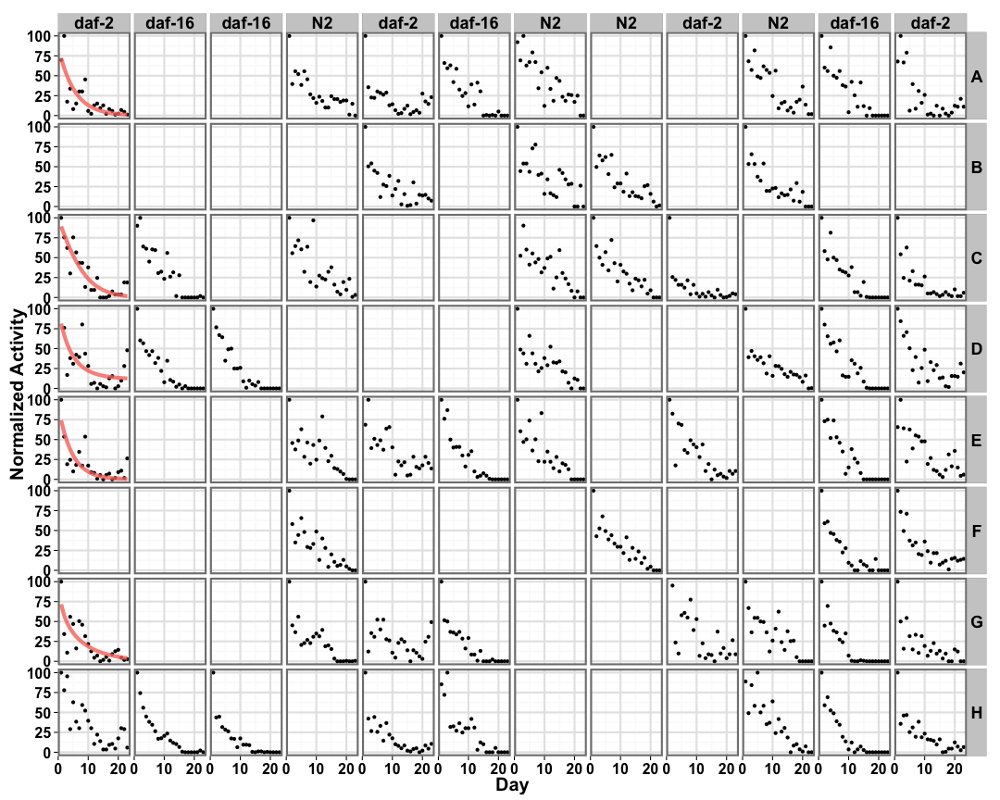
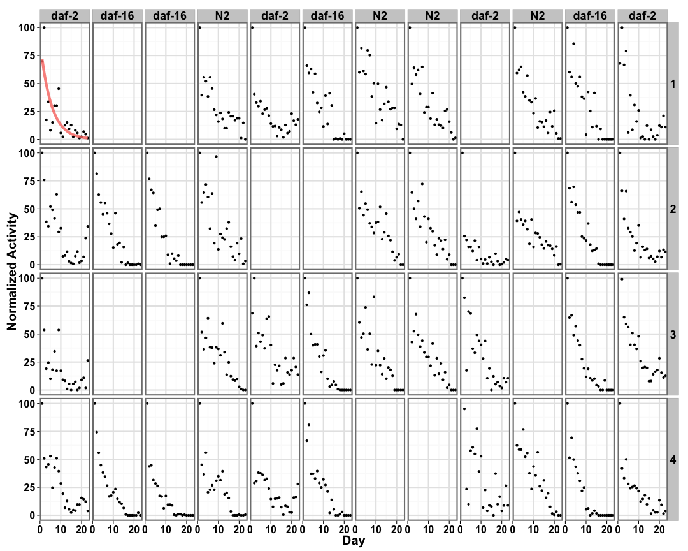
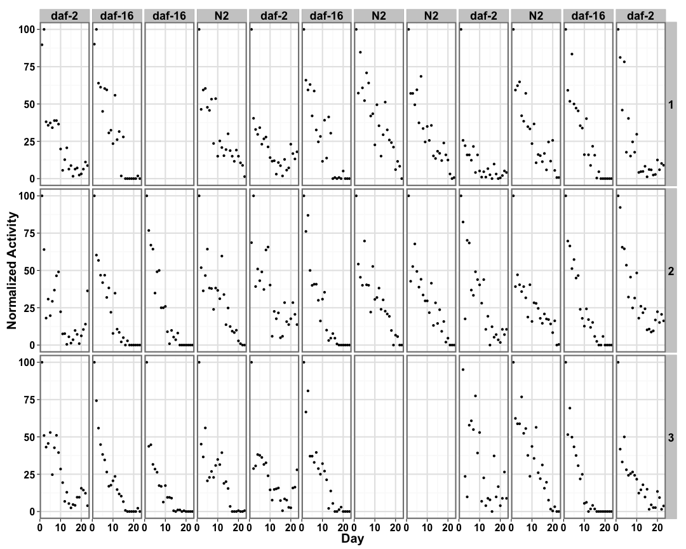
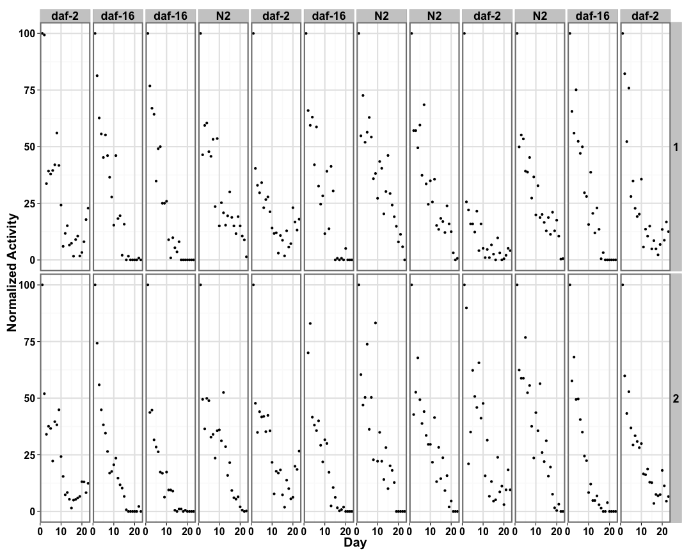
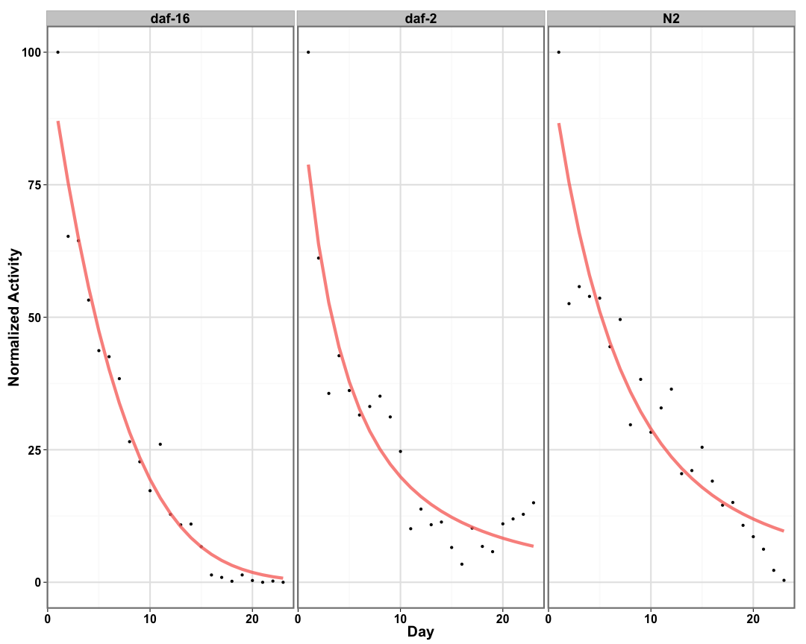
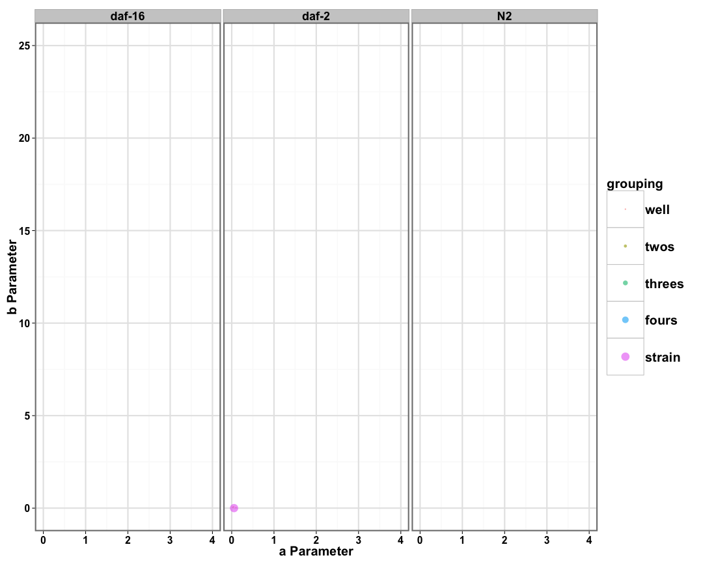
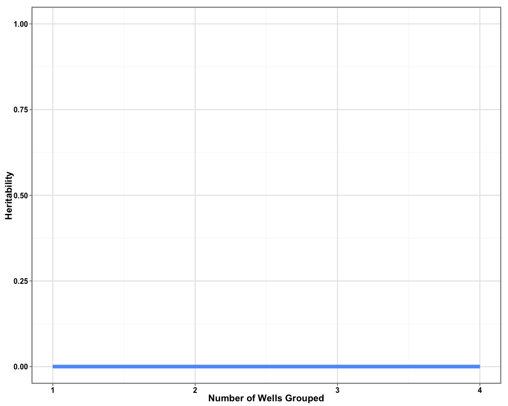
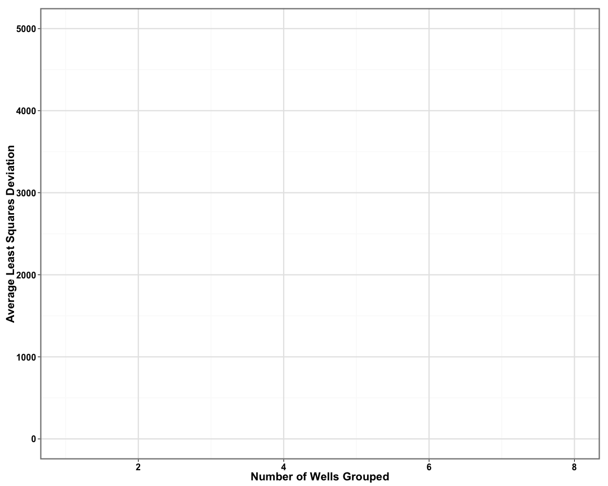

```
## [1] "p05_daf3"
```


## Individual Well Fits ##


```
## Error in nlm(well_threeplog, c(0.01, 0.1, 0.06), well.df, y, x): non-finite value supplied by 'nlm'
```

 

## Two Wells Fits ##


```
## Error in nlm(well_threeplog_grouping, c(0.01, 0.1, 0.06), well_twos.df, : non-finite value supplied by 'nlm'
```

 

## Three Wells Fits ##


```
## Error in nlm(well_threeplog_grouping, c(0.01, 0.1, 0.06), well_threes.df, : non-finite value supplied by 'nlm'
```

 

## Four Wells Fits ##


```
## Error in nlm(well_threeplog_grouping, c(0.01, 0.1, 0.06), well_fours.df, : non-finite value supplied by 'nlm'
```

 

## Strain Fits ##

 

## Distribution of Parameters ##

 


```
## Error: grouping factors must have > 1 sampled level
```

## Heritability of Parameters ##

 

## Quantifying Curve Fits ##

 
