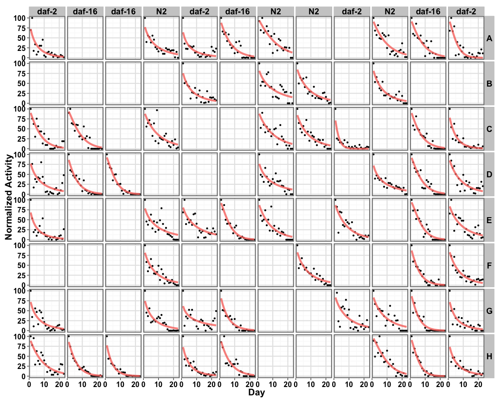
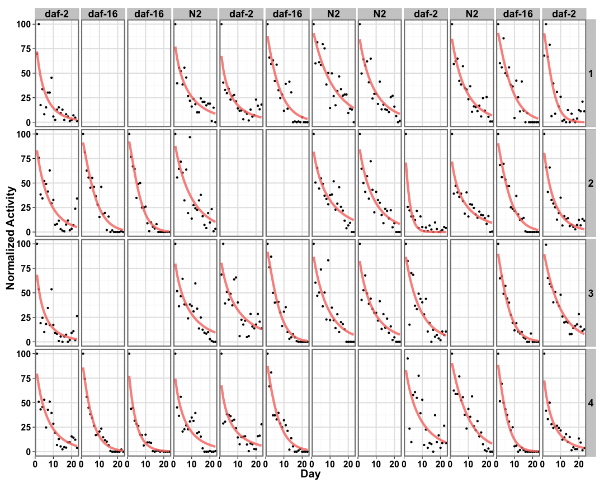
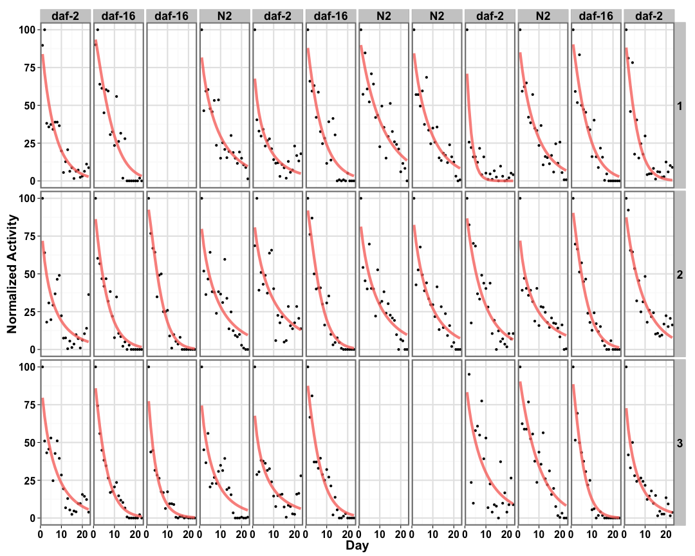
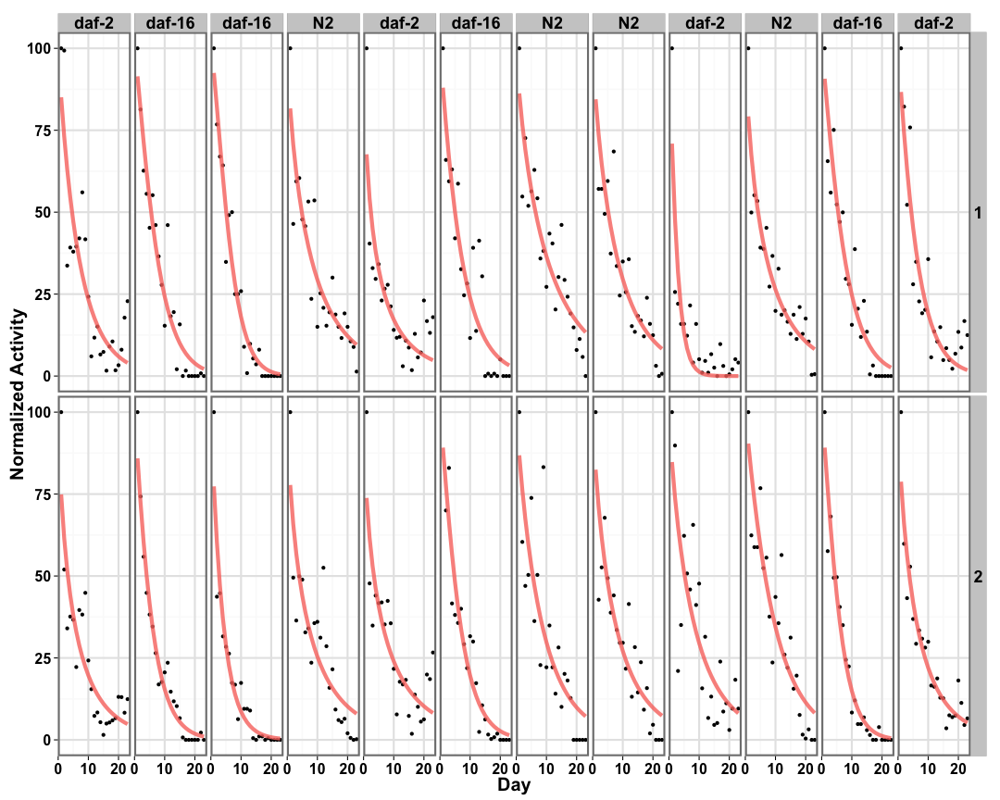
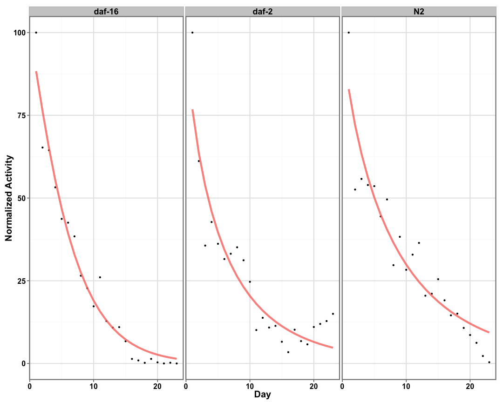
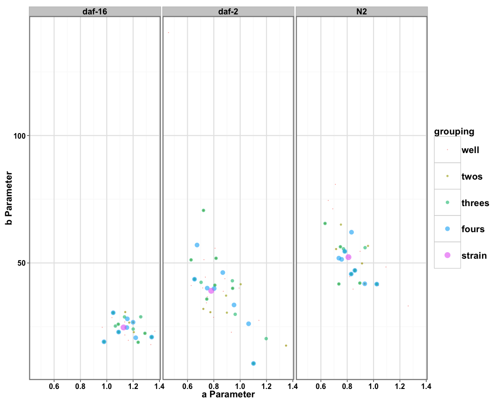
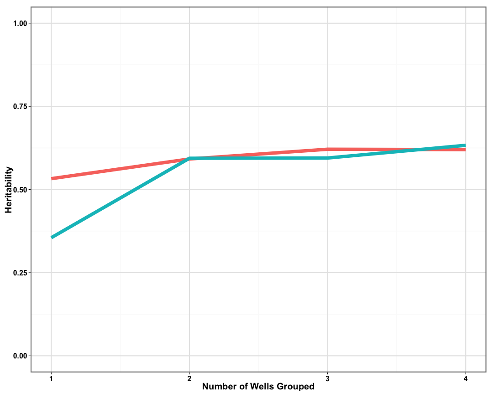
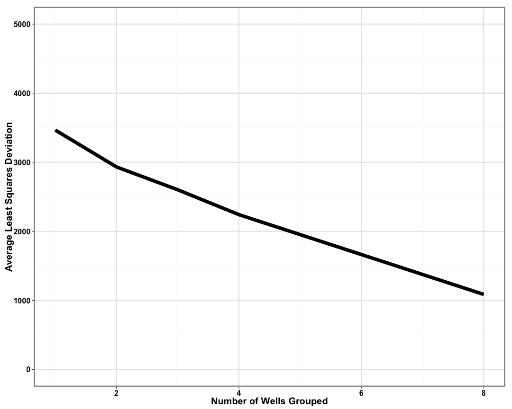

```
## [1] "p05_daf3"
```


## Individual Well Fits ##

 

## Two Wells Fits ##

 

## Three Wells Fits ##

 

## Four Wells Fits ##

 

## Strain Fits ##

 

## Distribution of Parameters ##

 


```
## Error in names(pdata.melted) = c("pheno", "strain"): 'names' attribute [2] must be the same length as the vector [1]
```

## Heritability of Parameters ##

 

## Quantifying Curve Fits ##

 
