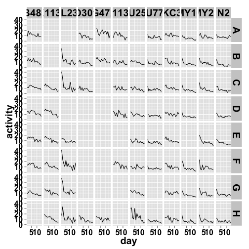
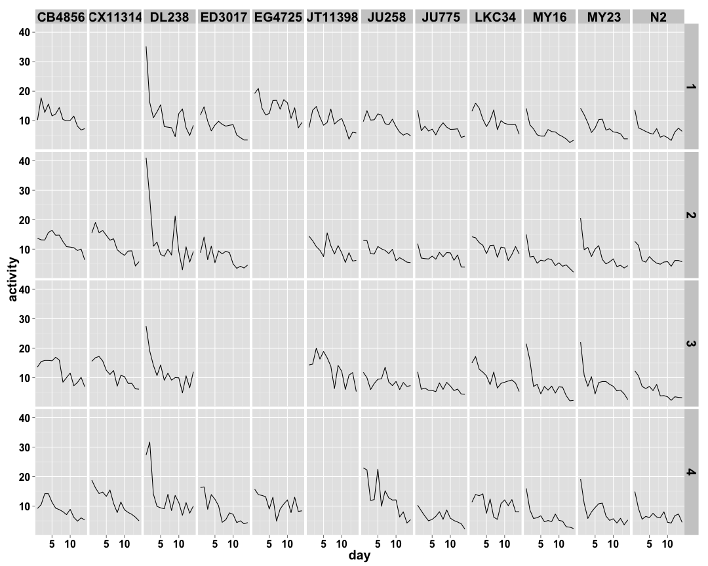
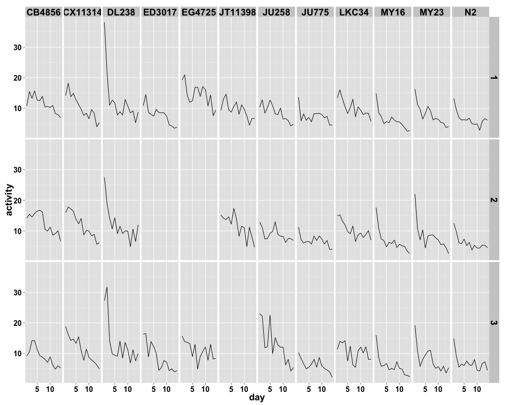
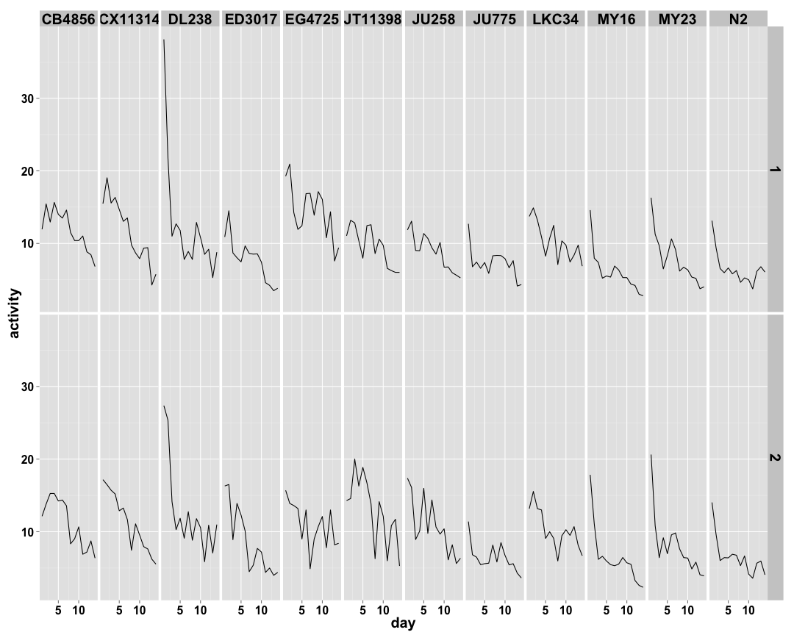
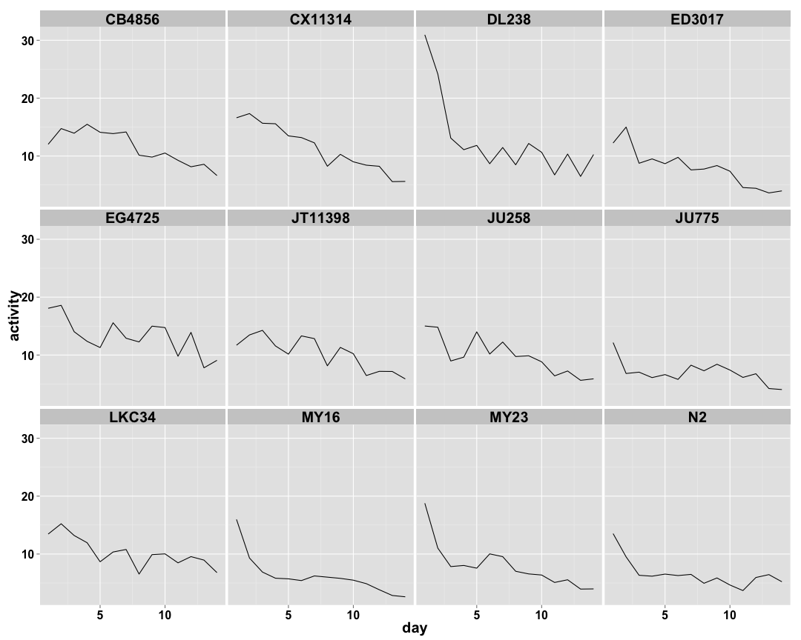

 

 

 

 

 

| col|row |    bparam|       cparam|
|---:|:---|---------:|------------:|
|   1|A   | 0.5755852|    13.280236|
|   1|B   | 1.4021147|    12.020783|
|   1|C   | 1.6361118|    14.795366|
|   1|D   | 2.2909058|    12.976444|
|   1|E   | 2.1799810|    13.144025|
|   1|F   | 2.7539912|    11.251685|
|   1|G   | 1.6594980|    10.117088|
|   1|H   | 0.0000000|     0.000000|
|   2|A   | 0.0000000|     0.000000|
|   2|B   | 0.0000000|     0.000000|
|   2|C   | 1.5056588|     8.162561|
|   2|D   | 2.4098488|     9.923760|
|   2|E   | 1.6560316|     9.607970|
|   2|F   | 1.3879851|     8.925420|
|   2|G   | 1.3413505|     9.512144|
|   2|H   | 1.9400519|     8.560299|
|   3|A   | 1.3874319|     7.432852|
|   3|B   | 0.8900423|     7.813427|
|   3|C   | 0.9153590|     7.036721|
|   3|D   | 0.0000000|     0.000000|
|   3|E   | 0.0000000|     0.000000|
|   3|F   | 0.0000000|     0.000000|
|   3|G   | 0.0000000|     0.000000|
|   3|H   | 1.6551117|     6.810870|
|   4|A   | 1.7008789|     9.526191|
|   4|B   | 0.6136643|    16.307108|
|   4|C   | 0.7963848|    15.465900|
|   4|D   | 0.8407751|     8.403763|
|   4|E   | 0.0000000|     0.000000|
|   4|F   | 1.6272856|    10.889113|
|   4|G   | 0.0000000|     0.000000|
|   4|H   | 0.0000000|     0.000000|
|   5|A   | 0.0000000|     0.000000|
|   5|B   | 1.0174821|     2.769029|
|   5|C   | 1.2202477|     2.798395|
|   5|D   | 0.0000000|     0.000000|
|   5|E   | 0.8944041|    11.411198|
|   5|F   | 1.0402719|     3.164337|
|   5|G   | 1.0284914|     3.504655|
|   5|H   | 0.8523651|     2.854116|
|   6|A   | 0.3123228|    29.333112|
|   6|B   | 1.1203953|     3.021609|
|   6|C   | 1.0544745|     5.909987|
|   6|D   | 0.5311475|     6.811130|
|   6|E   | 1.3437936|     5.475153|
|   6|F   | 0.0000000|     0.000000|
|   6|G   | 0.7010914|     4.057854|
|   6|H   | 0.6568715|     6.260953|
|   7|A   | 0.7522996|     7.955200|
|   7|B   | 1.0070717|     4.643031|
|   7|C   | 1.0696698|     3.682606|
|   7|D   | 0.0000000|     0.000000|
|   7|E   | 1.2955244|     3.638444|
|   7|F   | 0.6902585|     2.581784|
|   7|G   | 1.0179364|     4.307865|
|   7|H   | 0.8154827|     3.700186|
|   8|A   | 0.0000000|     0.000000|
|   8|B   | 1.9316202|    11.302437|
|   8|C   | 1.2818194|    10.402674|
|   8|D   | 0.8430142|    11.490531|
|   8|E   | 0.7108928|    10.307924|
|   8|F   | 0.0476832| 24729.775813|
|   8|G   | 1.7867642|    11.015203|
|   8|H   | 1.3387082|     5.953623|
|   9|A   | 0.7394048|    18.011543|
|   9|B   | 0.8321878|    16.540824|
|   9|C   | 0.0000000|     0.000000|
|   9|D   | 0.0000000|     0.000000|
|   9|E   | 0.0000000|     0.000000|
|   9|F   | 0.0000000|     0.000000|
|   9|G   | 0.0000000|     0.000000|
|   9|H   | 0.8071521|    17.776237|
|  10|A   | 0.4833595|    44.640892|
|  10|B   | 1.3078403|     7.395864|
|  10|C   | 0.8496566|    11.108175|
|  10|D   | 0.6015675|    32.182335|
|  10|E   | 1.0210679|     8.698324|
|  10|F   | 1.0622148|     9.451359|
|  10|G   | 0.2600931|   258.416809|
|  10|H   | 0.7392173|    12.156148|
|  11|A   | 0.4940527|    10.857150|
|  11|B   | 0.5785320|     6.641909|
|  11|C   | 0.3918093|     8.428036|
|  11|D   | 1.1184189|    17.887940|
|  11|E   | 0.5937113|     7.109093|
|  11|F   | 0.3863908|    12.356774|
|  11|G   | 0.0000000|     0.000000|
|  11|H   | 0.8614023|    10.223884|
|  12|A   | 0.9852235|     5.460645|
|  12|B   | 0.9174739|     3.453297|
|  12|C   | 1.0315146|     3.570259|
|  12|D   | 0.7997876|     4.113816|
|  12|E   | 0.0000000|     0.000000|
|  12|F   | 1.2817919|     3.231229|
|  12|G   | 1.1100684|     3.932885|
|  12|H   | 0.9250174|     2.840055|

| col| grouping|    bparam|    cparam|
|---:|--------:|---------:|---------:|
|   1|        1| 0.9205283| 12.958311|
|   1|        2| 2.3694338| 13.554945|
|   1|        3| 2.4381033| 12.079074|
|   1|        4| 1.6594980| 10.117088|
|   2|        1| 0.0000000|  0.000000|
|   2|        2| 1.8630830|  9.183093|
|   2|        3| 1.8015652| 10.219529|
|   2|        4| 1.6004781|  8.897750|
|   3|        1| 1.1435945|  7.568045|
|   3|        2| 0.9153590|  7.036721|
|   3|        3| 0.0000000|  0.000000|
|   3|        4| 1.6551117|  6.810870|
|   4|        1| 1.1234433| 11.912582|
|   4|        2| 0.9138288| 11.810816|
|   4|        3| 1.6272856| 10.889113|
|   4|        4| 0.0000000|  0.000000|
|   5|        1| 1.0174821|  2.769029|
|   5|        2| 1.2202477|  2.798395|
|   5|        3| 0.9561671|  4.527437|
|   5|        4| 1.0419210|  4.123228|
|   6|        1| 0.6685664|  4.913290|
|   6|        2| 0.8027698|  6.823450|
|   6|        3| 1.3437936|  5.475153|
|   6|        4| 0.6789130|  4.847160|
|   7|        1| 1.0646248|  7.668566|
|   7|        2| 1.0696698|  3.682606|
|   7|        3| 0.9423114|  3.145879|
|   7|        4| 0.9140343|  4.017655|
|   8|        1| 1.9316202| 11.302437|
|   8|        2| 1.2366346| 12.469941|
|   8|        3| 0.3906728| 27.237051|
|   8|        4| 1.4200325|  7.708362|
|   9|        1| 0.8054648| 17.785561|
|   9|        2| 0.0000000|  0.000000|
|   9|        3| 0.0000000|  0.000000|
|   9|        4| 0.8071521| 17.776237|
|  10|        1| 0.9929621| 11.915836|
|  10|        2| 0.9003220| 19.678754|
|  10|        3| 1.0448256|  9.067424|
|  10|        4| 0.6977381| 29.124702|
|  11|        1| 0.5372236|  8.197599|
|  11|        2| 0.5177082| 15.666079|
|  11|        3| 0.4905223|  8.819771|
|  11|        4| 0.8614023| 10.223884|
|  12|        1| 0.9263206|  4.147060|
|  12|        2| 0.9238948|  3.783232|
|  12|        3| 1.2817919|  3.231229|
|  12|        4| 1.0000760|  3.329243|

| col| grouping|    bparam|    cparam|
|---:|--------:|---------:|---------:|
|   1|        1| 1.7700072| 13.846170|
|   1|        2| 2.6360818| 12.567212|
|   1|        3| 1.6594980| 10.117088|
|   2|        1| 1.5056588|  8.162561|
|   2|        2| 2.0512604| 10.263289|
|   2|        3| 1.6004781|  8.897750|
|   3|        1| 1.0764120|  7.416741|
|   3|        2| 0.0000000|  0.000000|
|   3|        3| 1.6551117|  6.810870|
|   4|        1| 0.9542465| 13.009370|
|   4|        2| 1.6330726| 11.255358|
|   4|        3| 0.0000000|  0.000000|
|   5|        1| 1.1201276|  2.786736|
|   5|        2| 0.9561671|  4.527437|
|   5|        3| 1.0419210|  4.123228|
|   6|        1| 0.7972580|  5.646853|
|   6|        2| 0.8795833|  5.746593|
|   6|        3| 0.6789130|  4.847160|
|   7|        1| 1.0266135|  5.644264|
|   7|        2| 0.9423114|  3.145879|
|   7|        3| 0.9140343|  4.017655|
|   8|        1| 1.8501929| 11.253571|
|   8|        2| 0.6650093| 21.129971|
|   8|        3| 1.4200325|  7.708362|
|   9|        1| 0.8054648| 17.785561|
|   9|        2| 0.0000000|  0.000000|
|   9|        3| 0.8071521| 17.776237|
|  10|        1| 0.9404144| 11.673404|
|  10|        2| 1.0333532| 13.327717|
|  10|        3| 0.6977381| 29.124702|
|  11|        1| 0.4865663|  8.261051|
|  11|        2| 0.5519057| 13.066688|
|  11|        3| 0.8614023| 10.223884|
|  12|        1| 0.9646057|  3.915974|
|  12|        2| 1.0637279|  3.485306|
|  12|        3| 1.0000760|  3.329243|

| col| grouping|    bparam|    cparam|
|---:|--------:|---------:|---------:|
|   1|        1| 2.3036299| 13.651701|
|   1|        2| 2.5016482| 11.998735|
|   2|        1| 1.8630830|  9.183093|
|   2|        2| 1.9086076| 10.083466|
|   3|        1| 1.0764120|  7.416741|
|   3|        2| 1.6551117|  6.810870|
|   4|        1| 1.9354246| 13.091447|
|   4|        2| 1.6272856| 10.889113|
|   5|        1| 1.1201276|  2.786736|
|   5|        2| 1.0582336|  5.041252|
|   6|        1| 0.7290660|  5.831613|
|   6|        2| 0.8395848|  5.038579|
|   7|        1| 1.0266135|  5.644264|
|   7|        2| 0.9235322|  3.517389|
|   8|        1| 1.3953370| 12.115375|
|   8|        2| 1.1225648| 10.117354|
|   9|        1| 0.8054648| 17.785561|
|   9|        2| 0.8071521| 17.776237|
|  10|        1| 0.9762424| 15.120091|
|  10|        2| 0.8979154| 13.744034|
|  11|        1| 0.5227950| 11.058132|
|  11|        2| 0.5824242|  9.409380|
|  12|        1| 0.9251859|  3.956788|
|  12|        2| 1.1033373|  3.285550|

| col|    bparam|    cparam|
|---:|---------:|---------:|
|   1| 2.3762922| 12.910151|
|   2| 2.0175229| 10.047034|
|   3| 1.2303349|  7.217771|
|   4| 1.9906201| 12.667487|
|   5| 1.0564589|  3.947028|
|   6| 0.7785139|  5.437550|
|   7| 0.9447638|  4.223726|
|   8| 1.3261686| 11.436888|
|   9| 0.8815579| 18.679678|
|  10| 0.9334472| 14.439924|
|  11| 0.5467597| 10.319990|
|  12| 1.0028112|  3.598342|
